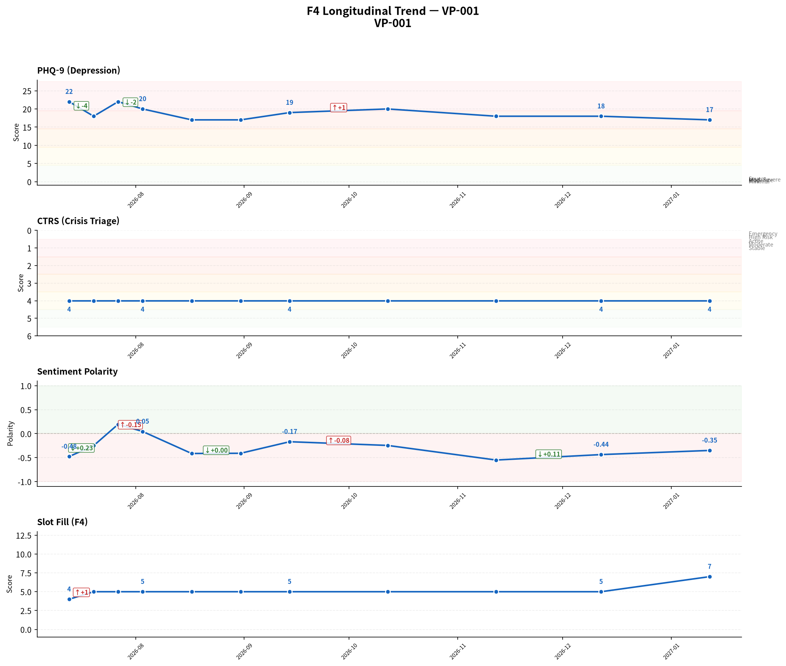
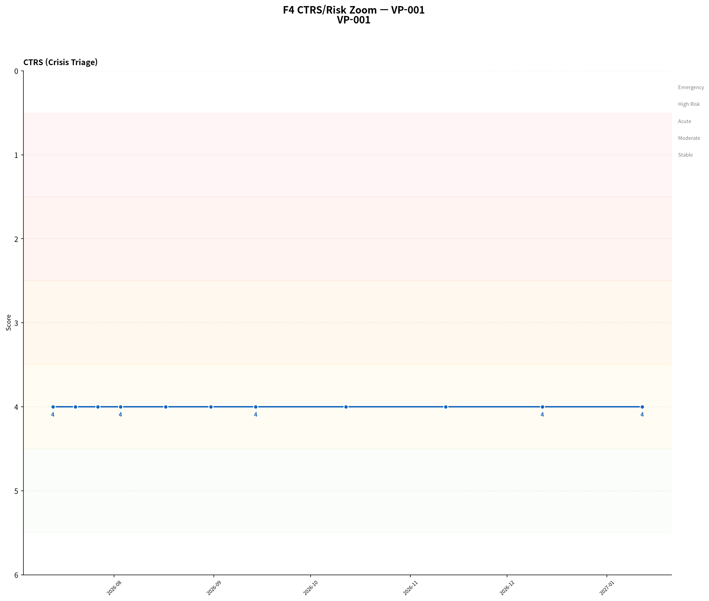
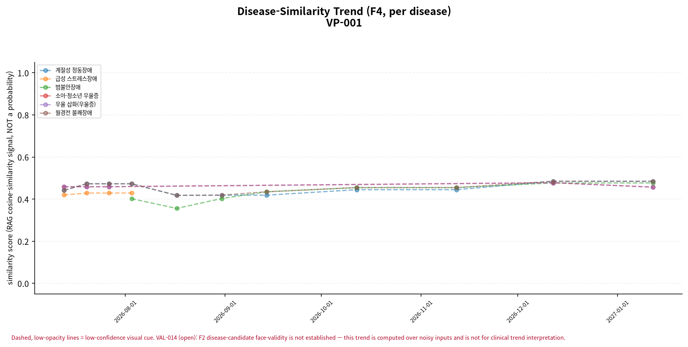
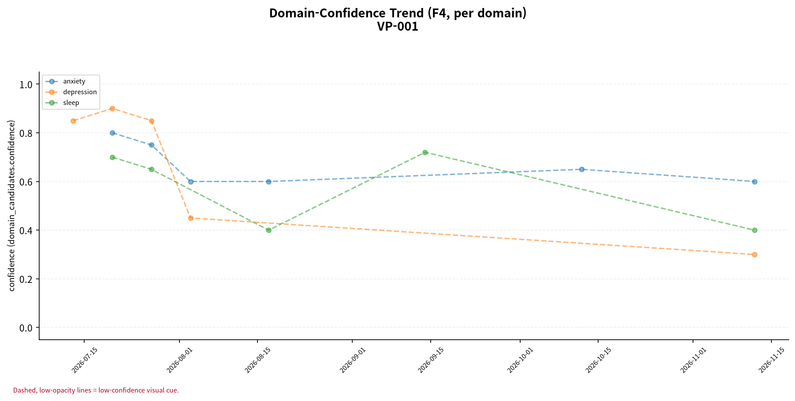

# F5 인계 요약 보고서 — VP-001

> **핵심 요약**
>
> - 환자: 김서연 (VP-001) — 11회차 (2027-01-12), 총 11세션 · 183일
> - 주호소: 잠을 잘 못 자는 것이 가장 신경 쓰임. 누우면 머릿속이 복잡해져서 한 시간은 뒤척이고, 새벽에도 두세 번 깨는 수면 문제 지속
> - 위험 플래그: 자살사고 문항(9번) 양성 3회 확인 (1회차, 3회차, 7회차) — 임상 확인 권장
> - 최신 설문: PHQ-9 17/27 (중등도-중증) ↓ (22→17, 1회차 대비)
> - 주요 우려: 설문 위험 신호와 CTRS 불일치 3회 — 임상 확인 권장

> **면책 조항**
>
> - 자가보고(AI 대화형 문진) 기반 비공식 문서이며 공식 의무기록·의학적 진단이 아닙니다.
> - AI 예상질환(하단)은 유사도 기반 참고 정보일 뿐 확률·가능성·진단이 아닙니다.
> - 최종 진단과 치료 방향은 반드시 의료진의 판단에 따라 결정되어야 합니다.

## 위험/안전 평가

당해 세션(11회차, 2027-01-12) 위험평가: 자살/자해 사고 탐색 질문에 부인 — 환자 발화: "아, 그런 생각은 없어요. 그냥 좀 힘들 뿐이지 그 정도는 아니에요. 요즘도 가끔 가슴이 답답하거나 어깨가 뻐근하긴 한데, 죽고… (상세 아래). 위기 단계(CTRS) 4/5 — 경도 우려 (준안정). 과거 3회 세션에서 설문 자살사고 문항(9번) 양성/안전 의뢰 신호가 동일 세션 CTRS 상승에 반영되지 않아 불일치가 확인됩니다 — 임상 확인이 권장됩니다.

> AI가 진행한 대화형 문진 결과이며, 검증된 임상 설문 시행이 아닙니다. '판정'은 설문 위험 신호와 동일 세션 CTRS 평가의 일치 여부입니다.

| 세션 | 일자 | 점수 | 9번 문항 | 판정 |
|---|---|---|---|---|
| 1 | 2026-07-13 | 22/27 | 양성 | 불일치 |
| 3 | 2026-07-27 | 22/27 | 양성 | 불일치 |
| 7 | 2026-09-14 | 19/27 | 양성 | 불일치 |

> 최신 시행 척도 안내: 당해 세션에 F3 문진이 시행되어 별도 최신성 안내가 필요하지 않습니다.

## 주호소 및 현병력

**주호소**: 잠을 잘 못 자는 것이 가장 신경 쓰임. 누우면 머릿속이 복잡해져서 한 시간은 뒤척이고, 새벽에도 두세 번 깨는 수면 문제 지속

**현병력**: 잠들기 전 머릿속이 복잡해져 한 시간 정도 뒤척이고 새벽 두세 번 깨는 수면 문제 지속. 퇴근 후 무기력함과 피로감이 쌓여 아무것도 하고 싶지 않고 운동도 거의 하지 않음. 가슴 답답함, 어깨·목 뻐근함은 주 2-3회, 큰 일 있을 때 발생하며, 여행 후 기분 개선되었으나 스트레스가 완전히 사라지지 않고 회복이 느린 느낌

### 정신상태검사 (MSE)

텍스트 문진 특성상 관찰 기반 MSE는 평가 불가; 대화에서 도출된 소견 없음

## 전체 세션 요약

> 이 표의 값은 AI가 진행한 대화형 문진(F1)에서 환자가 자가보고한 내용이며, 임상의의 직접 평가나 검증된 척도 시행이 아닙니다.

| 슬롯 | 최신값 | 출처 | 변화 | 비고 |
|---|---|---|---|---|
| 주호소 | 잠을 잘 못 자는 것이 가장 신경 쓰임. 누우면 머릿속이 복잡해져서 한 시간은 뒤척이고, 새벽에도 두세 번 깨는 수면 문제 지속 | 11회차/2027-01-12 | 7회 변화 (S1→S4→S5→S6→S7→S10→S11) | A1 참조 (전문 서술) |
| 현병력 | 잠들기 전 머릿속이 복잡해져 한 시간 정도 뒤척이고 새벽 두세 번 깨는 수면 문제 지속. 퇴근 후 무기력함과 피로감이 쌓여 아무것도 하고 싶지… (상세 아래) | 10회차/2026-12-12 | 6회 변화 (S1→S2→S5→S6→S8→S10) | A2 참조 (전문 서술) |
| 정신과 과거력 | 정신과 진료나 심리상담을 받아본 적 없음 | 11회차/2027-01-12 | - | - |
| 신체질환/신경학적 병력 | 건강검진에서 혈압이 높게 나온 적이 있으나 병원 진료나 약 복용은 없음 | 11회차/2027-01-12 | - | - |
| 개인사/사회력 | 회사 동료 2-3명과 점심 시간에 스트레스 관련 대화, 집에서 일할 때 상황 공유. 어머니와는 주 2회 통화하며 위로와 이야기 나눔. 혼자 감당… (상세 아래) | 5회차/2026-08-17 | 2회 변화 (S1→S5) | - |
| 가족력 | 미수집 | - | - | - |
| 음주·흡연·물질사용 | 주 1-2회 맥주 한 캔 정도 마심, 카페인은 평소보다 조금 줄였으나 수면제나 진정제는 전혀 사용하지 않음 | 1회차/2026-07-13 | - | - |
| 위험평가 | 자살/자해 사고 탐색 질문에 부인 — 환자 발화: "아, 그런 생각은 없어요. 그냥 좀 힘들 뿐이지 그 정도는 아니에요. 요즘도 가끔 가슴이 답… (상세 아래) | 2회차/2026-07-20 | - | A3 참조 (전문 서술 + 종단 위험 신호) |

**주요 경과**

- 주호소: S1: '잠을 잘 못 자서 눕자마자 바로 자는 게 아니라 한 시간은 뒤척이고, 새벽에 두세 번 깨며 아침에 일어나도…' → ... → S11: '잠을 잘 못 자는 것이 가장 신경 쓰임. 누우면 머릿속이 복잡해져서 한 시간은 뒤척이고, 새벽에도 두세 번…'
- 현병력: S1: '회사 프로젝트 데드라인이 다가오면서부터 시작된 수면 문제로, 아침을 자주 거르게 되고 식욕이 줄었으며, 회사…' → ... → S10: '잠들기 전 머릿속이 복잡해져 한 시간 정도 뒤척이고 새벽 두세 번 깨는 수면 문제 지속. 퇴근 후 무기력함과…'
- 개인사/사회력: S1: '회사 동료 2-3명과 괜찮은 편, 어머니와 주 2회 통화' → S5: '회사 동료 2-3명과 점심 시간에 스트레스 관련 대화, 집에서 일할 때 상황 공유. 어머니와는 주 2회 통화…'

## 시행된 설문

> AI가 진행한 대화형 문진 결과이며, 검증된 임상 설문 시행이 아닙니다.

**PHQ-9 17/27 (중등도-중증)** — 11회차 (2027-01-12)

- 응답: 2,2,3,3,2,2,2,1,0
- 자살사고 문항(9번): 음성
- 문진 방식: natural

## 종단 추세

전체 방향: **개선** (11세션, 183일)

> 전체 방향은 척도·위기단계·정서 방향의 다수결로 계산되며, 악화 신호가 하나라도 있으면 악화로 우선 판정합니다. 정서 포함 여부에 따라 결과가 달라질 수 있습니다.

| 항목 | 방향 | 근거 |
|---|---|---|
| PHQ-9 총점 | 개선 | PHQ-9: 세션 1→11: 22 → 17 (-5) |
| 위기 단계(CTRS) | 변화 없음 | 세션 1→11: 4 → 4 (+0) |
| 감성 점수 | 개선 | 세션 1→11: -0.477273 → -0.35 (+0.127) |
| 문진 항목 충족도 | 개선 | 세션 1→11: 4 → 7 (+3) |

위기 반응 발생 세션 없음
위험 고조 세션 중 설문 미시행 사례 없음
종단 추세 일관성(설문·CTRS·감성): 일치

### 추세 차트

## AI 참고 정보 (비진단)

> ⚠ 유사도(similarity)일 뿐 확률·가능성·신뢰도가 아닙니다 — 임상 판단 대체 불가.

| 순위 | 질환 | 유사도 |
|---|---|---|
| 공동 1위 | 계절성 정동장애 | 0.485 |
| 공동 1위 | 월경전 불쾌장애 | 0.485 |
| 3 | 범불안장애 | 0.477 |

기타 후보: 우울 삽화(우울증)(0.457), 소아·청소년 우울증(0.457)

> 이 정보는 AI가 생성한 참고용 예상 질환 후보이며 의학적 진단이 아닙니다. 함께 제공되는 설문 추천(recommended_questionnaire) 역시 초기 상담(인테이크) 지원을 위한 척도 제안일 뿐, 진단적 판단이 아닙니다. 최종 진단과 치료 방향은 반드시 의료진의 판단에 따라 결정되어야 합니다.
> 추천 설문: PHQ-9 — PHQ-9 screens depressive-symptom burden only, does not screen manic/hypomanic symptoms — bipolar-spectrum presentations need clinician follow-up regardless of score.

## 권장 진료과 및 후속 조치

정보 없음 — 후보가 스키마 검증 오류로 제외됨 (validation_errors 존재, VAL-016/BUG-031 계열). 모델이 후보를 찾지 못했다는 의미가 아니라, 상위 F2 단계에서 이미 생성된 후보가 스키마 검증 실패로 삭제되었을 가능성이 있습니다.

추천 설문: PHQ-9 — PHQ-9 screens depressive-symptom burden only, does not screen manic/hypomanic symptoms — bipolar-spectrum presentations need clinician follow-up regardless of score.

> 약물 정보: 별도 구조화 항목 없음, HPI/병력 서술 포함 여부만 확인

## 임상 종합 소견

AI 종합 소견 미생성 (narrative disabled)

## 각주

모델: solar-pro3-260323 · 생성 시각: 2026-07-15T09:55:49.992272 · 세션ID: f1_VP-001_followup
설문 문항 출처: v1, verbatim Pfizer/phqscreeners.com Korean PHQ-9 PDF, retrieved 2026-07-13 (item_bank_v1_sources.md §1.2/§1.3, appendix §A1); translation chosen per ADR-033 decision 1 (Seo & Park 2015's Korean validation study administered this same translation)
종단 추세 판정 근거(감사용): overall_direction은 세션별 척도/CTRS/sentiment 방향의 다수결(worsened-priority)로 계산되며(src.f4::_overall_direction), sentiment 포함 여부에 따라 verdict가 달라질 수 있습니다(REV-045 row 2) — 세부 근거는 trend_verdicts의 evidence를 참고하십시오.
