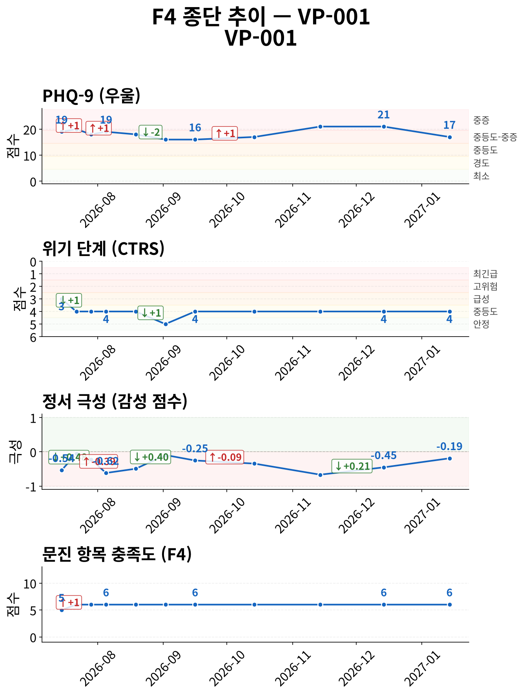
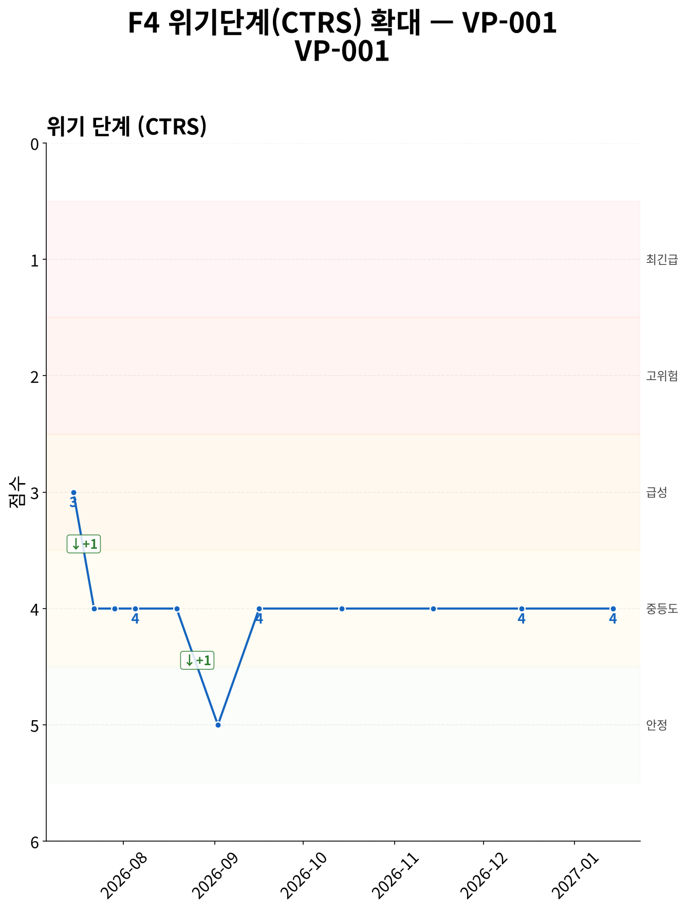
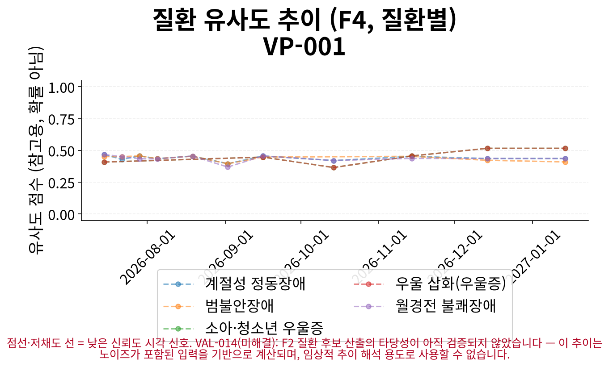
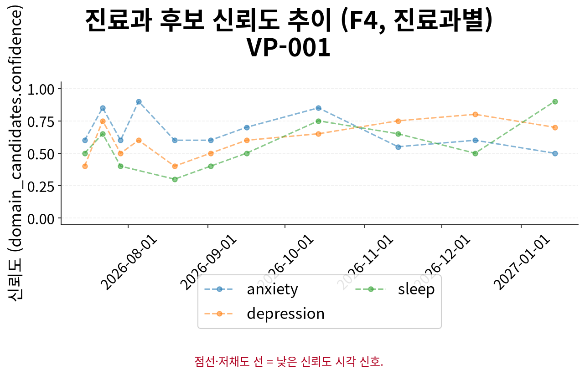

# F5 인계 요약 보고서 — VP-001

> **핵심 요약**
>
> - 환자: 김서연 (VP-001) — 11회차 (2027-01-14), 총 11세션 · 183일
> - 주호소: 잠들기 힘들고 새벽에 자주 깨는 증상
> - 위험 플래그: 자살사고 문항 양성 이력 없음 (자가보고 기준)
> - 최신 설문: PHQ-9 17/27 (중등도-중증) ↓ (19→17, 1회차 대비)
> - 주요 우려: 특이 우려 사항 없음

> **면책 조항**
>
> - 자가보고(AI 대화형 문진) 기반 비공식 문서이며 공식 의무기록·의학적 진단이 아닙니다.
> - AI 예상질환(하단)은 유사도 기반 참고 정보일 뿐 확률·가능성·진단이 아닙니다.
> - 최종 진단과 치료 방향은 반드시 의료진의 판단에 따라 결정되어야 합니다.

## 위험/안전 평가

당해 세션(11회차, 2027-01-14) 위험평가: 자살/자해 사고 탐색 질문에 대한 환자 응답: "회사에서 대규모 프로젝트를 진행하면서부터 잠들기 전부터 마음이 조마조마해졌어요. 퇴근 후에도 어깨와 목이 뻐근하고, 가끔 가슴이 답… (상세 부록 1 참조). 위기 단계(CTRS) 4/5 — 경도 우려 (준안정).

해당 없음 — 전체 세션 중 item-9 양성/안전 의뢰 이력이 없습니다.

> 최신 시행 척도 안내: 당해 세션에 F3 문진이 시행되어 별도 최신성 안내가 필요하지 않습니다.

## 주호소 및 현병력

**주호소**: 잠들기 힘들고 새벽에 자주 깨는 증상

**현병력**: 지난번에 비하면 조금 나아진 것 같아요. 작은 마감은 있었지만 예전처럼 정신없이 흔들리진 않았고, 잠도 여전히 잘 안 오긴 했지만 새벽에 더 자주 깨는 건 좀 줄어든 느낌이에요. 전반적으로는 마음이 덜 답답하고, 회사에서도 실수는 가끔 있지만 지적받는 빈도는 좀 줄어든 것 같아요.

### 정신상태검사 (MSE)

텍스트 문진 특성상 관찰 기반 MSE는 평가 불가; 대화에서 도출된 소견 없음

## 전체 세션 요약

> 이 표의 값은 AI가 진행한 대화형 문진(F1)에서 환자가 자가보고한 내용이며, 임상의의 직접 평가나 검증된 척도 시행이 아닙니다.

| 슬롯 | 최신값 | 출처 | 변화 | 비고 |
|---|---|---|---|---|
| 주호소 | 잠들기 힘들고 새벽에 자주 깨는 증상 | 10회차/2026-12-14 | 10회 변화 (S1→S2→S3→S4→S5→S6→S7→S8→S9→S10) · 상세 부록 참조 | A1 참조 (전문 서술) |
| 현병력 | 지난번에 비하면 조금 나아진 것 같아요. 작은 마감은 있었지만 예전처럼 정신없이 흔들리진 않았고, 잠도 여전히 잘 안 오긴 했지만 새벽에 더 자… (상세 부록 2 참조) | 11회차/2027-01-14 | 10회 변화 (S1→S3→S4→S5→S6→S7→S8→S9→S10→S11) · 상세 부록 참조 | A2 참조 (전문 서술) |
| 정신과 과거력 | 미수집 | - | - | - |
| 신체질환/신경학적 병력 | 미수집 | - | - | - |
| 개인사/사회력 | 퇴근 후 무기력해져 운동도 거의 하지 않고 저녁도 가볍게만 먹거나 건너뛰는 날이 생김 | 9회차/2026-11-14 | 2회 변화 (S2→S9) · 상세 부록 참조 | - |
| 가족력 | 어머니의 수면 문제와 스트레스 시 신체 뻣뻣함 | 11회차/2027-01-14 | 3회 변화 (S1→S10→S11) · 상세 부록 참조 | - |
| 음주·흡연·물질사용 | 커피 대신 차 위주로 마심 | 1회차/2026-07-15 | - | - |
| 위험평가 | 자살/자해 사고 탐색 질문에 대한 환자 응답: "회사에서 대규모 프로젝트를 진행하면서부터 잠들기 전부터 마음이 조마조마해졌어요. 퇴근 후에도 어… (상세 부록 3 참조) | 1회차/2026-07-15 | - | A3 참조 (전문 서술 + 종단 위험 신호) |

**주요 경과**

- 주호소: S1: '잠 못 자는 문제로 인해 낮에도 집중이 어렵고 실수가 늘어나 속상함' → S6: '가슴 답답함과 어깨 뻐근함이 아침에 덜함' → S10: '잠들기 힘들고 새벽에 자주 깨는 증상'
- 현병력: S1: '회사에서 대규모 프로젝트 진행 시작 후 잠들기 전부터 마음이 조마조마해지고, 새벽 2-3회 깨며 아침에 개운…' → S7: '지난번 불면과 가슴 답답함이 개선되었으나, 최근 피로로 인해 집중이 잘 안 되는 증상이 재발' → S11: '지난번에 비하면 조금 나아진 것 같아요. 작은 마감은 있었지만 예전처럼 정신없이 흔들리진 않았고, 잠도 여전…'
- 개인사/사회력: S2: '회사 동료와 주 2회 통화, 퇴근 후 혼자 있는 시간 증가, 최근 연락 감소' → S9: '퇴근 후 무기력해져 운동도 거의 하지 않고 저녁도 가볍게만 먹거나 건너뛰는 날이 생김'
- 가족력: S1: '어머니는 가끔 잠 못 주무심' → S10: '어머니의 수면 문제' → S11: '어머니의 수면 문제와 스트레스 시 신체 뻣뻣함'

## 시행된 설문

> AI가 진행한 대화형 문진 결과이며, 검증된 임상 설문 시행이 아닙니다.

**PHQ-9 17/27 (중등도-중증)** — 11회차 (2027-01-14)

- 응답: 2,1,3,2,2,2,3,2,0
- 자살사고 문항(9번): 음성
- 문진 방식: natural

## 종단 추세

전체 방향: **개선** (11세션, 183일)

> 전체 방향은 척도·위기단계·정서 방향의 다수결로 계산되며, 악화 신호가 하나라도 있으면 악화로 우선 판정합니다. 정서 포함 여부에 따라 결과가 달라질 수 있습니다.

| 항목 | 방향 | 근거 |
|---|---|---|
| PHQ-9 총점 | 개선 | PHQ-9: 세션 1→11: 19 → 17 (-2) |
| 위기 단계(CTRS) | 개선 | 세션 1→11: 3 → 4 (+1) |
| 감성 점수 | 개선 | 세션 1→11: -0.540909 → -0.190909 (+0.35) |
| 문진 항목 충족도 | 개선 | 세션 1→11: 5 → 6 (+1) |

위기 반응 발생 세션 없음
위험 고조 세션 중 설문 미시행 사례 없음
종단 추세 일관성(설문·CTRS·감성): 일치

### 추세 차트

*그림 1. 설문 총점·위기 단계(CTRS)·정서·문진 충족도 추이 (11세션, 183일) — 위기 단계는 값이 낮을수록(1에 가까울수록) 위험이 높습니다.*

*그림 2. 위기 단계(CTRS) 확대 추이 — 1(최긴급)에 가까울수록 위험, 5(안정)에 가까울수록 안정적입니다.*

*그림 3. 세션별 질환 유사도 추이 — 점선·저채도 선은 참고용 유사도 신호일 뿐이며 확률·가능성·진단이 아닙니다.*

*그림 4. 세션별 진료과 후보 신뢰도 추이 — 값이 높을수록 해당 진료과 매칭 신뢰도가 높습니다.*

## AI 참고 정보 (비진단)

> ⚠ 유사도(similarity)일 뿐 확률·가능성·신뢰도가 아닙니다 — 임상 판단 대체 불가.

| 순위 | 질환 | 유사도 |
|---|---|---|
| 공동 1위 | 우울 삽화(우울증) | 0.516 |
| 공동 1위 | 소아·청소년 우울증 | 0.516 |
| 공동 3위 | 계절성 정동장애 | 0.436 |

기타 후보: 월경전 불쾌장애(0.436), 범불안장애(0.409)

> 이 정보는 AI가 생성한 참고용 예상 질환 후보이며 의학적 진단이 아닙니다. 함께 제공되는 설문 추천(recommended_questionnaire) 역시 초기 상담(인테이크) 지원을 위한 척도 제안일 뿐, 진단적 판단이 아닙니다. 최종 진단과 치료 방향은 반드시 의료진의 판단에 따라 결정되어야 합니다.
> 추천 설문: PHQ-9 — PHQ-9 screens depressive-symptom burden only, does not screen manic/hypomanic symptoms — bipolar-spectrum presentations need clinician follow-up regardless of score.

## 권장 진료과 및 후속 조치

| 진료과 | 사유 |
|---|---|
| 정신건강의학과 | 수면 장애, 우울감, 불안 증상이 복합적으로 나타나며, PHQ-9 21점(중증)으로 우울 증상이 확인됨. 수면 패턴 변화, 흥미 감소, 자존감 저하, 집중력 저하 등의 증상이 관찰됨. |
| 정신건강의학과 | 수면 문제와 함께 우울감, 무기력함, 자존감 저하 등의 증상이 보고됨. PHQ-9 21점(중증)으로 우울 증상이 확인됨. |
| 정신건강의학과 | 불안 증상, 정서조절 어려움, 실수에 대한 사후 반추 등이 보고됨. 수면 문제와 함께 불안 관련 증상이 관찰됨. |

추천 설문: PHQ-9 — PHQ-9 screens depressive-symptom burden only, does not screen manic/hypomanic symptoms — bipolar-spectrum presentations need clinician follow-up regardless of score.

> 약물 정보: 별도 구조화 항목 없음, HPI/병력 서술 포함 여부만 확인

## 임상 종합 소견

AI 종합 소견 미생성 (narrative disabled)

## 상세 부록

**1. 위험평가 발화 원문 (당해 세션)**

자살/자해 사고 탐색 질문에 대한 환자 응답: "회사에서 대규모 프로젝트를 진행하면서부터 잠들기 전부터 마음이 조마조마해졌어요. 퇴근 후에도 어깨와 목이 뻐근하고, 가끔 가슴이 답답한 느낌이 ..."

**2. 현병력 최신값 전문**

지난번에 비하면 조금 나아진 것 같아요. 작은 마감은 있었지만 예전처럼 정신없이 흔들리진 않았고, 잠도 여전히 잘 안 오긴 했지만 새벽에 더 자주 깨는 건 좀 줄어든 느낌이에요. 전반적으로는 마음이 덜 답답하고, 회사에서도 실수는 가끔 있지만 지적받는 빈도는 좀 줄어든 것 같아요.

**3. 위험평가 최신값 전문**

자살/자해 사고 탐색 질문에 대한 환자 응답: "회사에서 대규모 프로젝트를 진행하면서부터 잠들기 전부터 마음이 조마조마해졌어요. 퇴근 후에도 어깨와 목이 뻐근하고, 가끔 가슴이 답답한 느낌이 ..."

### 슬롯별 전체 변화 이력 (미압축)

**주호소**

S1: '잠 못 자는 문제로 인해 낮에도 집중이 어렵고 실수가 늘어나 속상함' → S2: '잠이 조금 나아졌으나 아침에 개운하지 않고 낮에 멍해지는 증상이 지속됨' → S3: '수면이 조금 나아지고 식욕도 서서히 돌아오고 있으나, 일 생각이 나면 가슴이 답답해지고 어깨가 뻣뻣해지는 증상이 지속됨' → S4: '가슴 답답함과 어깨 뻣뻣함이 여전히 가끔씩 느껴지며, 아침에 업무 메일을 확인할 때 가슴이 조이는 느낌이 있음' → S5: '가슴 답답함과 어깨 뻣뻣함이 아침에 더 자주 느껴지고, 퇴근 후 소파에 눕는 습관이 심해짐' → S6: '가슴 답답함과 어깨 뻐근함이 아침에 덜함' → S7: '불면이나 가슴 답답함은 나아졌으나, 최근 피로로 인해 집중이 잘 안 되는 날이 가끔 생김' → S8: '잠도 잘 못 자고 집중이 잘 안 되는 날이 가끔 있음' → S9: '잠이 잘 안 오고 아침에 피곤하게 깨며 집중이 잘 안 되는 증상' → S10: '잠들기 힘들고 새벽에 자주 깨는 증상'

**현병력**

S1: '회사에서 대규모 프로젝트 진행 시작 후 잠들기 전부터 마음이 조마조마해지고, 새벽 2-3회 깨며 아침에 개운하지 않음. 낮에 집중이 잘 안 되고 실수가 늘어나 속상함. 아침을 자주 거르고 식사량이 줄어 체력이 떨어지며 운동도 예전처럼 못함. 어깨와 목 뻐근함, 가끔 가슴 답답함 동반' → S3: '회사 대규모 프로젝트 진행 시작 후 잠들기 전부터 마음이 조마조마해지고 새벽 2-3회 깨며 아침에 개운하지 않음. 낮에 집중이 잘 안 되고 실수가 늘어나 속상함. 아침을 자주 거르고 식사량이 줄어 체력이 떨어지며 운동도 예전처럼 못함. 어깨와 목 뻐근함, 가끔 가슴 답답함 동반. 2주 만에 요가 수업에 다녀와 기분 전환되었으나, 일 생각이 나면 다시 긴장됨. 깊은 숨을 쉬려고 노력하지만 금방 가라앉지 않고, 집에 와서 차 한 잔 마시며 잠깐 멈추는 것이 도움이 되나 퇴근 후 소파에 눕는 것이 편해 자주 못함' → S4: '아침 업무 메일 확인 시 가슴이 조이는 느낌이 재발하며, 스트레스 상황에서 조마조마함과 함께 나타남. 과거보다 덜하지만 긴장되는 일이 있을 때 다시 증상이 나타남. 요가 수업으로 기분 전환되었으나 일 생각이 나면 다시 긴장됨. 깊은 숨을 쉬려고 노력하지만 금방 가라앉지 않고, 집에 와서 차 한 잔 마시며 잠깐 멈추는 것이 도움이 되나 퇴근 후 소파에 눕는 것이 편해 자주 못함' → S5: '가슴 답답함과 어깨 뻣뻣함이 아침에 더 자주 느껴지며, 퇴근 후 소파에 눕는 습관이 심해짐. 피로가 남아 있고, 새 프로젝트 시작으로 긴장되는 느낌과 조마조마한 기분이 가끔 듦. 요가 수업으로 기분 전환되나 일 생각이 나면 다시 긴장됨. 깊은 숨을 쉬려고 노력하지만 금방 가라앉지 않고, 집에 와서 차 한 잔 마시며 잠깐 멈추는 것이 도움이 되나 퇴근 후 소파에 눕는 것이 편해 자주 못함' → S6: '가슴 답답함과 어깨 뻐근함이 아침에 덜하며, 퇴근 후 소파에 눕는 대신 10분 정도 걸으려고 노력함. 피로로 인해 금방 눕고 싶을 때가 있으나 스트레칭과 따뜻한 샤워로 관리함' → S7: '지난번 불면과 가슴 답답함이 개선되었으나, 최근 피로로 인해 집중이 잘 안 되는 증상이 재발' → S8: '지난 주말 친구와의 근교 방문으로 마음이 가벼워졌으나, 최근 다시 집중이 잘 안 되는 날이 가끔 발생함' → S9: '회사 프로젝트 마감으로 인한 스트레스가 쌓이면서 다시 잠들기 어려워지고 새벽에 자주 깨는 증상이 지속됨. 퇴근 후 무기력해져 운동도 거의 하지 않고 저녁도 가볍게 먹거나 건너뛰는 날이 생김. 기분이 가라앉는 날도 있으나 죽고 싶다는 생각은 없음. 업무 집중이 어려워 실수가 발생함' → S10: '프로젝트 종료 후 여유로워졌으나 잠들기 어려움과 새벽 각성 증상이 재발, 운동 부족으로 인한 신체 무거움 및 아침 기상 곤란, 가끔 가슴 답답함과 어깨 뻣뻣함 동반' → S11: '지난번에 비하면 조금 나아진 것 같아요. 작은 마감은 있었지만 예전처럼 정신없이 흔들리진 않았고, 잠도 여전히 잘 안 오긴 했지만 새벽에 더 자주 깨는 건 좀 줄어든 느낌이에요. 전반적으로는 마음이 덜 답답하고, 회사에서도 실수는 가끔 있지만 지적받는 빈도는 좀 줄어든 것 같아요.'

**개인사/사회력**

S2: '회사 동료와 주 2회 통화, 퇴근 후 혼자 있는 시간 증가, 최근 연락 감소' → S9: '퇴근 후 무기력해져 운동도 거의 하지 않고 저녁도 가볍게만 먹거나 건너뛰는 날이 생김'

**가족력**

S1: '어머니는 가끔 잠 못 주무심' → S10: '어머니의 수면 문제' → S11: '어머니의 수면 문제와 스트레스 시 신체 뻣뻣함'

## 각주

모델: solar-pro3-260323 · 생성 시각: 2026-07-15T17:30:58.919324 · 세션ID: f1_VP-001_followup
설문 문항 출처: v1, verbatim Pfizer/phqscreeners.com Korean PHQ-9 PDF, retrieved 2026-07-13 (item_bank_v1_sources.md §1.2/§1.3, appendix §A1); translation chosen per ADR-033 decision 1 (Seo & Park 2015's Korean validation study administered this same translation)

### 시스템 참고 (내부 감사용, 임상 판단 근거 아님)

종단 추세 판정 근거: overall_direction은 세션별 척도/CTRS/sentiment 방향의 다수결(worsened-priority)로 계산되며(src.f4::_overall_direction), sentiment 포함 여부에 따라 verdict가 달라질 수 있습니다(REV-045 row 2) — 세부 근거는 trend_verdicts의 evidence를 참고하십시오.
