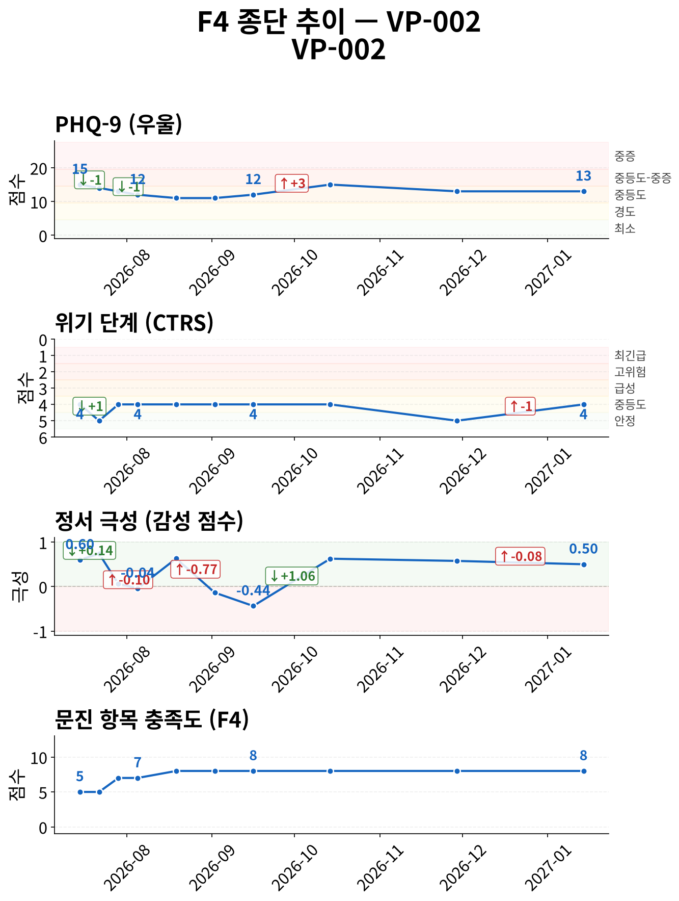
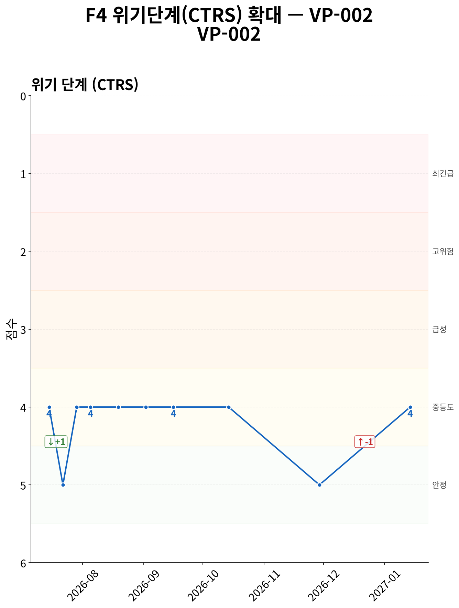
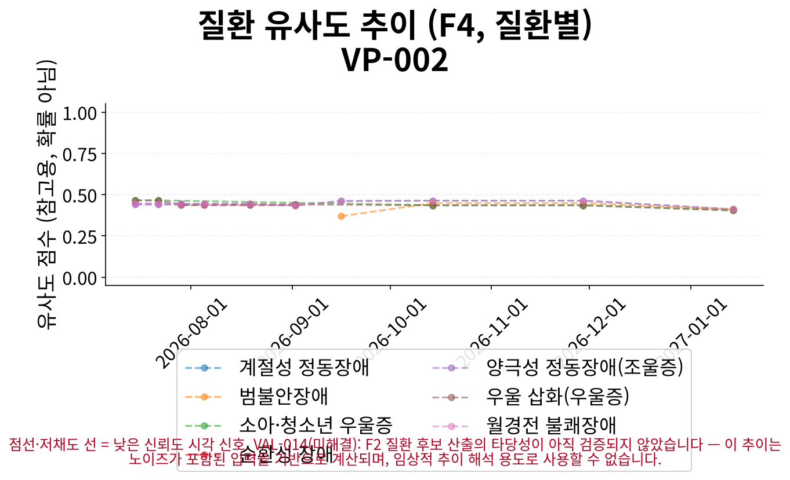
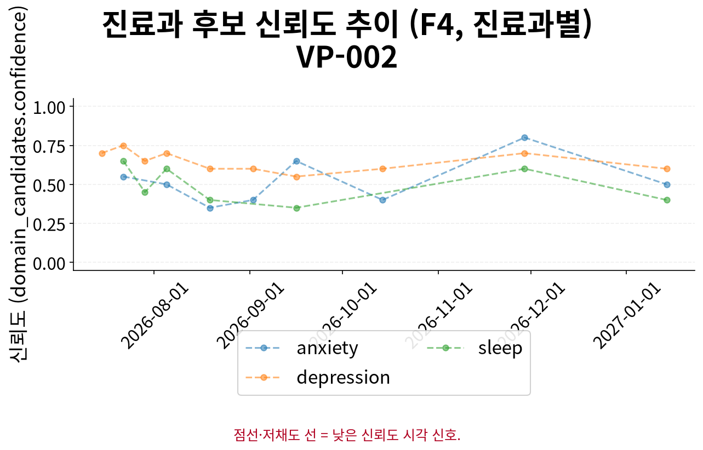

# F5 인계 요약 보고서 — VP-002

> **핵심 요약**
>
> - 환자: 이준호 (VP-002) — 10회차 (2027-01-14), 총 10세션 · 183일
> - 주호소: 새 학기 시작으로 인한 업무 몰림으로 약 복용 깜빡, 피로와 의욕 저하, 새로운 시작에 대한 막막함
> - 위험 플래그: 자살사고 문항 양성 이력 없음 (자가보고 기준)
> - 최신 설문: PHQ-9 13/27 (중등도) ↓ (15→13, 1회차 대비)
> - 주요 우려: 특이 우려 사항 없음

> **면책 조항**
>
> - 자가보고(AI 대화형 문진) 기반 비공식 문서이며 공식 의무기록·의학적 진단이 아닙니다.
> - AI 예상질환(하단)은 유사도 기반 참고 정보일 뿐 확률·가능성·진단이 아닙니다.
> - 최종 진단과 치료 방향은 반드시 의료진의 판단에 따라 결정되어야 합니다.

## 위험/안전 평가

당해 세션(10회차, 2027-01-14) 위험평가: 자살/자해 사고 탐색 질문에 부인 — 환자 발화: "아니요, 그런 생각은 전혀 없어요. 자살이나 자해하고 싶다는 생각은 한 번도 없었고, 지금도 전혀 그런 감정은 들지 않아요. 아… (상세 부록 1 참조). 위기 단계(CTRS) 4/5 — 경도 우려 (준안정).

해당 없음 — 전체 세션 중 item-9 양성/안전 의뢰 이력이 없습니다.

> 최신 시행 척도 안내: 당해 세션에 F3 문진이 시행되어 별도 최신성 안내가 필요하지 않습니다.

## 주호소 및 현병력

**주호소**: 새 학기 시작으로 인한 업무 몰림으로 약 복용 깜빡, 피로와 의욕 저하, 새로운 시작에 대한 막막함

**현병력**: 6주 전보다 나아져 새 학기 업무 감당 가능, 약 아침 꾸준히 복용, 가끔 깜빡하나 아내 챙김으로 괜찮음, 피로감 감소 및 퇴근 후 산책, 새로운 시작에 대한 막막함 지속

### 정신상태검사 (MSE)

텍스트 문진 특성상 관찰 기반 MSE는 평가 불가; 대화에서 도출된 소견 없음

## 전체 세션 요약

> 이 표의 값은 AI가 진행한 대화형 문진(F1)에서 환자가 자가보고한 내용이며, 임상의의 직접 평가나 검증된 척도 시행이 아닙니다.

| 슬롯 | 최신값 | 출처 | 변화 | 비고 |
|---|---|---|---|---|
| 주호소 | 새 학기 시작으로 인한 업무 몰림으로 약 복용 깜빡, 피로와 의욕 저하, 새로운 시작에 대한 막막함 | 7회차/2026-09-16 | 2회 변화 (S1→S7) · 상세 부록 참조 | A1 참조 (전문 서술) |
| 현병력 | 6주 전보다 나아져 새 학기 업무 감당 가능, 약 아침 꾸준히 복용, 가끔 깜빡하나 아내 챙김으로 괜찮음, 피로감 감소 및 퇴근 후 산책, 새로… (상세 부록 2 참조) | 10회차/2027-01-14 | 6회 변화 (S1→S3→S6→S7→S8→S10) · 상세 부록 참조 | A2 참조 (전문 서술) |
| 정신과 과거력 | 6주 전에 정신건강의학과를 처음 방문하여 경도 우울 진단을 받고 약을 시작함 | 5회차/2026-08-19 | - | - |
| 신체질환/신경학적 병력 | 아내는 고혈압이 있어서 약 드시고 계시고, 부모님은 당뇨 있으셔서 자주 챙기시는 편임 | 3회차/2026-07-29 | - | - |
| 개인사/사회력 | 아내가 약 챙겨주고 산책 함께 해줌 | 8회차/2026-10-14 | 3회 변화 (S1→S7→S8) · 상세 부록 참조 | - |
| 가족력 | 아내는 고혈압이 있어서 약 드시고 계시고, 부모님은 당뇨 있으셔서 자주 챙기시는 편임 | 3회차/2026-07-29 | - | - |
| 음주·흡연·물질사용 | 술은 거의 안 마시고 에시탈로프람 매일 아침 복용, 가끔 깜빡함 | 6회차/2026-09-02 | 3회 변화 (S1→S2→S6) · 상세 부록 참조 | - |
| 위험평가 | 자살/자해 사고 탐색 질문에 부인 — 환자 발화: "아니요, 그런 생각은 전혀 없어요. 자살이나 자해하고 싶다는 생각은 한 번도 없었고, 지금도… (상세 부록 3 참조) | 10회차/2027-01-14 | 7회 변화 (S1→S5→S6→S7→S8→S9→S10) · 상세 부록 참조 | A3 참조 (전문 서술 + 종단 위험 신호) |

**주요 경과**

- 위험평가: S1: '자살/자해 사고 탐색 질문에 부인 — 환자 발화: "아니요, 그런 생각은 전혀 없었어요. 아내가 많이 돌봐주…' → S7: '자살/자해 사고 탐색 질문에 부인 — 환자 발화: "아니요, 그런 생각은 전혀 없습니다. 아내가 요즘 제 상…' → S10: '자살/자해 사고 탐색 질문에 부인 — 환자 발화: "아니요, 그런 생각은 전혀 없어요. 자살이나 자해하고 싶…'
- 주호소: S1: '잠이 잘 오고 증상이 나아진 것 같아 다행이지만, 여전히 가끔 우울감이 있고 새로운 시작을 하는 데 어려움을…' → S7: '새 학기 시작으로 인한 업무 몰림으로 약 복용 깜빡, 피로와 의욕 저하, 새로운 시작에 대한 막막함'
- 현병력: S1: '6주 전 일이 너무 힘들어서 아무것도 하고 싶지 않았으나, 현재는 잠이 잘 오고 증상이 나아졌으며, 가끔 우…' → S7: '잠은 예전보다 잘 자는 편이나, 새 학기 시작으로 인한 업무 몰림으로 약 복용 깜빡, 피로와 의욕 저하, 가…' → S10: '6주 전보다 나아져 새 학기 업무 감당 가능, 약 아침 꾸준히 복용, 가끔 깜빡하나 아내 챙김으로 괜찮음,…'
- 개인사/사회력: S1: '아내가 많이 도와주고 있으며, 주말에는 같이 외식도 하고 있음' → S7: '새 학기 시작으로 업무 몰림' → S8: '아내가 약 챙겨주고 산책 함께 해줌'
- 음주·흡연·물질사용: S1: '술은 거의 안 마시고 있으며, 에스시탈로프람을 매일 아침에 복용하고 있으나 가끔 깜빡함' → S2: '술은 거의 안 마시고 있으며, 에시탈로프람을 매일 아침에 복용하고 있으나 가끔 깜빡함' → S6: '술은 거의 안 마시고 에시탈로프람 매일 아침 복용, 가끔 깜빡함'

## 시행된 설문

> AI가 진행한 대화형 문진 결과이며, 검증된 임상 설문 시행이 아닙니다.

**PHQ-9 13/27 (중등도)** — 10회차 (2027-01-14)

- 응답: 2,2,2,2,2,1,2,0,0
- 자살사고 문항(9번): 음성
- 문진 방식: natural

## 종단 추세

전체 방향: **악화** (10세션, 183일)

> 전체 방향은 척도·위기단계·정서 방향의 다수결로 계산되며, 악화 신호가 하나라도 있으면 악화로 우선 판정합니다. 정서 포함 여부에 따라 결과가 달라질 수 있습니다.

| 항목 | 방향 | 근거 |
|---|---|---|
| PHQ-9 총점 | 개선 | PHQ-9: 세션 1→10: 15 → 13 (-2) |
| 위기 단계(CTRS) | 변화 없음 | 세션 1→10: 4 → 4 (+0) |
| 감성 점수 | 악화 | 세션 1→10: 0.6 → 0.5 (-0.1) |
| 문진 항목 충족도 | 개선 | 세션 1→10: 5 → 8 (+3) |

위기 반응 발생 세션 없음
위험 고조 세션 중 설문 미시행 사례 없음
종단 추세 일관성(설문·CTRS·감성): 불일치

### 추세 차트

*그림 1. 설문 총점·위기 단계(CTRS)·정서·문진 충족도 추이 (10세션, 183일) — 위기 단계는 값이 낮을수록(1에 가까울수록) 위험이 높습니다.*

*그림 2. 위기 단계(CTRS) 확대 추이 — 1(최긴급)에 가까울수록 위험, 5(안정)에 가까울수록 안정적입니다.*

*그림 3. 세션별 질환 유사도 추이 — 점선·저채도 선은 참고용 유사도 신호일 뿐이며 확률·가능성·진단이 아닙니다.*

*그림 4. 세션별 진료과 후보 신뢰도 추이 — 값이 높을수록 해당 진료과 매칭 신뢰도가 높습니다.*

## AI 참고 정보 (비진단)

> ⚠ 유사도(similarity)일 뿐 확률·가능성·신뢰도가 아닙니다 — 임상 판단 대체 불가.

| 순위 | 질환 | 유사도 |
|---|---|---|
| 공동 1위 | 계절성 정동장애 | 0.411 |
| 공동 1위 | 월경전 불쾌장애 | 0.411 |
| 3 | 범불안장애 | 0.410 |

기타 후보: 우울 삽화(우울증)(0.404), 소아·청소년 우울증(0.404)

> 이 정보는 AI가 생성한 참고용 예상 질환 후보이며 의학적 진단이 아닙니다. 함께 제공되는 설문 추천(recommended_questionnaire) 역시 초기 상담(인테이크) 지원을 위한 척도 제안일 뿐, 진단적 판단이 아닙니다. 최종 진단과 치료 방향은 반드시 의료진의 판단에 따라 결정되어야 합니다.
> 추천 설문: PHQ-9 — PHQ-9 screens depressive-symptom burden only, does not screen manic/hypomanic symptoms — bipolar-spectrum presentations need clinician follow-up regardless of score.

## 권장 진료과 및 후속 조치

| 진료과 | 사유 |
|---|---|
| 정신건강의학과 | 우울, 불안, 수면 문제 등 정신건강 관련 증상이 복합적으로 나타나며, 현재 항우울제 복용 중으로 지속적인 모니터링이 필요함 |

추천 설문: PHQ-9 — PHQ-9 screens depressive-symptom burden only, does not screen manic/hypomanic symptoms — bipolar-spectrum presentations need clinician follow-up regardless of score.

> 약물 정보: 별도 구조화 항목 없음, HPI/병력 서술 포함 여부만 확인

## 임상 종합 소견

AI 종합 소견 미생성 (narrative disabled)

## 상세 부록

**1. 위험평가 발화 원문 (당해 세션)**

자살/자해 사고 탐색 질문에 부인 — 환자 발화: "아니요, 그런 생각은 전혀 없어요. 자살이나 자해하고 싶다는 생각은 한 번도 없었고, 지금도 전혀 그런 감정은 들지 않아요. 아내가 많이 도와줘..."

**2. 현병력 최신값 전문**

6주 전보다 나아져 새 학기 업무 감당 가능, 약 아침 꾸준히 복용, 가끔 깜빡하나 아내 챙김으로 괜찮음, 피로감 감소 및 퇴근 후 산책, 새로운 시작에 대한 막막함 지속

**3. 위험평가 최신값 전문**

자살/자해 사고 탐색 질문에 부인 — 환자 발화: "아니요, 그런 생각은 전혀 없어요. 자살이나 자해하고 싶다는 생각은 한 번도 없었고, 지금도 전혀 그런 감정은 들지 않아요. 아내가 많이 도와줘..."

### 슬롯별 전체 변화 이력 (미압축)

**주호소**

S1: '잠이 잘 오고 증상이 나아진 것 같아 다행이지만, 여전히 가끔 우울감이 있고 새로운 시작을 하는 데 어려움을 겪고 있음' → S7: '새 학기 시작으로 인한 업무 몰림으로 약 복용 깜빡, 피로와 의욕 저하, 새로운 시작에 대한 막막함'

**현병력**

S1: '6주 전 일이 너무 힘들어서 아무것도 하고 싶지 않았으나, 현재는 잠이 잘 오고 증상이 나아졌으며, 가끔 우울감이 있고 새로운 시작을 하는 데 어려움을 겪고 있음' → S3: '약 복용 6주 경과, 우울감 감소, 주말 외식 및 퇴근 후 산책 가능' → S6: '잠이 30분 내 입면으로 개선되었으나 새 학기 시작으로 인한 긴장감 지속, 아내의 도움으로 주말 외출 및 산책 가능, 새로운 시작에 대한 어려움 호소' → S7: '잠은 예전보다 잘 자는 편이나, 새 학기 시작으로 인한 업무 몰림으로 약 복용 깜빡, 피로와 의욕 저하, 가끔 우울감 있으나 횟수는 감소, 아내의 약 복용 챙김과 산책 및 대화로 기분 개선' → S8: '약 복용 6주 경과 후 우울한 기분 감소, 주말 기분 개선, 아내의 약 챙김과 산책으로 도움' → S10: '6주 전보다 나아져 새 학기 업무 감당 가능, 약 아침 꾸준히 복용, 가끔 깜빡하나 아내 챙김으로 괜찮음, 피로감 감소 및 퇴근 후 산책, 새로운 시작에 대한 막막함 지속'

**개인사/사회력**

S1: '아내가 많이 도와주고 있으며, 주말에는 같이 외식도 하고 있음' → S7: '새 학기 시작으로 업무 몰림' → S8: '아내가 약 챙겨주고 산책 함께 해줌'

**음주·흡연·물질사용**

S1: '술은 거의 안 마시고 있으며, 에스시탈로프람을 매일 아침에 복용하고 있으나 가끔 깜빡함' → S2: '술은 거의 안 마시고 있으며, 에시탈로프람을 매일 아침에 복용하고 있으나 가끔 깜빡함' → S6: '술은 거의 안 마시고 에시탈로프람 매일 아침 복용, 가끔 깜빡함'

**위험평가**

S1: '자살/자해 사고 탐색 질문에 부인 — 환자 발화: "아니요, 그런 생각은 전혀 없었어요. 아내가 많이 돌봐주고, 주말에는 같이 외식도 하다 보니 기분도 조금씩 나아지고 있어요."' → S5: '자살/자해 사고 탐색 질문에 부인 — 환자 발화: "네, 감사합니다. 아내가 많이 신경 써줘서 술도 거의 안 마시고, 주말엔 같이 외식도 가고 산책도 할 수 있게 되었어요. 아직 새로운 일을 시작..."' → S6: '자살/자해 사고 탐색 질문에 부인 — 환자 발화: "네, 긴장은 조금 있지만 예전보다는 훨씬 나아졌어요. 새 학기라 긴장되는 건 사실이에요. 예전에 담임과 생활지도부를 동시에 하게 될 때 힘들었던..."' → S7: '자살/자해 사고 탐색 질문에 부인 — 환자 발화: "아니요, 그런 생각은 전혀 없습니다. 아내가 요즘 제 상태를 잘 살펴줘서 그런지, 외출도 하고 산책도 하면서 조금씩 다시 움직이고 있어요. 그래..."' → S8: '자살/자해 사고 탐색 질문에 부인 — 환자 발화: "아니요, 그런 생각은 전혀 없어요. 오히려 요즘 아내와 산책 나가거나 동료랑 점심 먹을 때 기분이 조금씩 풀리는 게 느껴지니까 그런 생각은 전혀..."' → S9: '자살/자해 사고 탐색 질문에 부인 — 환자 발화: "아니요, 그런 생각은 전혀 없어요. 자해하고 싶다거나 그런 생각은 전혀 없고, 지금은 아내와 산책도 하고 기분도 조금씩 나아지고 있어서 괜찮아요..."' → S10: '자살/자해 사고 탐색 질문에 부인 — 환자 발화: "아니요, 그런 생각은 전혀 없어요. 자살이나 자해하고 싶다는 생각은 한 번도 없었고, 지금도 전혀 그런 감정은 들지 않아요. 아내가 많이 도와줘..."'

## 각주

모델: solar-pro3-260323 · 생성 시각: 2026-07-15T17:31:00.011685 · 세션ID: f1_VP-002_followup
설문 문항 출처: v1, verbatim Pfizer/phqscreeners.com Korean PHQ-9 PDF, retrieved 2026-07-13 (item_bank_v1_sources.md §1.2/§1.3, appendix §A1); translation chosen per ADR-033 decision 1 (Seo & Park 2015's Korean validation study administered this same translation)

### 시스템 참고 (내부 감사용, 임상 판단 근거 아님)

종단 추세 판정 근거: overall_direction은 세션별 척도/CTRS/sentiment 방향의 다수결(worsened-priority)로 계산되며(src.f4::_overall_direction), sentiment 포함 여부에 따라 verdict가 달라질 수 있습니다(REV-045 row 2) — 세부 근거는 trend_verdicts의 evidence를 참고하십시오.
