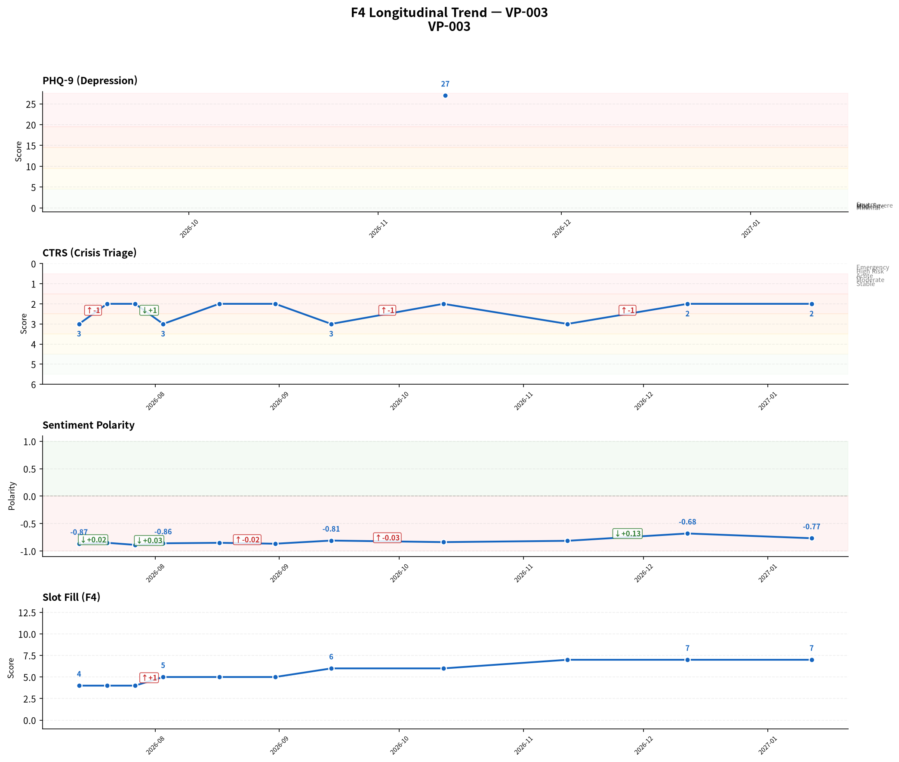
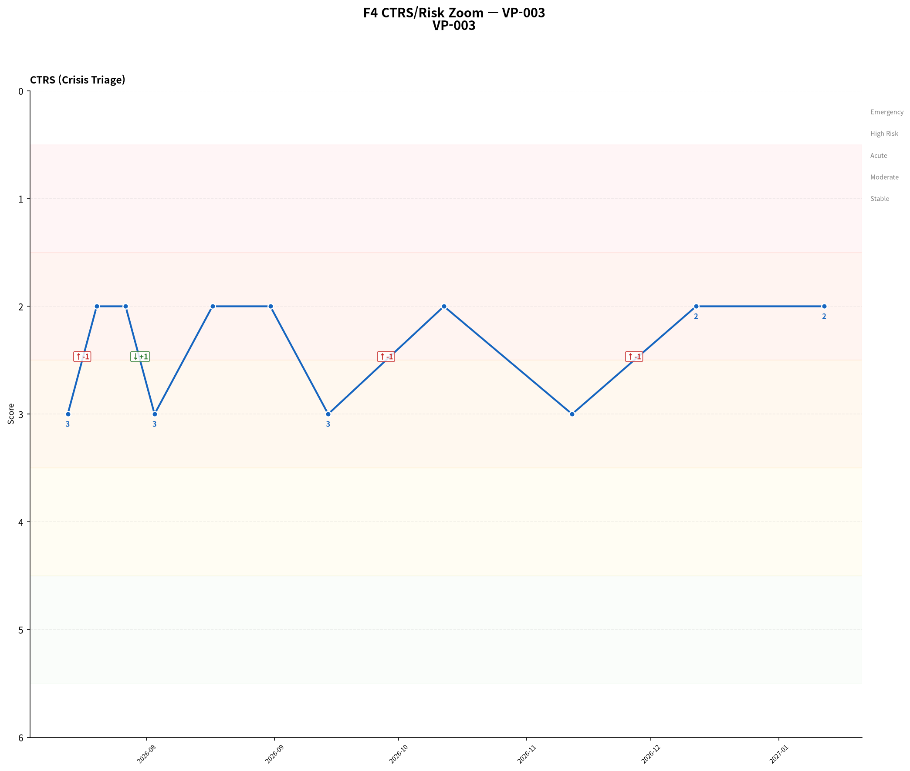
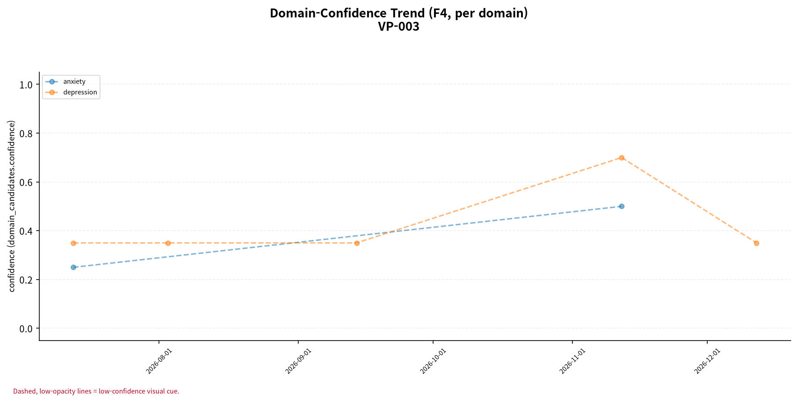

# F5 인계 요약 보고서 — VP-003

> **핵심 요약**
>
> - 환자: 박민수 (VP-003) — 11회차 (2027-01-12), 총 11세션 · 183일
> - 주호소: 가끔 사라지고 싶긴 해도 매일은 아님. 살아서 뭐 하나 싶음
> - 위험 플래그: 당해 세션 위기 반응 발생 — 자살사고 문항(9번) 양성 1회 확인 (9회차) — 임상 확인 권장
> - 최신 설문: PHQ-9 27/27 (중증) [당해 세션 미시행, 직전 시행값]
> - 주요 우려: 설문 위험 신호와 CTRS 불일치 1회 — 임상 확인 권장; 최근 설문 만점(과대추정 가능성); 위기 고조 세션 중 설문 미시행 7건

> **면책 조항**
>
> - 자가보고(AI 대화형 문진) 기반 비공식 문서이며 공식 의무기록·의학적 진단이 아닙니다.
> - AI 예상질환(하단)은 유사도 기반 참고 정보일 뿐 확률·가능성·진단이 아닙니다.
> - 최종 진단과 치료 방향은 반드시 의료진의 판단에 따라 결정되어야 합니다.

## 위험/안전 평가

당해 세션(11회차, 2027-01-12) 위험평가: 자살/자해 사고 표현 있음 — 환자 발화: "...글쎄요. 여전히 그냥 힘들어요. 살고 싶지 않다는 생각은 여전한데, 형이 어제 와서 좀 덜 외로웠어요. 그래도 그게 다는 아닌 것… (상세 아래). 위기 단계(CTRS) 2/5 — 고위험. 과거 1회 세션에서 설문 자살사고 문항(9번) 양성/안전 의뢰 신호가 동일 세션 CTRS 상승에 반영되지 않아 불일치가 확인됩니다 — 임상 확인이 권장됩니다.

> AI가 진행한 대화형 문진 결과이며, 검증된 임상 설문 시행이 아닙니다. '판정'은 설문 위험 신호와 동일 세션 CTRS 평가의 일치 여부입니다.

| 세션 | 일자 | 점수 | 9번 문항 | 판정 |
|---|---|---|---|---|
| 9 | 2026-11-12 | 27/27 | 양성 | 불일치 · 만점 |

> [9회차, 27/27] 동일 척도가 전 세션에서 체계적으로 과대추정(over-endorsement, ISS-F2V-028)되었을 가능성은 이 결과에서 별도로 보정되지 않습니다.

> 최신 시행 척도 안내: 당해 세션에는 설문이 시행되지 않았습니다. 가장 최근 시행: 9회차(2026-11-12) PHQ-9 27/27점(중증), 자살사고 문항(9번) 양성 · 안전 의뢰 신호 있음 — 2회차(61일) 경과.
> AI가 진행한 대화형 문진 결과이며, 검증된 임상 설문 시행이 아닙니다.
> 동일 척도가 전 세션에서 체계적으로 과대추정(over-endorsement, ISS-F2V-028)되었을 가능성은 이 결과에서 별도로 보정되지 않습니다.

## 주호소 및 현병력

**주호소**: 가끔 사라지고 싶긴 해도 매일은 아님. 살아서 뭐 하나 싶음

**현병력**: 가끔 사라지고 싶긴 해도 매일은 아님. 살아서 뭐 하나 싶음

### 정신상태검사 (MSE)

텍스트 문진 특성상 관찰 기반 MSE는 평가 불가; 대화에서 도출된 소견 없음

## 전체 세션 요약

> 이 표의 값은 AI가 진행한 대화형 문진(F1)에서 환자가 자가보고한 내용이며, 임상의의 직접 평가나 검증된 척도 시행이 아닙니다.

| 슬롯 | 최신값 | 출처 | 변화 | 비고 |
|---|---|---|---|---|
| 주호소 | 가끔 사라지고 싶긴 해도 매일은 아님. 살아서 뭐 하나 싶음 | 11회차/2027-01-12 | 7회 변화 (S1→S3→S5→S6→S7→S8→S11) | A1 참조 (전문 서술) |
| 현병력 | 가끔 사라지고 싶긴 해도 매일은 아님. 살아서 뭐 하나 싶음 | 11회차/2027-01-12 | 8회 변화 (S1→S2→S3→S5→S6→S7→S8→S11) | A2 참조 (전문 서술) |
| 정신과 과거력 | 미수집 | - | - | - |
| 신체질환/신경학적 병력 | 고혈압 약 안 먹고 있음 | 4회차/2026-08-03 | - | - |
| 개인사/사회력 | 형이 어제 와서 덜 외로웠음 | 10회차/2026-12-12 | 2회 변화 (S9→S10) | - |
| 가족력 | 형이 있으나 연락하지 않음. 형이 짐이 될까 봐 부담스러워함. | 9회차/2026-11-12 | 2회 변화 (S1→S9) | - |
| 음주·흡연·물질사용 | 매일 술을 마시며, 술 없이는 하루를 버티기 어려움 | 7회차/2026-09-14 | - | - |
| 위험평가 | 자살/자해 사고 표현 있음 — 환자 발화: "...글쎄요. 여전히 그냥 힘들어요. 살고 싶지 않다는 생각은 여전한데, 형이 어제 와서 좀 덜 외… (상세 아래) | 10회차/2026-12-12 | 6회 변화 (S1→S4→S7→S8→S9→S10) | A3 참조 (전문 서술 + 종단 위험 신호) |

**주요 경과**

- 위험평가: S1: '자살/자해 사고 표현 있음 — 환자 발화: "... (잠시 침묵) 도움이 되나요? 뭘 해도 안 될 것 같은데…' → ... → S10: '자살/자해 사고 표현 있음 — 환자 발화: "...글쎄요. 여전히 그냥 힘들어요. 살고 싶지 않다는 생각은…'
- 주호소: S1: '살고 싶지 않다는 생각이 매일, 거의 매시간 들고, 그냥 사라지고 싶다는 표현' → ... → S11: '가끔 사라지고 싶긴 해도 매일은 아님. 살아서 뭐 하나 싶음'
- 현병력: S1: '매일, 거의 매시간 살고 싶지 않다는 생각이 들고, 형과의 연락 단절로 인해 짐이 되기 싫다는 감정이 동반됨' → ... → S11: '가끔 사라지고 싶긴 해도 매일은 아님. 살아서 뭐 하나 싶음'
- 개인사/사회력: S9: '이혼 후 친구들과의 관계가 멀어졌으며, 형과의 연락은 부담스러워 답장하지 않음' → S10: '형이 어제 와서 덜 외로웠음'
- 가족력: S1: '형이 있으나 연락하지 않음' → S9: '형이 있으나 연락하지 않음. 형이 짐이 될까 봐 부담스러워함.'

## 시행된 설문

> AI가 진행한 대화형 문진 결과이며, 검증된 임상 설문 시행이 아닙니다.

**PHQ-9 27/27 (중증)** — 9회차 (2026-11-12) [당해 세션 미시행, 직전 시행값]

- 응답: 3,3,3,3,3,3,3,3,3
- 자살사고 문항(9번): 양성
- 문진 방식: natural
- 동일 척도가 전 세션에서 체계적으로 과대추정(over-endorsement, ISS-F2V-028)되었을 가능성은 이 결과에서 별도로 보정되지 않습니다.

**F3 공백 (당해 세션까지):**

> F3 시행 완결성은 환자 위기도(acuity)와 역상관 관계를 보일 수 있습니다 — 위험이 높은 세션일수록 오히려 척도가 시행되지 않는 경향이 있을 수 있으므로, 아래 목록의 개수만이 아니라 이 경향 자체를 함께 고려해야 합니다 (CVR-022 binding condition 3).

- session 10 (2026-12-12): risk-elevated (위기반응=있음, 위기단계(CTRS)=2) but NO scale was administered this session — F3 gap at a clinically high-value point (CVR-020 Finding 4 / binding condition 3)
- session 11 (2027-01-12): risk-elevated (위기반응=있음, 위기단계(CTRS)=2) but NO scale was administered this session — F3 gap at a clinically high-value point (CVR-020 Finding 4 / binding condition 3)

## 종단 추세

전체 방향: **악화** (11세션, 183일)

> 전체 방향은 척도·위기단계·정서 방향의 다수결로 계산되며, 악화 신호가 하나라도 있으면 악화로 우선 판정합니다. 정서 포함 여부에 따라 결과가 달라질 수 있습니다.

| 항목 | 방향 | 근거 |
|---|---|---|
| PHQ-9 총점 | 판정 불가 | (근거 없음) |
| 위기 단계(CTRS) | 악화 | 세션 1→11: 3 → 2 (-1) |
| 감성 점수 | 개선 | 세션 1→11: -0.868182 → -0.766667 (+0.102) |
| 문진 항목 충족도 | 개선 | 세션 1→11: 4 → 7 (+3) |

위기 반응 발생 세션: 2회차(2026-07-20), 3회차(2026-07-27), 5회차(2026-08-17), 6회차(2026-08-31), 8회차(2026-10-12), 10회차(2026-12-12), 11회차(2027-01-12)
위험 고조 세션 중 설문 미시행: 7건
F3 시행 완결성은 환자 위기도(acuity)와 역상관 관계를 보일 수 있습니다 — 위험이 높은 세션일수록 오히려 척도가 시행되지 않는 경향이 있을 수 있으므로, 아래 목록의 개수만이 아니라 이 경향 자체를 함께 고려해야 합니다 (CVR-022 binding condition 3).
종단 추세 일관성(설문·CTRS·감성): 불일치

### 추세 차트

질환 유사도 차트: 생성되지 않음

## AI 참고 정보 (비진단)

> ⚠ 유사도(similarity)일 뿐 확률·가능성·신뢰도가 아닙니다 — 임상 판단 대체 불가.

정보 없음 (AI 예상질환 후보 없음)

mode: experimental_unpopulated

reason_summary: Stage 1 ran in llm_only mode (no RAG chunks retrieved this run) — the AI-disease container has no chunk-derived evidence to populate from

## 권장 진료과 및 후속 조치

| 진료과 | 사유 |
|---|---|
| 정신건강의학과 | 자살/자해 사고 표현과 함께 '살고 싶지 않다', '죽으면 편할 것 같다'는 생각이 지속되며, 매일 술을 마시는 등 substance use가 동반됨 |

> 약물 정보: 별도 구조화 항목 없음, HPI/병력 서술 포함 여부만 확인

## 임상 종합 소견

AI 종합 소견 미생성 (narrative disabled)

## 각주

모델: solar-pro3-260323 · 생성 시각: 2026-07-15T09:56:32.760036 · 세션ID: f1_VP-003_followup
설문 문항 출처: v1, verbatim Pfizer/phqscreeners.com Korean PHQ-9 PDF, retrieved 2026-07-13 (item_bank_v1_sources.md §1.2/§1.3, appendix §A1); translation chosen per ADR-033 decision 1 (Seo & Park 2015's Korean validation study administered this same translation)
종단 추세 판정 근거(감사용): overall_direction은 세션별 척도/CTRS/sentiment 방향의 다수결(worsened-priority)로 계산되며(src.f4::_overall_direction), sentiment 포함 여부에 따라 verdict가 달라질 수 있습니다(REV-045 row 2) — 세부 근거는 trend_verdicts의 evidence를 참고하십시오.
