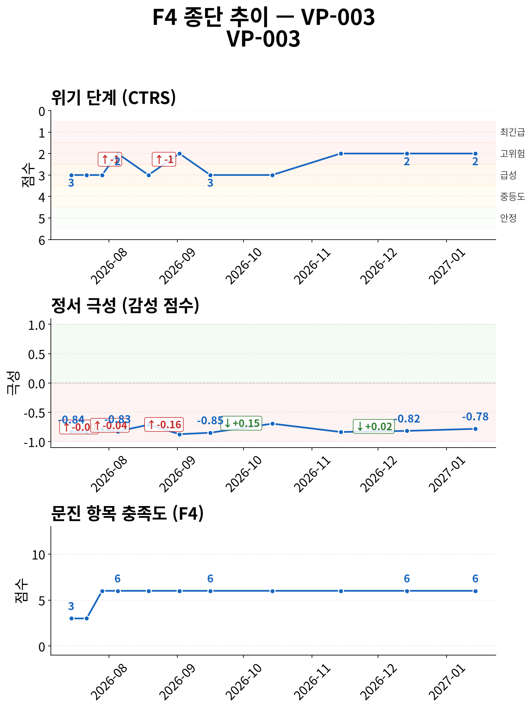
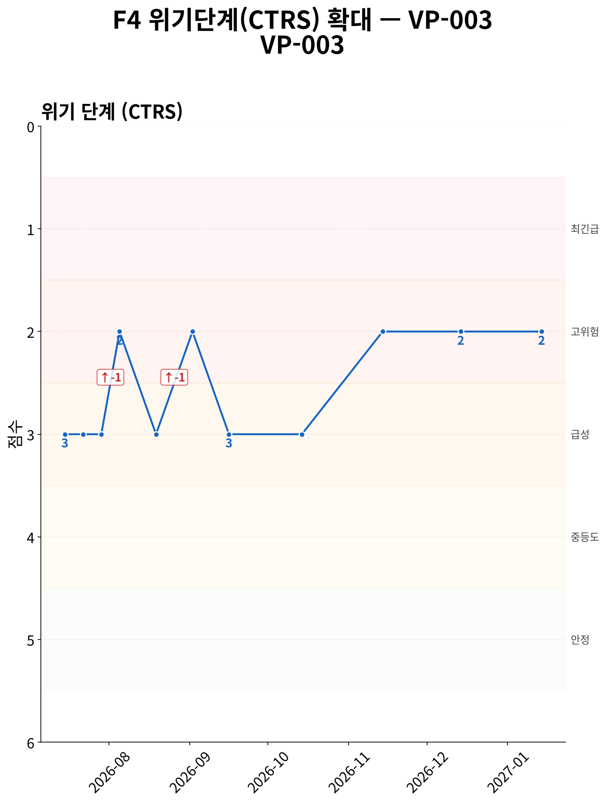
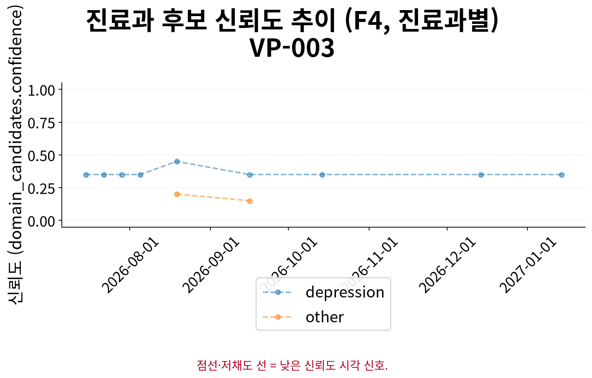

# F5 인계 요약 보고서 — VP-003

> **핵심 요약**
>
> - 환자: 박민수 (VP-003) — 11회차 (2027-01-14), 총 11세션 · 183일
> - 주호소: 사라지고 싶다는 생각이 자주 들며, 죽으면 편할 것 같다는 표현
> - 위험 플래그: 당해 세션 위기 반응 발생 — 자살사고 문항 양성 이력 없음 (자가보고 기준)
> - 최신 설문: 시행된 설문 없음
> - 주요 우려: 위기 고조 세션 중 설문 미시행 5건

> **면책 조항**
>
> - 자가보고(AI 대화형 문진) 기반 비공식 문서이며 공식 의무기록·의학적 진단이 아닙니다.
> - AI 예상질환(하단)은 유사도 기반 참고 정보일 뿐 확률·가능성·진단이 아닙니다.
> - 최종 진단과 치료 방향은 반드시 의료진의 판단에 따라 결정되어야 합니다.

## 위험/안전 평가

당해 세션(11회차, 2027-01-14) 위험평가: 자살/자해 사고 표현 있음 — 환자 발화: "...형이랑은 전혀 몰라요. 그냥... 혼자인 게 익숙해요. 도움이 되나요? 뭘 해도 안 될 것 같은데."; 구체적 계획/의도 부인 —… (상세 부록 1 참조). 위기 단계(CTRS) 2/5 — 고위험.

해당 없음 — 전체 세션 중 item-9 양성/안전 의뢰 이력이 없습니다.

> 최신 시행 척도 안내: 당해 세션에 F3 문진이 시행되지 않았고, 이 환자의 이전 세션 중에도 시행된 문진 이력이 없습니다 — 참조할 과거 척도 결과가 없습니다.

## 주호소 및 현병력

**주호소**: 사라지고 싶다는 생각이 자주 들며, 죽으면 편할 것 같다는 표현

**현병력**: 매일 하루 종일 사라지고 싶다는 생각이 들며, 죽으면 편할 것 같다는 표현이 반복됨. '내가 다 망쳤다'는 생각이 이혼, 회사, 형과의 연락 등 모든 일에 대해 지속되고, 쓸모없는 사람이라는 죄책감과 아무도 날 원하지 않는다는 느낌이 동반됨

### 정신상태검사 (MSE)

텍스트 문진 특성상 관찰 기반 MSE는 평가 불가; 대화에서 도출된 소견 없음

## 전체 세션 요약

> 이 표의 값은 AI가 진행한 대화형 문진(F1)에서 환자가 자가보고한 내용이며, 임상의의 직접 평가나 검증된 척도 시행이 아닙니다.

| 슬롯 | 최신값 | 출처 | 변화 | 비고 |
|---|---|---|---|---|
| 주호소 | 사라지고 싶다는 생각이 자주 들며, 죽으면 편할 것 같다는 표현 | 9회차/2026-11-14 | 5회 변화 (S1→S4→S5→S6→S9) · 상세 부록 참조 | A1 참조 (전문 서술) |
| 현병력 | 매일 하루 종일 사라지고 싶다는 생각이 들며, 죽으면 편할 것 같다는 표현이 반복됨. '내가 다 망쳤다'는 생각이 이혼, 회사, 형과의 연락 등… (상세 부록 2 참조) | 10회차/2026-12-14 | 5회 변화 (S1→S4→S6→S9→S10) · 상세 부록 참조 | A2 참조 (전문 서술) |
| 정신과 과거력 | 미수집 | - | - | - |
| 신체질환/신경학적 병력 | 고혈압이 있는데 약은 안 먹어요 | 3회차/2026-07-29 | - | - |
| 개인사/사회력 | 형과의 짧은 연락 외에는 아무것도 안 하고 방에만 있으며, TV도 집중 안 됨 | 3회차/2026-07-29 | - | - |
| 가족력 | 미수집 | - | - | - |
| 음주·흡연·물질사용 | 술은 안 마시면 못 버텨요 | 4회차/2026-08-05 | 2회 변화 (S3→S4) · 상세 부록 참조 | - |
| 위험평가 | 자살/자해 사고 표현 있음 — 환자 발화: "...형이랑은 전혀 몰라요. 그냥... 혼자인 게 익숙해요. 도움이 되나요? 뭘 해도 안 될 것 같… (상세 부록 3 참조) | 11회차/2027-01-14 | 9회 변화 (S1→S2→S3→S4→S5→S7→S8→S10→S11) · 상세 부록 참조 | A3 참조 (전문 서술 + 종단 위험 신호) |

**주요 경과**

- 위험평가: S1: '자살/자해 사고 표현 있음 — 환자 발화: "형은 있는데... 짐이 되기 싫어서 연락도 안 해요. ... 도…' → S5: '자살/자해 사고 표현 있음 — 환자 발화: "... 사라지고 싶은 건, 어제부터가 아니라... 거의 매일이에…' → S11: '자살/자해 사고 표현 있음 — 환자 발화: "...형이랑은 전혀 몰라요. 그냥... 혼자인 게 익숙해요. 도…'
- 주호소: S1: '사라지고 싶은 생각이 거의 매일 든다' → S5: '숨이 막혀요. 실업급여 끝나는 거 생각하면 사라지고 싶어요' → S9: '사라지고 싶다는 생각이 자주 들며, 죽으면 편할 것 같다는 표현'
- 현병력: S1: '사라지고 싶은 생각이 거의 매일 지속되며, 형이 있음에도 불구하고 짐이 될까 봐 연락도 못 하고 있다' → S6: '실업급여가 끊긴 이후 미래에 대한 불확실성과 함께 사라지고 싶다는 생각이 예전보다 더 자주 들고, 죽으면 편…' → S10: '매일 하루 종일 사라지고 싶다는 생각이 들며, 죽으면 편할 것 같다는 표현이 반복됨. '내가 다 망쳤다'는…'
- 음주·흡연·물질사용: S3: '오늘도 아침에 소주 한 병 마셨어요' → S4: '술은 안 마시면 못 버텨요'

## 시행된 설문

정보 없음 (전체 세션 중 시행된 설문 없음)

## 종단 추세

전체 방향: **악화** (11세션, 183일)

> 전체 방향은 척도·위기단계·정서 방향의 다수결로 계산되며, 악화 신호가 하나라도 있으면 악화로 우선 판정합니다. 정서 포함 여부에 따라 결과가 달라질 수 있습니다.

| 항목 | 방향 | 근거 |
|---|---|---|
| 위기 단계(CTRS) | 악화 | 세션 1→11: 3 → 2 (-1) |
| 감성 점수 | 개선 | 세션 1→11: -0.836364 → -0.783333 (+0.053) |
| 문진 항목 충족도 | 개선 | 세션 1→11: 3 → 6 (+3) |

위기 반응 발생 세션: 4회차(2026-08-05), 6회차(2026-09-02), 9회차(2026-11-14), 10회차(2026-12-14), 11회차(2027-01-14)
위험 고조 세션 중 설문 미시행: 5건
F3 시행 완결성은 환자 위기도(acuity)와 역상관 관계를 보일 수 있습니다 — 위험이 높은 세션일수록 오히려 척도가 시행되지 않는 경향이 있을 수 있으므로, 아래 목록의 개수만이 아니라 이 경향 자체를 함께 고려해야 합니다.
종단 추세 일관성(설문·CTRS·감성): 불일치

### 추세 차트

*그림 1. 설문 총점·위기 단계(CTRS)·정서·문진 충족도 추이 (11세션, 183일) — 위기 단계는 값이 낮을수록(1에 가까울수록) 위험이 높습니다.*

*그림 2. 위기 단계(CTRS) 확대 추이 — 1(최긴급)에 가까울수록 위험, 5(안정)에 가까울수록 안정적입니다.*

질환 유사도 차트: 생성되지 않음

*그림 3. 세션별 진료과 후보 신뢰도 추이 — 값이 높을수록 해당 진료과 매칭 신뢰도가 높습니다.*

## AI 참고 정보 (비진단)

> ⚠ 유사도(similarity)일 뿐 확률·가능성·신뢰도가 아닙니다 — 임상 판단 대체 불가.

정보 없음 (AI 예상질환 후보 없음)

mode: experimental_unpopulated

사유: 1단계 분석이 RAG(근거 검색) 없이 대화 기반으로만 진행되어 질환 후보를 생성하지 못했습니다.

## 권장 진료과 및 후속 조치

| 진료과 | 사유 |
|---|---|
| 정신건강의학과 | 자살 사고, 지속적인 우울감, 죄책감, 수면 장애, 알코올 의존 등 우울증의 주요 증상이 확인됨 |

> 약물 정보: 별도 구조화 항목 없음, HPI/병력 서술 포함 여부만 확인

## 임상 종합 소견

AI 종합 소견 미생성 (narrative disabled)

## 상세 부록

**1. 위험평가 발화 원문 (당해 세션)**

자살/자해 사고 표현 있음 — 환자 발화: "...형이랑은 전혀 몰라요. 그냥... 혼자인 게 익숙해요. 도움이 되나요? 뭘 해도 안 될 것 같은데."; 구체적 계획/의도 부인 — 환자 발화: "어떻게까지는... 생각 안 했어요. 그냥 사라지고 싶은 거예요. 죽으면 편할 것 같아요."

**2. 현병력 최신값 전문**

매일 하루 종일 사라지고 싶다는 생각이 들며, 죽으면 편할 것 같다는 표현이 반복됨. '내가 다 망쳤다'는 생각이 이혼, 회사, 형과의 연락 등 모든 일에 대해 지속되고, 쓸모없는 사람이라는 죄책감과 아무도 날 원하지 않는다는 느낌이 동반됨

**3. 위험평가 최신값 전문**

자살/자해 사고 표현 있음 — 환자 발화: "...형이랑은 전혀 몰라요. 그냥... 혼자인 게 익숙해요. 도움이 되나요? 뭘 해도 안 될 것 같은데."; 구체적 계획/의도 부인 — 환자 발화: "어떻게까지는... 생각 안 했어요. 그냥 사라지고 싶은 거예요. 죽으면 편할 것 같아요."

### 슬롯별 전체 변화 이력 (미압축)

**주호소**

S1: '사라지고 싶은 생각이 거의 매일 든다' → S4: '살고 싶지 않다, 사라지고 싶다' → S5: '숨이 막혀요. 실업급여 끝나는 거 생각하면 사라지고 싶어요' → S6: '실업급여가 끊기고 앞으로 뭘 해야 할지 모르며, 사라지고 싶다는 생각이 자주 들어 죽으면 편할 것 같다는 표현' → S9: '사라지고 싶다는 생각이 자주 들며, 죽으면 편할 것 같다는 표현'

**현병력**

S1: '사라지고 싶은 생각이 거의 매일 지속되며, 형이 있음에도 불구하고 짐이 될까 봐 연락도 못 하고 있다' → S4: '거의 매일 살고 싶지 않다, 사라지고 싶다는 생각이 지속되며, 형이 있음에도 불구하고 짐이 될까 봐 연락도 못 하고 있다' → S6: '실업급여가 끊긴 이후 미래에 대한 불확실성과 함께 사라지고 싶다는 생각이 예전보다 더 자주 들고, 죽으면 편할 것 같다는 표현' → S9: '매일 사라지고 싶다는 생각이 들며, 죽으면 편할 것 같다는 표현이 반복됨' → S10: '매일 하루 종일 사라지고 싶다는 생각이 들며, 죽으면 편할 것 같다는 표현이 반복됨. '내가 다 망쳤다'는 생각이 이혼, 회사, 형과의 연락 등 모든 일에 대해 지속되고, 쓸모없는 사람이라는 죄책감과 아무도 날 원하지 않는다는 느낌이 동반됨'

**음주·흡연·물질사용**

S3: '오늘도 아침에 소주 한 병 마셨어요' → S4: '술은 안 마시면 못 버텨요'

**위험평가**

S1: '자살/자해 사고 표현 있음 — 환자 발화: "형은 있는데... 짐이 되기 싫어서 연락도 안 해요. ... 도움이 되나요? 뭘 해도 안 될 것 같은데."; 구체적 계획/의도 부인 — 환자 발화: "생각은 안 해봤어요. 그냥 사라지고 싶은 거예요. ... 도움이 되나요? 뭘 해도 안 될 것 같은데."' → S2: '자살/자해 사고 표현 있음 — 환자 발화: "... 지금 이 순간이 제일 무거워요. 사기보다... 사라지는 게 나을 것 같아요. ... 도움 되나요? ... 뭐 해도 안 될 것 같은데."; 구체적 계획/의도 부인 — 환자 발화: "... 형한테는 연락 안 해요. 짐이 될까 봐. ... 그냥... 내가 없어지는 게 낫겠죠."' → S3: '자살/자해 사고 표현 있음 — 환자 발화: "...도움이 되나요? 뭘 해도 안 될 것 같은데. 그래도... 전화라도 해볼까 싶기도 하고. ...모르겠어요."; 구체적 계획/의도 부인 — 환자 발화: "그냥... 숨 쉬는 것조차 힘들어요. 형이랑 통화한 거 말고는, 어제도 아무것도 안 했어요. 방에만 있고, TV도 집중 안 돼요. ...살아서 ..."' → S4: '자살/자해 사고 표현 있음 — 환자 발화: "...그냥요. 살고 싶지 않아요. 오늘은 그래도 이력서 몇 군데 넣긴 했는데, 뭐 하나... 해봤자 의미 없을 것 같아서. 잠은 어제보다 40분..."; 구체적 계획/의도 부인 — 환자 발화: "... 생각 안 했어요. 어떻게까지는... 생각 안 했어요. 그냥 사라지고 싶은 거예요. 죽으면 편할 것 같다, 싶은 거... 계속 들어요. 하..."' → S5: '자살/자해 사고 표현 있음 — 환자 발화: "... 사라지고 싶은 건, 어제부터가 아니라... 거의 매일이에요. 형한테도 말 못 해요. 짐이 될까 봐. ... 도움이 되나요?"; 구체적 계획/의도 부인 — 환자 발화: "어떻게까지는... 생각 안 했어요. 그냥 사라지고 싶은 거예요. 죽으면 편할 것 같아요."' → S7: '자살/자해 사고 표현 있음 — 환자 발화: "... 도움이 되나요? 뭘 해도 안 될 것 같다는 생각이 들어요. 지금 이대로면… 시간이 지나면 더 나아질까요? 아니면… 계속 이럴까요? ......"; 구체적 계획/의도 부인 — 환자 발화: "... 어떻게까지는… 생각 안 했어요. 그냥 사라지고 싶은 거예요. 죽으면 편할 것 같다는 생각만 계속 들어요. 구체적인 건 몰라요. 그냥… 여..."' → S8: '자살/자해 사고 표현 있음 — 환자 발화: "... 몰라요. 그때도 혼자였어요. 도와줄 사람도 없고, 뭐 해야 할지도 몰라서... 그냥... 그랬어요."; 구체적 계획/의도 부인 — 환자 발화: "아니요. 그런 건 없어요. 그냥... 사라지고 싶은 거예요. 죽으면 편할 것 같다. 어떻게까지는... 생각 안 했어요. 그냥."' → S10: '자살/자해 사고 표현 있음 — 환자 발화: "...네. 그냥 힘들어요."; 구체적 계획/의도 부인 — 환자 발화: "... "내가 다 망쳤다"는 생각이 계속 들어요. 이혼도, 회사도, 다 내가 잘못해서 생긴 일이라고요. 형한테도 연락 안 하는 건 내가 짐이 되..."' → S11: '자살/자해 사고 표현 있음 — 환자 발화: "...형이랑은 전혀 몰라요. 그냥... 혼자인 게 익숙해요. 도움이 되나요? 뭘 해도 안 될 것 같은데."; 구체적 계획/의도 부인 — 환자 발화: "어떻게까지는... 생각 안 했어요. 그냥 사라지고 싶은 거예요. 죽으면 편할 것 같아요."'

## 각주

모델: solar-pro3-260323 · 생성 시각: 2026-07-15T17:31:01.099445 · 세션ID: f1_VP-003_followup

### 시스템 참고 (내부 감사용, 임상 판단 근거 아님)

종단 추세 판정 근거: overall_direction은 세션별 척도/CTRS/sentiment 방향의 다수결(worsened-priority)로 계산되며(src.f4::_overall_direction), sentiment 포함 여부에 따라 verdict가 달라질 수 있습니다(REV-045 row 2) — 세부 근거는 trend_verdicts의 evidence를 참고하십시오.
CVR-022 binding condition 3
