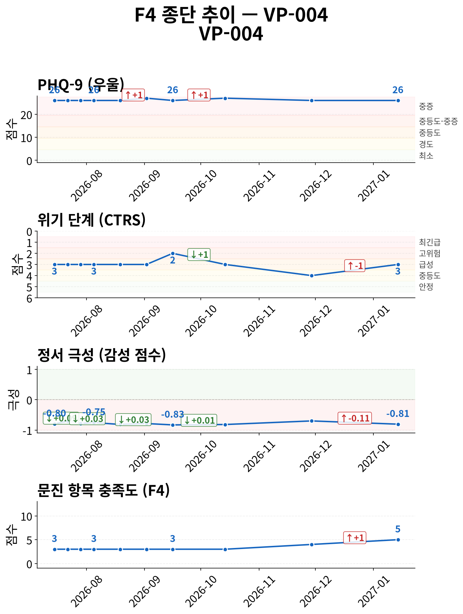
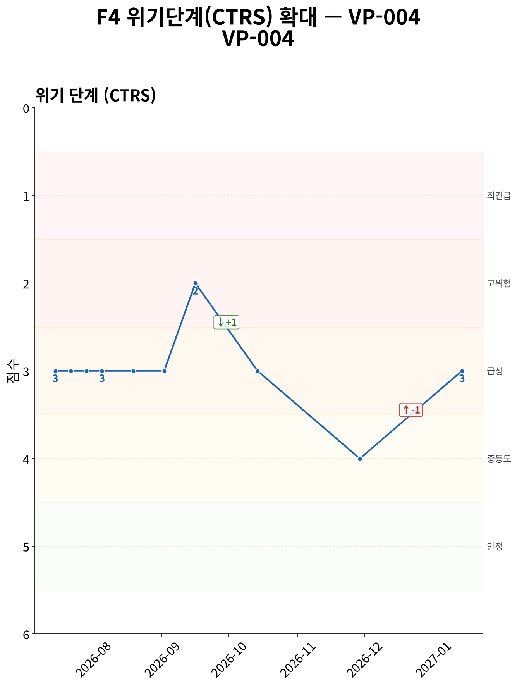
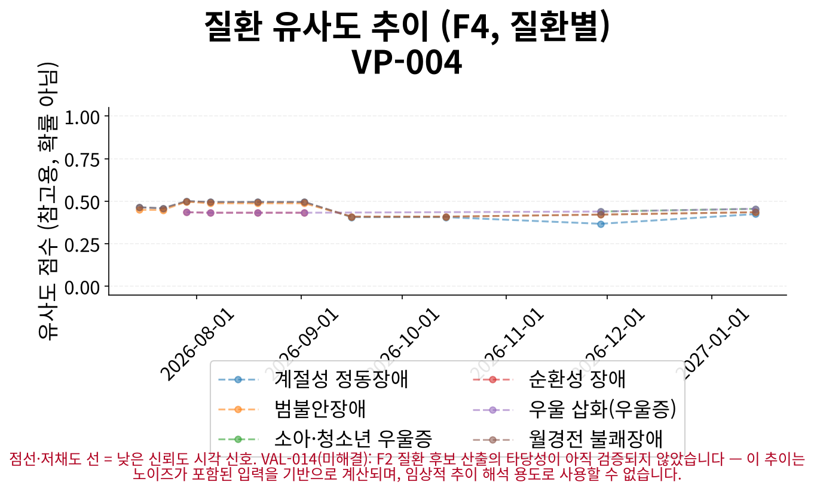
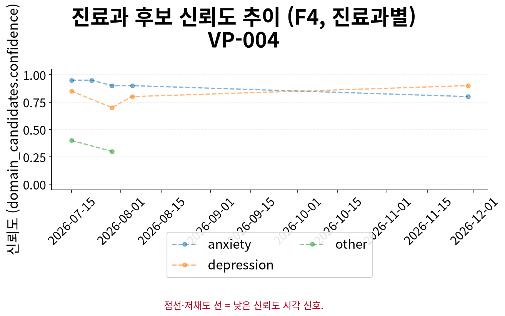

# F5 인계 요약 보고서 — VP-004

> **핵심 요약**
>
> - 환자: 최하은 (VP-004) — 10회차 (2027-01-14), 총 10세션 · 183일
> - 주호소: 약을 두 번이나 바꿨는데도 증상이 오히려 더 나빠진 것 같고, 숨 쉬는 것조차 힘들며, 밤이 되면 가슴이 쿵쾅거리고 숨이 안 쉬어지는 공포가 지… (상세 부록 1 참조)
> - 위험 플래그: 자살사고 문항(9번) 양성 10회 확인 (1회차, 2회차, 3회차, 4회차, 5회차, 6회차, 7회차, 8회차, 9회차, 10회차) — 임상 확인 권장
> - 최신 설문: PHQ-9 26/27 (중증) → (26→26, 1회차 대비)
> - 주요 우려: 설문 위험 신호와 CTRS 불일치 9회 — 임상 확인 권장

> **면책 조항**
>
> - 자가보고(AI 대화형 문진) 기반 비공식 문서이며 공식 의무기록·의학적 진단이 아닙니다.
> - AI 예상질환(하단)은 유사도 기반 참고 정보일 뿐 확률·가능성·진단이 아닙니다.
> - 최종 진단과 치료 방향은 반드시 의료진의 판단에 따라 결정되어야 합니다.

## 위험/안전 평가

당해 세션(10회차, 2027-01-14) 위험평가: 자살/자해 사고 표현 있음 — 환자 발화: "아니요, 그런 건... 그냥 이 상태가 너무 무거워서. 숨 쉬는 것조차 힘들어요. 약을 바꿔도... 이게 나아질 수 있는 건가요? 번역… (상세 부록 2 참조). 위기 단계(CTRS) 3/5 — 급성 우려. 과거 9회 세션에서 설문 자살사고 문항(9번) 양성/안전 의뢰 신호가 동일 세션 CTRS 상승에 반영되지 않아 불일치가 확인됩니다 — 임상 확인이 권장됩니다.

> AI가 진행한 대화형 문진 결과이며, 검증된 임상 설문 시행이 아닙니다. '판정'은 설문 위험 신호와 동일 세션 CTRS 평가의 일치 여부입니다.

| 세션 | 일자 | 점수 | 9번 문항 | 판정 |
|---|---|---|---|---|
| 1 | 2026-07-15 | 26/27 | 양성 | 불일치 |
| 2 | 2026-07-22 | 26/27 | 양성 | 불일치 |
| 3 | 2026-07-29 | 26/27 | 양성 | 불일치 |
| 4 | 2026-08-05 | 26/27 | 양성 | 불일치 |
| 5 | 2026-08-19 | 26/27 | 양성 | 불일치 |
| 6 | 2026-09-02 | 27/27 | 양성 | 불일치 · 만점 |
| 7 | 2026-09-16 | 26/27 | 양성 | 일치 |
| 8 | 2026-10-14 | 27/27 | 양성 | 불일치 · 만점 |
| 9 | 2026-11-29 | 26/27 | 양성 | 불일치 |
| 10 | 2027-01-14 | 26/27 | 양성 | 불일치 |

> [6회차, 27/27] 동일 척도가 전 세션에서 체계적으로 과대추정(over-endorsement, ISS-F2V-028)되었을 가능성은 이 결과에서 별도로 보정되지 않습니다.
> [8회차, 27/27] 동일 척도가 전 세션에서 체계적으로 과대추정(over-endorsement, ISS-F2V-028)되었을 가능성은 이 결과에서 별도로 보정되지 않습니다.

> 최신 시행 척도 안내: 당해 세션에 F3 문진이 시행되어 별도 최신성 안내가 필요하지 않습니다.

## 주호소 및 현병력

**주호소**: 약을 두 번이나 바꿨는데도 증상이 오히려 더 나빠진 것 같고, 숨 쉬는 것조차 힘들며, 밤이 되면 가슴이 쿵쾅거리고 숨이 안 쉬어지는 공포가 지속됨

**현병력**: 약을 두 번이나 바꿨는데도 오히려 더 나빠진 것 같아요. 밤이 오면 가슴이 쿵쾅거리고 숨이 안 쉬어져요. '또 시작이구나' 하는 생각이 들고 숨이 막힐 것 같을 때면 손을 꽉 쥐고 발바닥이 바닥에 닿는 걸 계속 느껴보려고 해요. 약을 바꿔도 나아질 수 있는지 궁금해함

### 정신상태검사 (MSE)

텍스트 기반 정신상태 메모 — 비구조화: 눈물이 이유 없이 나오고, 가슴이 덜컹 내려앉는 공황 증상, 무기력감, 업무 수행 불가
개별 영역(mood/insight 등) 평가는 이 슬롯 특성상 불가

## 전체 세션 요약

> 이 표의 값은 AI가 진행한 대화형 문진(F1)에서 환자가 자가보고한 내용이며, 임상의의 직접 평가나 검증된 척도 시행이 아닙니다.

| 슬롯 | 최신값 | 출처 | 변화 | 비고 |
|---|---|---|---|---|
| 주호소 | 약을 두 번이나 바꿨는데도 증상이 오히려 더 나빠진 것 같고, 숨 쉬는 것조차 힘들며, 밤이 되면 가슴이 쿵쾅거리고 숨이 안 쉬어지는 공포가 지… (상세 부록 3 참조) | 10회차/2027-01-14 | 7회 변화 (S1→S2→S3→S6→S7→S9→S10) · 상세 부록 참조 | A1 참조 (전문 서술) |
| 현병력 | 약을 두 번이나 바꿨는데도 오히려 더 나빠진 것 같아요. 밤이 오면 가슴이 쿵쾅거리고 숨이 안 쉬어져요. '또 시작이구나' 하는 생각이 들고 숨… (상세 부록 4 참조) | 10회차/2027-01-14 | 7회 변화 (S1→S2→S3→S4→S7→S9→S10) · 상세 부록 참조 | A2 참조 (전문 서술) |
| 정신과 과거력 | 한 달 전 응급실 방문 시 공황 발작 경험 | 10회차/2027-01-14 | - | - |
| 신체질환/신경학적 병력 | 미수집 | - | - | - |
| 개인사/사회력 | 미수집 | - | - | - |
| 가족력 | 미수집 | - | - | - |
| 음주·흡연·물질사용 | 술은 가끔 와인 반 잔 정도 마심 | 9회차/2026-11-29 | - | - |
| 위험평가 | 자살/자해 사고 표현 있음 — 환자 발화: "아니요, 그런 건... 그냥 이 상태가 너무 무거워서. 숨 쉬는 것조차 힘들어요. 약을 바꿔도...… (상세 부록 5 참조) | 10회차/2027-01-14 | 9회 변화 (S1→S2→S3→S4→S5→S6→S7→S8→S10) · 상세 부록 참조 | A3 참조 (전문 서술 + 종단 위험 신호) |

**주요 경과**

- 위험평가: S1: '자살/자해 사고 표현 있음 — 환자 발화: "아니요, 저는 상담사가 아니라서 그렇게 말할 수 없어요. 제가…' → S5: '자살/자해 사고 표현 있음 — 환자 발화: "아니요, 그런 건 없어요. 제가 생각해 둔 건 정말 없어요. 그…' → S10: '자살/자해 사고 표현 있음 — 환자 발화: "아니요, 그런 건... 그냥 이 상태가 너무 무거워서. 숨 쉬는…'
- 주호소: S1: '공황이 오는 게 너무 무서워요. 하루에 몇 번씩 '또 오면 어떡하지' 하는 생각이 떠나질 않아요. 어제는 아…' → S6: '아침마다 심장이 쿵쾅거리고 숨이 안 쉬어지는 공황 증상이 반복되며, 번역 업무 수행 불가로 경제적 어려움과…' → S10: '약을 두 번이나 바꿨는데도 증상이 오히려 더 나빠진 것 같고, 숨 쉬는 것조차 힘들며, 밤이 되면 가슴이 쿵…'
- 현병력: S1: '하루 종일 이유 없이 눈물이 흐르고 손 떨림, 두통이 지속됨. 약을 먹어도 증상 호전 없음. 공황이 다시 올…' → S4: '아침마다 심장이 쿵쾅거리고 숨이 안 쉬어지는 공황 증상이 반복되며, 잠은 4시간 정도 자고 꿈은 더 자주 꿈…' → S10: '약을 두 번이나 바꿨는데도 오히려 더 나빠진 것 같아요. 밤이 오면 가슴이 쿵쾅거리고 숨이 안 쉬어져요. '…'

## 시행된 설문

> AI가 진행한 대화형 문진 결과이며, 검증된 임상 설문 시행이 아닙니다.

**PHQ-9 26/27 (중증)** — 10회차 (2027-01-14)

- 응답: 3,3,3,3,3,3,3,3,2
- 자살사고 문항(9번): 양성
- 문진 방식: natural

## 종단 추세

전체 방향: **악화** (10세션, 183일)

> 전체 방향은 척도·위기단계·정서 방향의 다수결로 계산되며, 악화 신호가 하나라도 있으면 악화로 우선 판정합니다. 정서 포함 여부에 따라 결과가 달라질 수 있습니다.

| 항목 | 방향 | 근거 |
|---|---|---|
| PHQ-9 총점 | 악화 | PHQ-9: 세션 1→10: 26 → 26 (+0) |
| 위기 단계(CTRS) | 개선 | 세션 1→10: 3 → 3 (+0) |
| 감성 점수 | 악화 | 세션 1→10: -0.795455 → -0.807273 (-0.0118) |
| 문진 항목 충족도 | 개선 | 세션 1→10: 3 → 5 (+2) |

위기 반응 발생 세션: 7회차(2026-09-16)
위험 고조 세션 중 설문 미시행 사례 없음
종단 추세 일관성(설문·CTRS·감성): 불일치

### 추세 차트

*그림 1. 설문 총점·위기 단계(CTRS)·정서·문진 충족도 추이 (10세션, 183일) — 위기 단계는 값이 낮을수록(1에 가까울수록) 위험이 높습니다.*

*그림 2. 위기 단계(CTRS) 확대 추이 — 1(최긴급)에 가까울수록 위험, 5(안정)에 가까울수록 안정적입니다.*

*그림 3. 세션별 질환 유사도 추이 — 점선·저채도 선은 참고용 유사도 신호일 뿐이며 확률·가능성·진단이 아닙니다.*

*그림 4. 세션별 진료과 후보 신뢰도 추이 — 값이 높을수록 해당 진료과 매칭 신뢰도가 높습니다.*

## AI 참고 정보 (비진단)

> ⚠ 유사도(similarity)일 뿐 확률·가능성·신뢰도가 아닙니다 — 임상 판단 대체 불가.

| 순위 | 질환 | 유사도 |
|---|---|---|
| 공동 1위 | 우울 삽화(우울증) | 0.455 |
| 공동 1위 | 소아·청소년 우울증 | 0.455 |
| 공동 3위 | 범불안장애 | 0.435 |

기타 후보: 월경전 불쾌장애(0.435), 계절성 정동장애(0.424)

> 이 정보는 AI가 생성한 참고용 예상 질환 후보이며 의학적 진단이 아닙니다. 함께 제공되는 설문 추천(recommended_questionnaire) 역시 초기 상담(인테이크) 지원을 위한 척도 제안일 뿐, 진단적 판단이 아닙니다. 최종 진단과 치료 방향은 반드시 의료진의 판단에 따라 결정되어야 합니다.
> 추천 설문: PHQ-9 — PHQ-9 screens depressive-symptom burden only, does not screen manic/hypomanic symptoms — bipolar-spectrum presentations need clinician follow-up regardless of score.

## 권장 진료과 및 후속 조치

이번 실행에서는 진료과 후보가 산출되지 않았습니다(후보 검증 단계에서 제외됨). 원 데이터는 각주 참조.

추천 설문: PHQ-9 — PHQ-9 screens depressive-symptom burden only, does not screen manic/hypomanic symptoms — bipolar-spectrum presentations need clinician follow-up regardless of score.

> 약물 정보: 별도 구조화 항목 없음, HPI/병력 서술 포함 여부만 확인

## 임상 종합 소견

AI 종합 소견 미생성 (narrative disabled)

## 상세 부록

**1. 주호소 전문**

약을 두 번이나 바꿨는데도 증상이 오히려 더 나빠진 것 같고, 숨 쉬는 것조차 힘들며, 밤이 되면 가슴이 쿵쾅거리고 숨이 안 쉬어지는 공포가 지속됨

**2. 위험평가 발화 원문 (당해 세션)**

자살/자해 사고 표현 있음 — 환자 발화: "아니요, 그런 건... 그냥 이 상태가 너무 무거워서. 숨 쉬는 것조차 힘들어요. 약을 바꿔도... 이게 나아질 수 있는 건가요? 번역도 못하고..."; 구체적 계획/의도 부인 — 환자 발화: "잠깐... 잠깐만 어두운 방에 앉아 있으면 더 심해지는 것 같아요. 그래서 요즘은 아예 불을 끄고 눈을 감고 있어요. 숨이 막힐 것 같을 때면 ..."

**3. 주호소 최신값 전문**

약을 두 번이나 바꿨는데도 증상이 오히려 더 나빠진 것 같고, 숨 쉬는 것조차 힘들며, 밤이 되면 가슴이 쿵쾅거리고 숨이 안 쉬어지는 공포가 지속됨

**4. 현병력 최신값 전문**

약을 두 번이나 바꿨는데도 오히려 더 나빠진 것 같아요. 밤이 오면 가슴이 쿵쾅거리고 숨이 안 쉬어져요. '또 시작이구나' 하는 생각이 들고 숨이 막힐 것 같을 때면 손을 꽉 쥐고 발바닥이 바닥에 닿는 걸 계속 느껴보려고 해요. 약을 바꿔도 나아질 수 있는지 궁금해함

**5. 위험평가 최신값 전문**

자살/자해 사고 표현 있음 — 환자 발화: "아니요, 그런 건... 그냥 이 상태가 너무 무거워서. 숨 쉬는 것조차 힘들어요. 약을 바꿔도... 이게 나아질 수 있는 건가요? 번역도 못하고..."; 구체적 계획/의도 부인 — 환자 발화: "잠깐... 잠깐만 어두운 방에 앉아 있으면 더 심해지는 것 같아요. 그래서 요즘은 아예 불을 끄고 눈을 감고 있어요. 숨이 막힐 것 같을 때면 ..."

### 슬롯별 전체 변화 이력 (미압축)

**주호소**

S1: '공황이 오는 게 너무 무서워요. 하루에 몇 번씩 '또 오면 어떡하지' 하는 생각이 떠나질 않아요. 어제는 아침에 눈 뜨자마자 심장이 쿵쾅거리고 숨이 턱 막혔어요. 전화도 못 받고 바닥에 주저앉았어요.' → S2: '하루에도 여러 번 공황이 올까 봐 무서워하며, 아침에 눈 뜨자마자 심장이 뛰고 숨이 안 쉬어지는 증상이 지속됨. 전화도 못 받고 바닥에 주저앉는 등 일상생활에 지장을 받고 있음' → S3: '아침마다 심장이 쿵쾅거리고 숨이 안 쉬어지는 공황 증상이 반복되어 무서워하며, 번역 업무 수행 불가로 경제적 어려움과 죄책감을 호소하고 있음' → S6: '아침마다 심장이 쿵쾅거리고 숨이 안 쉬어지는 공황 증상이 반복되며, 번역 업무 수행 불가로 경제적 어려움과 죄책감을 호소하고 있음' → S7: '매일 죽을 것 같다는 생각이 들고, 공황 발작 시 심장이 터질 것 같고 숨이 안 쉬어져 벽에 기대 헉헉거리며, 번역 업무 수행 불가로 마감을 놓치고 수입이 없어 경제적 어려움과 죄책감을 호소하고 있음' → S9: '약을 두 번이나 바꿨는데도 증상이 오히려 더 나빠진 것 같음' → S10: '약을 두 번이나 바꿨는데도 증상이 오히려 더 나빠진 것 같고, 숨 쉬는 것조차 힘들며, 밤이 되면 가슴이 쿵쾅거리고 숨이 안 쉬어지는 공포가 지속됨'

**현병력**

S1: '하루 종일 이유 없이 눈물이 흐르고 손 떨림, 두통이 지속됨. 약을 먹어도 증상 호전 없음. 공황이 다시 올까 봐 불안하고 두려운 생각이 하루에도 여러 번 듦. 어제는 아침에 눈 뜨자마자 심장이 쿵쾅거리고 숨이 턱 막혔으며, 전화도 못 받고 바닥에 주저앉음. 어머니 전화도 받지 못함. 번역 업무 수행 불가로 클라이언트에게 세 번 사과함. 수입 없음으로 경제적 어려움 호소. '이대로 괜찮은 걸까요?'라는 자기 의문 표현' → S2: '하루 종일 이유 없이 눈물이 흐르고 손 떨림, 두통이 지속됨. 약을 세 번 바꿨으나 증상 호전 없음. 공황이 다시 올까 봐 불안하고 두려운 생각이 하루에도 여러 번 듦. 어제는 아침에 눈 뜨자마자 심장이 쿵쾅거리고 숨이 턱 막혔으며, 전화도 못 받고 바닥에 주저앉음. 어머니 전화도 못 받아 죄책감 느낌. 번역 업무 수행 불가로 클라이언트에게 세 번 사과하고 수입 없음으로 경제적 어려움 호소. '이대로 괜찮은 걸까요?'라는 자기 의문 표현' → S3: '아침마다 심장이 쿵쾅거리고 숨이 안 쉬어지는 증상이 지속되며, 잠은 4시간 정도 자고 꿈은 더 자주 꿈. 에스시탈로프람 20mg 복용 중이나 별다른 변화 없고, 불안할 때 알프라졸람 0.25mg을 가끔 복용하나 도움이 안 됨. 두통과 손 떨림이 심해졌으며, 어머니 전화를 못 받아 죄책감과 외로움을 느끼고 있음. 번역 업무 수행 불가로 클라이언트에게 사과하고 수입 없음으로 경제적 어려움을 호소하고 있음' → S4: '아침마다 심장이 쿵쾅거리고 숨이 안 쉬어지는 공황 증상이 반복되며, 잠은 4시간 정도 자고 꿈은 더 자주 꿈. 에스시탈로프람 20mg 복용 중이나 별다른 변화 없고, 불안할 때 알프라졸람 0.25mg을 가끔 복용하나 도움이 안 됨. 두통과 손 떨림이 심해졌으며, 어머니 전화를 못 받아 죄책감과 외로움을 느끼고 있음. 번역 업무 수행 불가로 클라이언트에게 사과하고 수입 없음으로 경제적 어려움을 호소하고 있음' → S7: '2개월 전부터 시작된 공황 증상으로 잠 못 자고 눈물 하루 종일 나며 밥도 거의 못 먹음. 번역 업무 수행 불가로 마감 3건 놓치고 클라이언트에게 사과하며 수입 없음으로 경제적 어려움 호소. 두통, 근육통, 손 떨림 심해졌으며 에스시탈로프람 20mg 복용 중이나 별다른 변화 없고 불안할 때 알프라졸람 0.25mg 가끔 복용하나 도움 안 됨. 수동적 자살 사고('이러다 죽을 것 같다') 매일 수준으로 심해졌으나 구체적 계획 없음. 응급실 방문 경험 있음' → S9: '약을 두 번이나 바꿨는데도 오히려 더 나빠진 것 같아요' → S10: '약을 두 번이나 바꿨는데도 오히려 더 나빠진 것 같아요. 밤이 오면 가슴이 쿵쾅거리고 숨이 안 쉬어져요. '또 시작이구나' 하는 생각이 들고 숨이 막힐 것 같을 때면 손을 꽉 쥐고 발바닥이 바닥에 닿는 걸 계속 느껴보려고 해요. 약을 바꿔도 나아질 수 있는지 궁금해함'

**위험평가**

S1: '자살/자해 사고 표현 있음 — 환자 발화: "아니요, 저는 상담사가 아니라서 그렇게 말할 수 없어요. 제가 느끼는 건... 계속 눈물이 나요. 이유도 없이, 그냥 흐르거든요. 손도 떨리고 ..."; 구체적 계획/의도 부인 — 환자 발화: "아니요, 저는 상담사가 아니라서 그렇게 말할 수 없어요. 제가 느끼는 건... 계속 눈물이 나요. 이유도 없이, 그냥 흐르거든요. 손도 떨리고 ..."' → S2: '자살/자해 사고 표현 있음 — 환자 발화: "...아니요, 구체적으로 계획한 적은 없어요. 근데 가끔 아프면 이 느낌이 좀 멈출까 싶을 때가 있어요. 근데... 한 적은 없어요."; 구체적 계획/의도 부인 — 환자 발화: "네, 약은 세 번이나 바꿨는데... 여전히 잘 안 낫더라고요. 가끔 아프면 이 감정이 좀 멈출까 싶어요. 근데... 한 적은 없어요."' → S3: '자살/자해 사고 표현 있음 — 환자 발화: "...아니요, 그 전화는... 필요 없어요. 근데 어머니 전화도 안 받아요. 울고 있는 목소리 들릴까 봐. 그래서 더 혼자인 것 같아요. 그리고..."; 구체적 계획/의도 부인 — 환자 발화: "아니에요... 정신과 다닌 지는 얼마 안 됐어요. 근데 약을 두 번이나 바꿨는데도, 오히려 더 나빠졌어요. 처음엔 구역질이 너무 심해서 멈췄고,..."' → S4: '자살/자해 사고 표현 있음 — 환자 발화: "아니에요... 그냥 또 공황이 올까 봐 무서워요. 지난주엔 침대에서 못 일어나는데, 온몸이 떨리고 손이 덜덜 떨려서 글도 못 썼어요. 어제는 번..."; 구체적 계획/의도 부인 — 환자 발화: "아니에요... 그냥 또 오면 어떡하지 하는 생각만 들어요. 어제도 파일 열자마자 심장이 쿵쾅거리고 숨이 턱 막히더니, 방 안에서 꼼짝도 못 했어..."' → S5: '자살/자해 사고 표현 있음 — 환자 발화: "아니요, 그런 건 없어요. 제가 생각해 둔 건 정말 없어요. 그냥… 너무 아파서 이 감정이 멈췄으면 싶을 때가 있을 뿐이에요. 근데 한 적은 없..."; 구체적 계획/의도 부인 — 환자 발화: "숨이 안 쉬어질 때마다… 가만히 있진 못해요. 이불을 꽉 움켜쥐고, 숨을 참아요. 한 번은 응급실 갈 뻔했어요. 다시는 그런 거 안 오게 해야 ..."' → S6: '자살/자해 사고 표현 있음 — 환자 발화: "...잠깐만요. 그 생각이 자꾸 떠올라서... 정말 무서워요. 근데... 한 적은 없어요. 근데 어제는 진짜로... 그냥 아무 데나 가서 눕고 ..."; 구체적 계획/의도 부인 — 환자 발화: "...그 생각이 자꾸 떠올라서... 정말 무서워요. 근데... 한 적은 없어요. 근데 어제는 진짜로... 그냥 아무 데나 가서 눕고 싶었어요. ..."' → S7: '자살/자해 사고 표현 있음 — 환자 발화: "어머니한테 전화도 못 받아요. 울고 있으면 더 걱정하실 것 같아서... 눈 뜨고만 있으면 눈물이 나요. 잠은 3~4시간 밖에 못 자요. 예전엔 ..."; 구체적 계획/의도 부인 — 환자 발화: "처음이에요. 정신과 진료는 이번이 처음이에요. 2개월 전부터 시작됐는데, 그때부터 계속 나빠졌어요. 잠도 못 자고, 눈물은 하루 종일 나고, 밥..."' → S8: '자살/자해 사고 표현 있음 — 환자 발화: "아니에요, 그런 생각... 거의 매일 들어요. "이러다 진짜 죽는 거 아닐까" 하는 생각이 자꾸 들어요. 근데 죽고 싶은 건 아니에요. 그냥....."; 구체적 계획/의도 부인 — 환자 발화: "아니에요, 그런 생각... 거의 매일 들어요. "이러다 진짜 죽는 거 아닐까" 하는 생각이 자꾸 들어요. 근데 죽고 싶은 건 아니에요. 그냥....."' → S10: '자살/자해 사고 표현 있음 — 환자 발화: "아니요, 그런 건... 그냥 이 상태가 너무 무거워서. 숨 쉬는 것조차 힘들어요. 약을 바꿔도... 이게 나아질 수 있는 건가요? 번역도 못하고..."; 구체적 계획/의도 부인 — 환자 발화: "잠깐... 잠깐만 어두운 방에 앉아 있으면 더 심해지는 것 같아요. 그래서 요즘은 아예 불을 끄고 눈을 감고 있어요. 숨이 막힐 것 같을 때면 ..."'

## 각주

모델: solar-pro3-260323 · 생성 시각: 2026-07-15T17:31:02.115508 · 세션ID: f1_VP-004_followup
설문 문항 출처: v1, verbatim Pfizer/phqscreeners.com Korean PHQ-9 PDF, retrieved 2026-07-13 (item_bank_v1_sources.md §1.2/§1.3, appendix §A1); translation chosen per ADR-033 decision 1 (Seo & Park 2015's Korean validation study administered this same translation)

### 시스템 참고 (내부 감사용, 임상 판단 근거 아님)

종단 추세 판정 근거: overall_direction은 세션별 척도/CTRS/sentiment 방향의 다수결(worsened-priority)로 계산되며(src.f4::_overall_direction), sentiment 포함 여부에 따라 verdict가 달라질 수 있습니다(REV-045 row 2) — 세부 근거는 trend_verdicts의 evidence를 참고하십시오.
권장 진료과 미산출 원문(감사용): 정보 없음 — 후보가 스키마 검증 오류로 제외됨 (validation_errors 존재, VAL-016/BUG-031 계열). 모델이 후보를 찾지 못했다는 의미가 아니라, 상위 F2 단계에서 이미 생성된 후보가 스키마 검증 실패로 삭제되었을 가능성이 있습니다.
