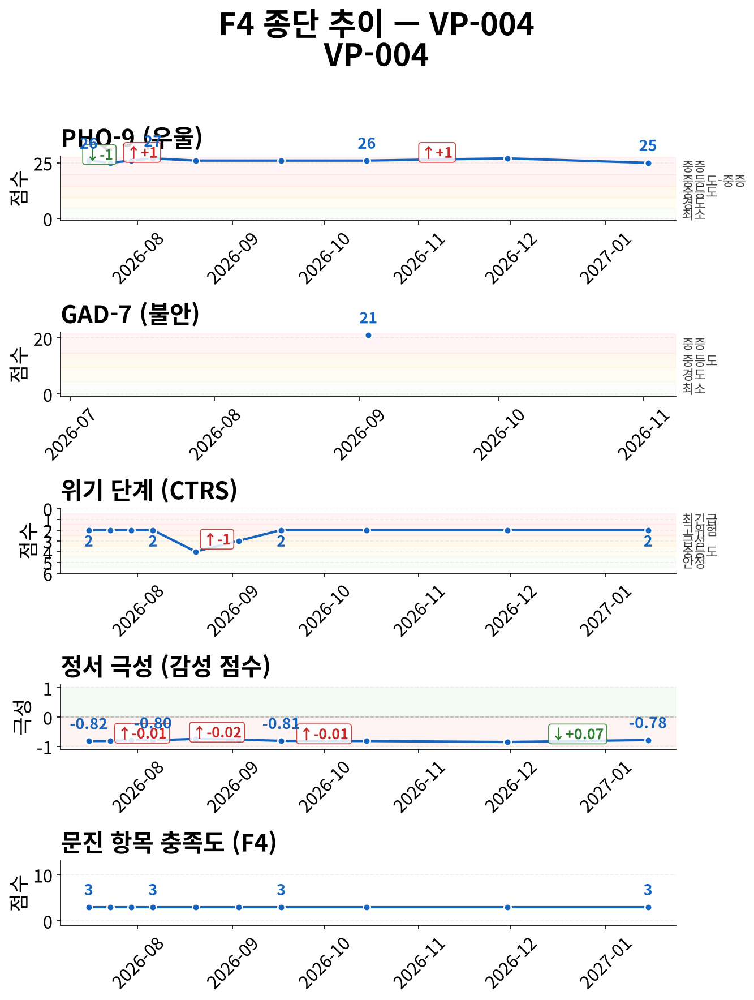
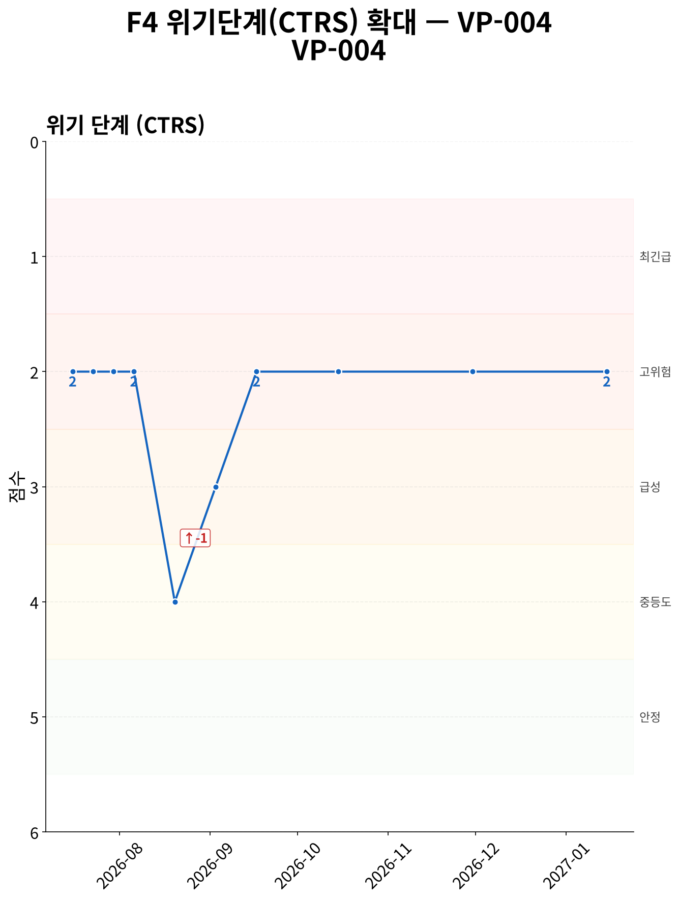
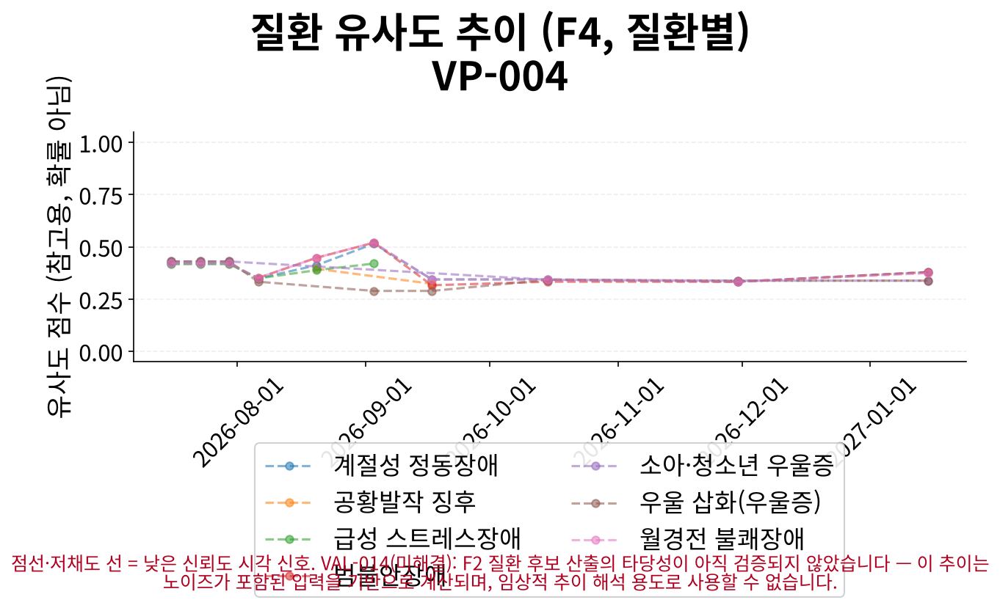
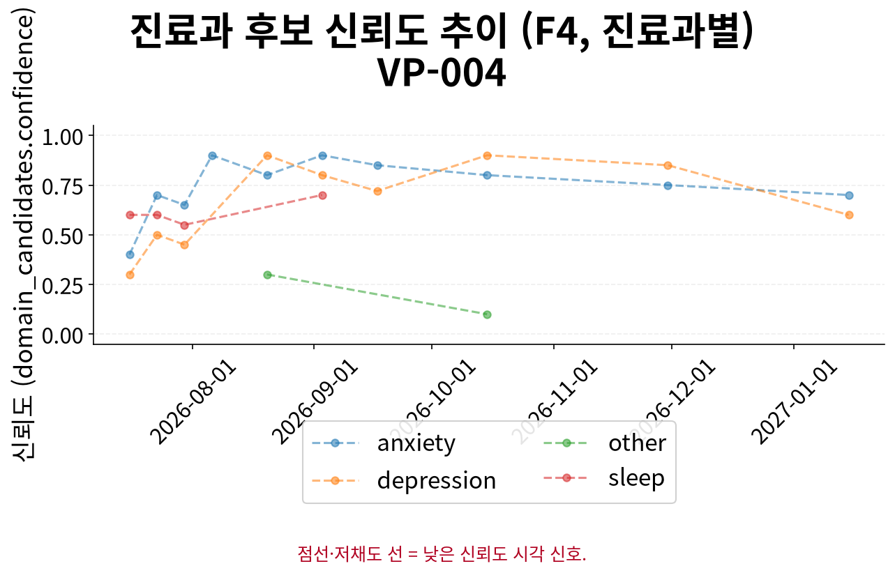

# F5 인계 요약 보고서 — VP-004

> **핵심 요약**
>
> - 환자: 최하은 (VP-004) — 10회차 (2027-01-15), 총 10세션 · 183일
> - 주호소: 약을 바꿨는데도 여전히 아무것도 안 되고 오히려 더 나빠진 것 같으며, 번역 작업 마감 세 개를 놓쳤고 공황 발작에 대한 두려움이 있음
> - 위험 플래그: 당해 세션 위기 반응 발생 — 자살사고 문항(9번) 양성 9회 확인 (1회차, 2회차, 3회차, 4회차, 5회차, 7회차, 8회차, 9회차, 10회차) — 임상 확인 권장
> - 최신 설문: PHQ-9 25/27 (중증) ↓ (26→25, 1회차 대비)
> - 주요 우려: 설문 위험 신호와 CTRS 불일치 1회 — 임상 확인 권장; 추세 판정 혼재 — 본문 종단 추세 참조

> **면책 조항**
>
> - 자가보고(AI 대화형 문진) 기반 비공식 문서이며 공식 의무기록·의학적 진단이 아닙니다.
> - AI 예상질환(하단)은 유사도 기반 참고 정보일 뿐 확률·가능성·진단이 아닙니다.
> - 최종 진단과 치료 방향은 반드시 의료진의 판단에 따라 결정되어야 합니다.

## 위험/안전 평가

당해 세션(10회차, 2027-01-15) 위험평가: 자살사고 부인(탐색 완료) — 환자 발화: "안녕하세요. 아니요, 상담은 안 하고 있어요. 저는 그냥... 약을 바꿔도 전혀 나아지지 않아서 너무 힘들어요. 번역은 거의 손도 못… (상세 부록 1 참조). 위기 단계(CTRS) 2/5 — 고위험. 과거 1회 세션에서 설문 자살사고 문항(9번) 양성/안전 의뢰 신호가 동일 세션 CTRS 상승에 반영되지 않아 불일치가 확인됩니다 — 임상 확인이 권장됩니다.

> AI가 진행한 대화형 문진 결과이며, 검증된 임상 설문 시행이 아닙니다. '판정'은 설문 위험 신호와 동일 세션 CTRS 평가의 일치 여부입니다.

| 세션 | 일자 | 점수 | 9번 문항 | 판정 |
|---|---|---|---|---|
| 1 | 2026-07-16 | 26/27 | 양성 | 일치 · 만점 |
| 2 | 2026-07-23 | 25/27 | 양성 | 일치 |
| 3 | 2026-07-30 | 26/27 | 양성 | 일치 · 만점 |
| 4 | 2026-08-06 | 27/27 | 양성 | 일치 · 만점 |
| 5 | 2026-08-20 | 26/27 | 양성 | 불일치 · 만점 |
| 6 | 2026-09-03 | 미시행 | - | 설문 시행(GAD-7) — 항목9 위험 신호 없음 |
| 7 | 2026-09-17 | 26/27 | 양성 | 일치 · 만점 |
| 8 | 2026-10-15 | 26/27 | 양성 | 일치 · 만점 |
| 9 | 2026-11-30 | 27/27 | 양성 | 일치 · 만점 |
| 10 | 2027-01-15 | 25/27 | 양성 | 일치 |

> [세션 1·3·4·5·7·8·9 — 만점/근접(26-27/27)] 동일 척도가 전 세션에서 체계적으로 과대추정(over-endorsement, ISS-F2V-028)되었을 가능성은 이 결과에서 별도로 보정되지 않습니다.

> 최신 시행 척도 안내: 당해 세션에 F3 문진이 시행되어 별도 최신성 안내가 필요하지 않습니다.

## 주호소 및 현병력

**주호소**: 약을 바꿨는데도 여전히 아무것도 안 되고 오히려 더 나빠진 것 같으며, 번역 작업 마감 세 개를 놓쳤고 공황 발작에 대한 두려움이 있음

**현병력**: 약을 두 번이나 바꿨는데도 여전히 아무것도 안 되고 오히려 더 나빠졌으며, 번역은 손도 못 대고 마감 세 개를 놓쳤고 하루 종일 이유 없이 눈물이 멈추지 않는 상태

### 정신상태검사 (MSE)

텍스트 문진 특성상 관찰 기반 MSE는 평가 불가; 대화에서 도출된 소견 없음

## 전체 세션 요약

> 이 표의 값은 AI가 진행한 대화형 문진(F1)에서 환자가 자가보고한 내용이며, 임상의의 직접 평가나 검증된 척도 시행이 아닙니다.

| 슬롯 | 최신값 | 출처 | 변화 | 비고 |
|---|---|---|---|---|
| 주호소 | 약을 바꿨는데도 여전히 아무것도 안 되고 오히려 더 나빠진 것 같으며, 번역 작업 마감 세 개를 놓쳤고 공황 발작에 대한 두려움이 있음 | 10회차/2027-01-15 | 6회 변화 (S1→S4→S5→S6→S8→S10) · 상세 부록 참조 | A1 참조 (전문 서술) |
| 현병력 | 약을 두 번이나 바꿨는데도 여전히 아무것도 안 되고 오히려 더 나빠졌으며, 번역은 손도 못 대고 마감 세 개를 놓쳤고 하루 종일 이유 없이 눈물… (상세 부록 2 참조) | 9회차/2026-11-30 | 6회 변화 (S1→S4→S5→S6→S7→S9) · 상세 부록 참조 | A2 참조 (전문 서술) |
| 정신과 과거력 | 미수집 | - | - | - |
| 신체질환/신경학적 병력 | 미수집 | - | - | - |
| 개인사/사회력 | 미수집 | - | - | - |
| 가족력 | 미수집 | - | - | - |
| 음주·흡연·물질사용 | 미수집 | - | - | - |
| 위험평가 | 자살사고 부인(탐색 완료) — 환자 발화: "안녕하세요. 아니요, 상담은 안 하고 있어요. 저는 그냥... 약을 바꿔도 전혀 나아지지 않아서 너… (상세 부록 3 참조) | 9회차/2026-11-30 | 6회 변화 (S1→S3→S4→S6→S7→S9) · 상세 부록 참조 | A3 참조 (전문 서술 + 종단 위험 신호) |

**주요 경과**

- 위험평가: S1: '자살사고 부인(탐색 완료) — 환자 발화: "가끔 아프면 이 감정이 멈출까 싶을 때가 있어요. 근데… 한 적…' → S6: '자살사고 부인(탐색 완료) — 환자 발화: "아니요, 가족 중에 그런 분은 없어요. 어머니는 걱정하실까 봐…' → S9: '자살사고 부인(탐색 완료) — 환자 발화: "안녕하세요. 아니요, 상담은 안 하고 있어요. 저는 그냥...…'
- 주호소: S1: '아침에 눈 뜨기 힘들고 잠도 제대로 못 자며 악몽을 꾸는 상태' → S6: '약을 두 번이나 바꿨는데도 여전히 아무것도 못 하고, 번역 작업 전혀 못 하며 마감 세 개를 놓침' → S10: '약을 바꿨는데도 여전히 아무것도 안 되고 오히려 더 나빠진 것 같으며, 번역 작업 마감 세 개를 놓쳤고 공황…'
- 현병력: S1: '아침에 눈 뜨는 것이 힘들고 잠도 거의 못 자며 악몽을 꾸는 증상이 지속되고 있음' → S6: '하루에 한 번 이상 공황 발작에 대한 생각이 들며, 밤에 눈 감으면 심장이 쿵쾅거리고 숨이 안 쉬어질까 봐…' → S9: '약을 두 번이나 바꿨는데도 여전히 아무것도 안 되고 오히려 더 나빠졌으며, 번역은 손도 못 대고 마감 세 개…'

## 시행된 설문

> AI가 진행한 대화형 문진 결과이며, 검증된 임상 설문 시행이 아닙니다.

**PHQ-9 25/27 (중증)** — 10회차 (2027-01-15)

- 응답: 3,3,3,3,3,3,3,3,1
- 자살사고 문항(9번): 양성
- 문진 방식: natural

## 종단 추세

전체 방향: **악화** (10세션, 183일)

> 전체 방향은 척도·위기단계·정서 방향의 다수결로 계산되며, 악화 신호가 하나라도 있으면 악화로 우선 판정합니다. 정서 포함 여부에 따라 결과가 달라질 수 있습니다.

| 항목 | 방향 | 근거 |
|---|---|---|
| GAD-7 총점 | 판정 불가 | (근거 없음) |
| PHQ-9 총점 | 개선 | PHQ-9: 세션 1→10: 26 → 25 (-1) |
| 위기 단계(CTRS) | 악화 | 세션 1→10: 2 → 2 (+0) |
| 감성 점수 | 개선 | 세션 1→10: -0.816667 → -0.783333 (+0.0333) |
| 문진 항목 충족도 | 변화 없음 | 세션 1→10: 3 → 3 (+0) |

위기 반응 발생 세션: 1회차(2026-07-16), 2회차(2026-07-23), 3회차(2026-07-30), 4회차(2026-08-06), 7회차(2026-09-17), 8회차(2026-10-15), 9회차(2026-11-30), 10회차(2027-01-15)
위험 고조 세션 중 설문 미시행 사례 없음
종단 추세 일관성(설문·CTRS·감성): 불일치

### 추세 차트

*그림 1. 설문 총점·위기 단계(CTRS)·정서·문진 충족도 추이 (10세션, 183일) — 위기 단계는 값이 낮을수록(1에 가까울수록) 위험이 높습니다.*

*그림 2. 위기 단계(CTRS) 확대 추이 — 1(최긴급)에 가까울수록 위험, 5(안정)에 가까울수록 안정적입니다.*

*그림 3. 세션별 질환 유사도 추이 — 점선·저채도 선은 참고용 유사도 신호일 뿐이며 확률·가능성·진단이 아닙니다.*

*그림 4. 세션별 진료과 후보 신뢰도 추이 — 값이 높을수록 해당 진료과 매칭 신뢰도가 높습니다.*

## AI 참고 정보 (비진단)

> ⚠ 유사도(similarity)일 뿐 확률·가능성·신뢰도가 아닙니다 — 임상 판단 대체 불가.

| 순위 | 질환 | 유사도 |
|---|---|---|
| 공동 1위 | 계절성 정동장애 | 0.379 |
| 공동 1위 | 범불안장애 | 0.379 |
| 3 | 월경전 불쾌장애 | 0.374 |

기타 후보: 우울 삽화(우울증)(0.338), 소아·청소년 우울증(0.338)

> 이 정보는 AI가 생성한 참고용 예상 질환 후보이며 의학적 진단이 아닙니다. 함께 제공되는 설문 추천(recommended_questionnaire) 역시 초기 상담(인테이크) 지원을 위한 척도 제안일 뿐, 진단적 판단이 아닙니다. 최종 진단과 치료 방향은 반드시 의료진의 판단에 따라 결정되어야 합니다.
> 추천 설문: PHQ-9 — PHQ-9 screens depressive-symptom burden only, does not screen manic/hypomanic symptoms — bipolar-spectrum presentations need clinician follow-up regardless of score.

## 권장 진료과 및 후속 조치

| 진료과 | 사유 |
|---|---|
| 정신건강의학과 | 불안 및 우울 증상, 공황 발작에 대한 두려움, 번역 작업 관련 스트레스, 약물 치료 실패 경험 |
| 정신건강의학과 | 지속적인 우울감, 무기력, 눈물, 약물 치료 반응 부족, PHQ-9 27점(중증) |

추천 설문: PHQ-9 — PHQ-9 screens depressive-symptom burden only, does not screen manic/hypomanic symptoms — bipolar-spectrum presentations need clinician follow-up regardless of score.

> 약물 정보: 별도 구조화 항목 없음, HPI/병력 서술 포함 여부만 확인

## 임상 종합 소견

AI 종합 소견 미생성 (narrative disabled)

## 상세 부록

**1. 위험평가 발화 원문 (당해 세션)**

자살사고 부인(탐색 완료) — 환자 발화: "안녕하세요. 아니요, 상담은 안 하고 있어요. 저는 그냥... 약을 바꿔도 전혀 나아지지 않아서 너무 힘들어요. 번역은 거의 손도 못 대겠고, ..."; 구체적 계획/의도 부인 — 환자 발화: "네... 그래서 더 힘들어요. 약을 두 번이나 바꿨는데도, 전혀 나아지지 않더라고요. 오히려 더 나빠진 것 같아요. 번역은 아예 손도 못 대고,..."

**2. 현병력 최신값 전문**

약을 두 번이나 바꿨는데도 여전히 아무것도 안 되고 오히려 더 나빠졌으며, 번역은 손도 못 대고 마감 세 개를 놓쳤고 하루 종일 이유 없이 눈물이 멈추지 않는 상태

**3. 위험평가 최신값 전문**

자살사고 부인(탐색 완료) — 환자 발화: "안녕하세요. 아니요, 상담은 안 하고 있어요. 저는 그냥... 약을 바꿔도 전혀 나아지지 않아서 너무 힘들어요. 번역은 거의 손도 못 대겠고, ..."; 구체적 계획/의도 부인 — 환자 발화: "네... 그래서 더 힘들어요. 약을 두 번이나 바꿨는데도, 전혀 나아지지 않더라고요. 오히려 더 나빠진 것 같아요. 번역은 아예 손도 못 대고,..."

### 슬롯별 전체 변화 이력 (미압축)

**주호소**

S1: '아침에 눈 뜨기 힘들고 잠도 제대로 못 자며 악몽을 꾸는 상태' → S4: '아침에 눈 뜨는 것부터 힘들고, 악몽이 떠올라 심장이 쿵쾅거리며, 번역 시작에 대한 불안과 손 떨림이 있음' → S5: '약을 바꿨는데도 여전히 낫지 않아 힘들다고 호소' → S6: '약을 두 번이나 바꿨는데도 여전히 아무것도 못 하고, 번역 작업 전혀 못 하며 마감 세 개를 놓침' → S8: '번역을 전혀 할 수 없고 마감 세 개를 놓쳤으며 아무 일도 못 하고 이유 없이 눈물이 나는 상태' → S10: '약을 바꿨는데도 여전히 아무것도 안 되고 오히려 더 나빠진 것 같으며, 번역 작업 마감 세 개를 놓쳤고 공황 발작에 대한 두려움이 있음'

**현병력**

S1: '아침에 눈 뜨는 것이 힘들고 잠도 거의 못 자며 악몽을 꾸는 증상이 지속되고 있음' → S4: '아침에 눈 뜨는 것부터 힘들었고, 악몽이 떠올라 심장이 쿵쾅거림. 어제 번역 한 줄도 못 했으며, 오늘은 30분만 해볼까 생각했으나 시작도 못 함. '또 그러면 어쩌지' 하는 생각에 손이 덜덜 떨림' → S5: '아침에 눈 뜨는 것부터 힘들고 악몽이 떠올라 심장이 쿵쾅거리며 번역 시작에 대한 불안과 손 떨림이 있음. 오늘은 공황이 한 번도 오지 않아 오히려 '왜 안 오지?' 하는 생각에 조마조마함. 두통이 자주 나고 손이 involuntary하게 떨리며 머리가 지끈거리는 증상이 새로 나타남. 약을 바꿔도 낫지 않아 나을 수 있는지 의문' → S6: '하루에 한 번 이상 공황 발작에 대한 생각이 들며, 밤에 눈 감으면 심장이 쿵쾅거리고 숨이 안 쉬어질까 봐 무서워서 잠을 못 잠. 어제 응급실 방문 1개월 되는 날이라 그날처럼 또 오면 어떡하지 하는 생각에 손이 덜덜 떨림. 두통이 자주 나고 손이 involuntary하게 떨리며 머리가 지끈거리는 증상이 새로 나타남' → S7: '약을 두 번이나 바꿨는데도 여전히 아무것도 안 돼요. 오히려 더 나빠졌어요. 번역은 아예 손도 못 대고, 마감 세 개나 놓쳤어요. 지금보다 한 달 전보다 확실히 더 안 좋아졌어요.' → S9: '약을 두 번이나 바꿨는데도 여전히 아무것도 안 되고 오히려 더 나빠졌으며, 번역은 손도 못 대고 마감 세 개를 놓쳤고 하루 종일 이유 없이 눈물이 멈추지 않는 상태'

**위험평가**

S1: '자살사고 부인(탐색 완료) — 환자 발화: "가끔 아프면 이 감정이 멈출까 싶을 때가 있어요. 근데… 한 적은 없어요. 어머니한테 전화도 못 받고 있어요. 울고 있는 목소리 나가면 더 불안..."; 구체적 계획/의도 부인 — 환자 발화: "…가끔 아프면 이 감정이 멈출까 싶을 때가 있어요. 근데… 한 적은 없어요. 근데 그 생각이 너무 무서워서, 오히려 더 깨어있고, 더 숨이 차는..."' → S3: '자살/자해 사고 표현 있음 — 환자 발화: "아침에 눈 뜨는 게 너무 힘들어요. 잠도 3~4시간밖에 못 자고, 그마저도 악몽에 시달려요. 오늘도 똑같은 악몽을 꿨어요… 왜 자꾸 그 장면이 ..."; 구체적 계획/의도 부인 — 환자 발화: "꿈속에선 항상 어두운 방에서 혼자인 것 같아요. 벽에 기대서 있는데, 문 밖에 발소리가 들리는 거예요. 점점 가까워지고… 근데 누구인지도 모르겠..."' → S4: '자살사고 부인(탐색 완료) — 환자 발화: "어머니가 자꾸 전화하시는데… 안 받아요. 울고 있는 목소리 들으시면 올라오실 것 같아서. 전화를 안 받아요… 걱정하실까 봐."; 구체적 계획/의도 부인 — 환자 발화: "하루에도 몇 번씩 와요. 약 먹어도 안 낫고, 오히려 더 심해진 것 같아서… 무서워 죽겠어요. 또 오면 어떡하지, 계속 그 생각만 맴돌아요."' → S6: '자살사고 부인(탐색 완료) — 환자 발화: "아니요, 가족 중에 그런 분은 없어요. 어머니는 걱정하실까 봐 전화도 안 받아요... 울고 있는 목소리 들으시면 올라오실 것 같아서."; 구체적 계획/의도 부인 — 환자 발화: "아니요, 가족 중에 그런 분은 없어요. 어머니는 걱정하실까 봐 전화도 안 받아요... 울고 있는 목소리 들으시면 올라오실 것 같아서."' → S7: '자살사고 부인(탐색 완료) — 환자 발화: "약을 두 번이나 바꿨는데도 여전히 아무것도 안 돼요. 오히려 더 나빠졌어요. 번역은 아예 손도 못 대고, 마감 세 개나 놓쳤어요. 지금보다 한 ..."; 구체적 계획/의도 부인 — 환자 발화: "...가끔 아프면 이 느낌이 좀 멈출까 싶을 때가 있어요. 근데... 한 적은 없어요."' → S9: '자살사고 부인(탐색 완료) — 환자 발화: "안녕하세요. 아니요, 상담은 안 하고 있어요. 저는 그냥... 약을 바꿔도 전혀 나아지지 않아서 너무 힘들어요. 번역은 거의 손도 못 대겠고, ..."; 구체적 계획/의도 부인 — 환자 발화: "네... 그래서 더 힘들어요. 약을 두 번이나 바꿨는데도, 전혀 나아지지 않더라고요. 오히려 더 나빠진 것 같아요. 번역은 아예 손도 못 대고,..."'

## 각주

모델: solar-pro3-260323 · 생성 시각: 2026-07-16T16:08:05.393021 · 세션ID: f1_VP-004_followup
설문 문항 출처: v1, verbatim Pfizer/phqscreeners.com Korean PHQ-9 PDF, retrieved 2026-07-13 (item_bank_v1_sources.md §1.2/§1.3, appendix §A1); translation chosen per ADR-033 decision 1 (Seo & Park 2015's Korean validation study administered this same translation)

### 시스템 참고 (내부 감사용, 임상 판단 근거 아님)

종단 추세 판정 근거: overall_direction은 세션별 척도/CTRS/sentiment 방향의 다수결(worsened-priority)로 계산되며(src.f4::_overall_direction), sentiment 포함 여부에 따라 verdict가 달라질 수 있습니다(REV-045 row 2) — 세부 근거는 trend_verdicts의 evidence를 참고하십시오.
