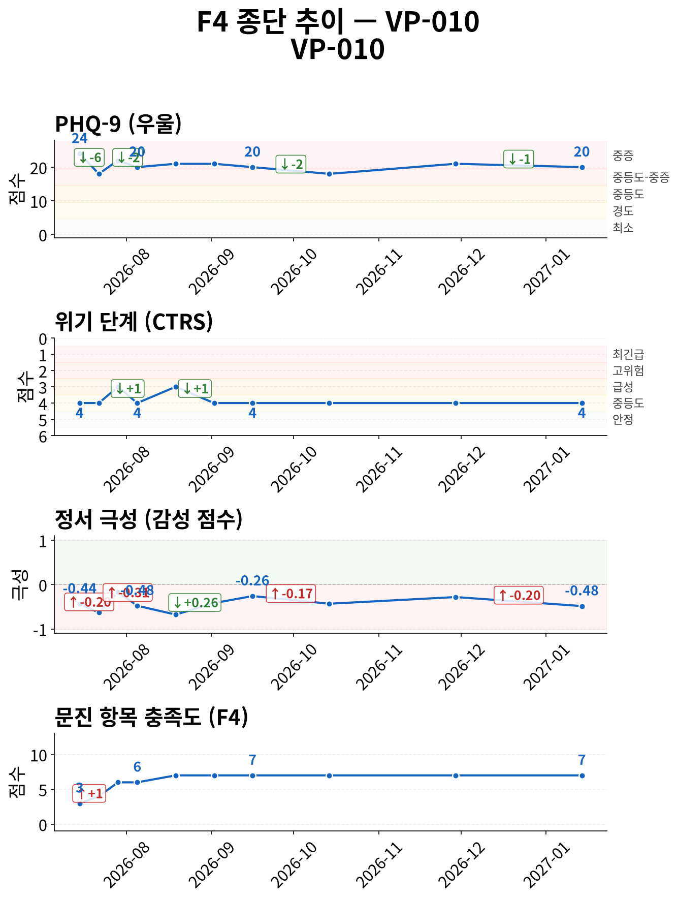
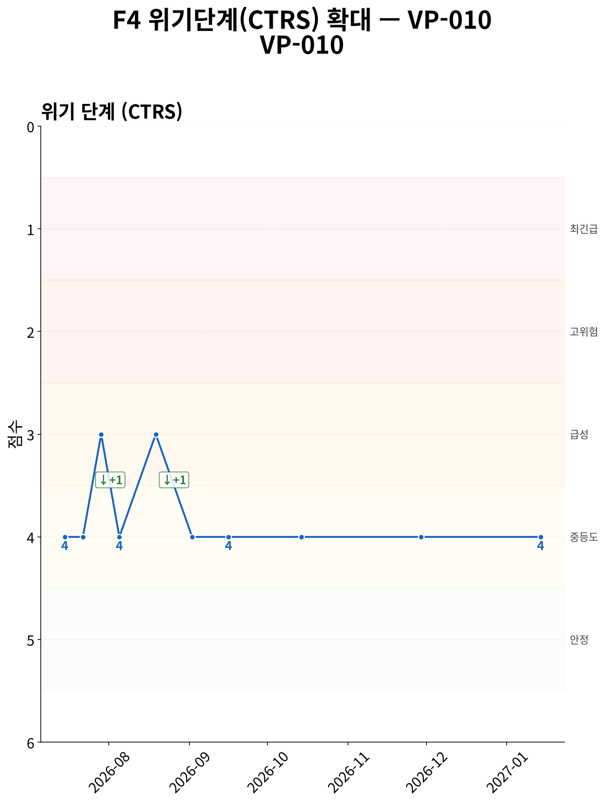
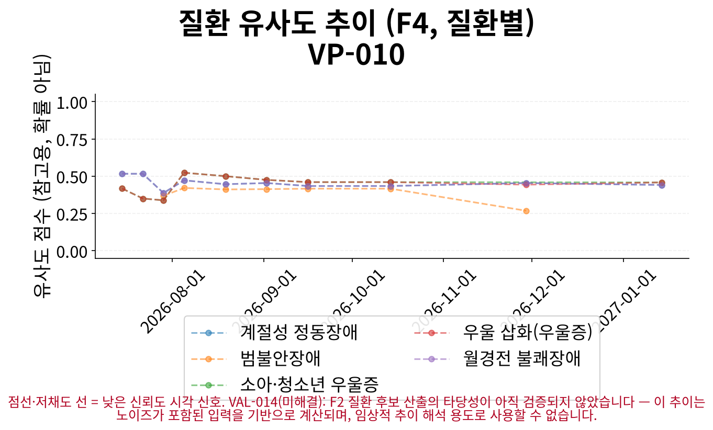
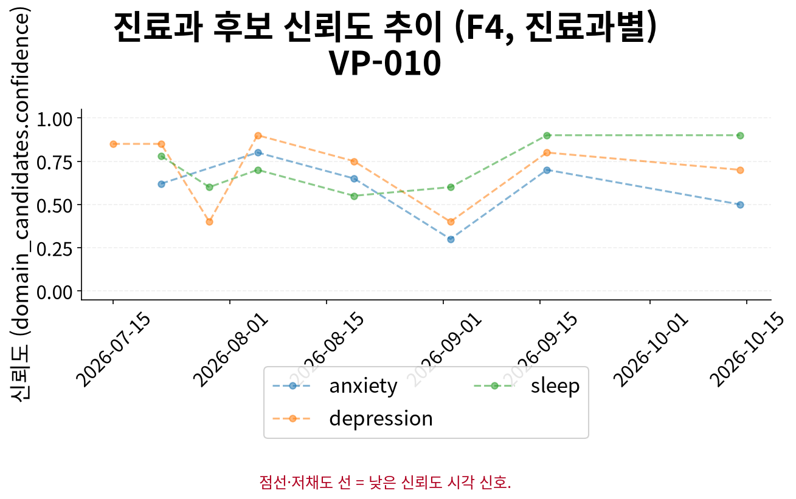

# F5 인계 요약 보고서 — VP-010

> **핵심 요약**
>
> - 환자: 강태민 (VP-010) — 10회차 (2027-01-14), 총 10세션 · 183일
> - 주호소: 피곤하고 잠들기 어려운 증상이 여전하며, 재워도 한두 시간은 뒤척이는 것 같음
> - 위험 플래그: 자살사고 문항 양성 이력 없음 (자가보고 기준)
> - 최신 설문: PHQ-9 20/27 (중증) ↓ (24→20, 1회차 대비)
> - 주요 우려: 특이 우려 사항 없음

> **면책 조항**
>
> - 자가보고(AI 대화형 문진) 기반 비공식 문서이며 공식 의무기록·의학적 진단이 아닙니다.
> - AI 예상질환(하단)은 유사도 기반 참고 정보일 뿐 확률·가능성·진단이 아닙니다.
> - 최종 진단과 치료 방향은 반드시 의료진의 판단에 따라 결정되어야 합니다.

## 위험/안전 평가

당해 세션(10회차, 2027-01-14) 위험평가: 자살/자해 사고 표현 있음 — 환자 발화: "아니요, 그런 건 전혀 없어요. 정신과 가본 적도 없고, 상담 같은 건 처음이에요. 근데 사실... 최근 한 달 동안 친구 약속을 일주… (상세 부록 1 참조). 위기 단계(CTRS) 4/5 — 경도 우려 (준안정).

해당 없음 — 전체 세션 중 item-9 양성/안전 의뢰 이력이 없습니다.

> 최신 시행 척도 안내: 당해 세션에 F3 문진이 시행되어 별도 최신성 안내가 필요하지 않습니다.

## 주호소 및 현병력

**주호소**: 피곤하고 잠들기 어려운 증상이 여전하며, 재워도 한두 시간은 뒤척이는 것 같음

**현병력**: 피곤하고 잠들기 어려운 증상이 지속되고 있으며, 재워도 한두 시간은 뒤척이는 증상이 있음. 예전보다는 조금 나아졌는지 여전히 비슷한 상태임

### 정신상태검사 (MSE)

텍스트 문진 특성상 관찰 기반 MSE는 평가 불가; 대화에서 도출된 소견 없음

## 전체 세션 요약

> 이 표의 값은 AI가 진행한 대화형 문진(F1)에서 환자가 자가보고한 내용이며, 임상의의 직접 평가나 검증된 척도 시행이 아닙니다.

| 슬롯 | 최신값 | 출처 | 변화 | 비고 |
|---|---|---|---|---|
| 주호소 | 피곤하고 잠들기 어려운 증상이 여전하며, 재워도 한두 시간은 뒤척이는 것 같음 | 10회차/2027-01-14 | 9회 변화 (S1→S2→S3→S4→S5→S6→S7→S9→S10) · 상세 부록 참조 | A1 참조 (전문 서술) |
| 현병력 | 피곤하고 잠들기 어려운 증상이 지속되고 있으며, 재워도 한두 시간은 뒤척이는 증상이 있음. 예전보다는 조금 나아졌는지 여전히 비슷한 상태임 | 10회차/2027-01-14 | 9회 변화 (S1→S2→S3→S4→S5→S6→S7→S9→S10) · 상세 부록 참조 | A2 참조 (전문 서술) |
| 정신과 과거력 | 미수집 | - | - | - |
| 신체질환/신경학적 병력 | 속이 자주 쓰리고 밥 먹은 후 증상이 악화되는 위장 증상 | 5회차/2026-08-19 | - | - |
| 개인사/사회력 | 친구 약속 일주일에 3회 정도 취소, 사람 만나는 것 부담, 약속 취소 시 미안함 및 부담감, 누워 있는 시간 증가 | 5회차/2026-08-19 | 2회 변화 (S3→S5) · 상세 부록 참조 | - |
| 가족력 | 어머니가 지방에 계심, 관계는 나쁘지 않으나 자주 연락하지 않음 | 3회차/2026-07-29 | - | - |
| 음주·흡연·물질사용 | 주 1~2회 맥주 1~2캔 정도, 카페인 아침 커피 한두 잔. 최근 밤에는 수면 방해로 거의 마시지 않음 | 2회차/2026-07-22 | - | - |
| 위험평가 | 자살/자해 사고 표현 있음 — 환자 발화: "아니요, 그런 건 전혀 없어요. 정신과 가본 적도 없고, 상담 같은 건 처음이에요. 근데 사실...… (상세 부록 2 참조) | 5회차/2026-08-19 | 3회 변화 (S1→S3→S5) · 상세 부록 참조 | A3 참조 (전문 서술 + 종단 위험 신호) |

**주요 경과**

- 위험평가: S1: '자살/자해 사고 탐색 질문에 부인 — 환자 발화: "사실... 거의 매일 그런 기분이 들어요. 그냥 티 안…' → S3: '자살/자해 사고 표현 있음 — 환자 발화: "그렇군요. 사실 요즘 거의 매일 그런 기분이 들어요. 그냥 티…' → S5: '자살/자해 사고 표현 있음 — 환자 발화: "아니요, 그런 건 전혀 없어요. 정신과 가본 적도 없고, 상담…'
- 주호소: S1: '수면 장애 및 무기력감' → S5: '잠들기 어렵고 새벽에 자주 깨며, 수면 시간 4-5시간 후 재수면 어려움' → S10: '피곤하고 잠들기 어려운 증상이 여전하며, 재워도 한두 시간은 뒤척이는 것 같음'
- 현병력: S1: '2개월 전부터 시작된 수면 장애로, 잠들기 전 2시간 이상 뒤척임, 총 4-5시간 수면, 새벽 2-3회 깨는…' → S5: '잠들기 어려움, 새벽 자주 깨는 수면 문제 지속, 가슴 두근거림 및 숨 막힘 증상(누워 있을 때, 승진 생각…' → S10: '피곤하고 잠들기 어려운 증상이 지속되고 있으며, 재워도 한두 시간은 뒤척이는 증상이 있음. 예전보다는 조금…'
- 개인사/사회력: S3: '주변에 힘들 때 연락하거나 도움을 요청할 수 있는 사람 없음, 가끔 연락함' → S5: '친구 약속 일주일에 3회 정도 취소, 사람 만나는 것 부담, 약속 취소 시 미안함 및 부담감, 누워 있는 시…'

## 시행된 설문

> AI가 진행한 대화형 문진 결과이며, 검증된 임상 설문 시행이 아닙니다.

**PHQ-9 20/27 (중증)** — 10회차 (2027-01-14)

- 응답: 2,3,3,3,3,3,3,0,0
- 자살사고 문항(9번): 음성
- 문진 방식: natural

## 종단 추세

전체 방향: **악화** (10세션, 183일)

> 전체 방향은 척도·위기단계·정서 방향의 다수결로 계산되며, 악화 신호가 하나라도 있으면 악화로 우선 판정합니다. 정서 포함 여부에 따라 결과가 달라질 수 있습니다.

| 항목 | 방향 | 근거 |
|---|---|---|
| PHQ-9 총점 | 개선 | PHQ-9: 세션 1→10: 24 → 20 (-4) |
| 위기 단계(CTRS) | 개선 | 세션 1→10: 4 → 4 (+0) |
| 감성 점수 | 악화 | 세션 1→10: -0.436364 → -0.484545 (-0.0482) |
| 문진 항목 충족도 | 개선 | 세션 1→10: 3 → 7 (+4) |

위기 반응 발생 세션 없음
위험 고조 세션 중 설문 미시행 사례 없음
종단 추세 일관성(설문·CTRS·감성): 불일치

### 추세 차트

*그림 1. 설문 총점·위기 단계(CTRS)·정서·문진 충족도 추이 (10세션, 183일) — 위기 단계는 값이 낮을수록(1에 가까울수록) 위험이 높습니다.*

*그림 2. 위기 단계(CTRS) 확대 추이 — 1(최긴급)에 가까울수록 위험, 5(안정)에 가까울수록 안정적입니다.*

*그림 3. 세션별 질환 유사도 추이 — 점선·저채도 선은 참고용 유사도 신호일 뿐이며 확률·가능성·진단이 아닙니다.*

*그림 4. 세션별 진료과 후보 신뢰도 추이 — 값이 높을수록 해당 진료과 매칭 신뢰도가 높습니다.*

## AI 참고 정보 (비진단)

> ⚠ 유사도(similarity)일 뿐 확률·가능성·신뢰도가 아닙니다 — 임상 판단 대체 불가.

| 순위 | 질환 | 유사도 |
|---|---|---|
| 공동 1위 | 우울 삽화(우울증) | 0.458 |
| 공동 1위 | 소아·청소년 우울증 | 0.458 |
| 공동 3위 | 계절성 정동장애 | 0.441 |

기타 후보: 월경전 불쾌장애(0.441)

> 이 정보는 AI가 생성한 참고용 예상 질환 후보이며 의학적 진단이 아닙니다. 함께 제공되는 설문 추천(recommended_questionnaire) 역시 초기 상담(인테이크) 지원을 위한 척도 제안일 뿐, 진단적 판단이 아닙니다. 최종 진단과 치료 방향은 반드시 의료진의 판단에 따라 결정되어야 합니다.
> 추천 설문: PHQ-9 — PHQ-9 screens depressive-symptom burden only, does not screen manic/hypomanic symptoms — bipolar-spectrum presentations need clinician follow-up regardless of score.

## 권장 진료과 및 후속 조치

이번 실행에서는 진료과 후보가 산출되지 않았습니다(후보 검증 단계에서 제외됨). 원 데이터는 각주 참조.

추천 설문: PHQ-9 — PHQ-9 screens depressive-symptom burden only, does not screen manic/hypomanic symptoms — bipolar-spectrum presentations need clinician follow-up regardless of score.

> 약물 정보: 별도 구조화 항목 없음, HPI/병력 서술 포함 여부만 확인

## 임상 종합 소견

AI 종합 소견 미생성 (narrative disabled)

## 상세 부록

**1. 위험평가 발화 원문 (당해 세션)**

자살/자해 사고 표현 있음 — 환자 발화: "아니요, 그런 건 전혀 없어요. 정신과 가본 적도 없고, 상담 같은 건 처음이에요. 근데 사실... 최근 한 달 동안 친구 약속을 일주일에 세 ..."; 탐색 질문에 대한 환자 응답: "음... 사실 거의 매일 그런 것 같아요. 약속을 취소할 때마다 “내가 뭘 잘못했나” 싶고, 미안한 마음도 들어요. 사실 요즘은 사람 만나는 것..."

**2. 위험평가 최신값 전문**

자살/자해 사고 표현 있음 — 환자 발화: "아니요, 그런 건 전혀 없어요. 정신과 가본 적도 없고, 상담 같은 건 처음이에요. 근데 사실... 최근 한 달 동안 친구 약속을 일주일에 세 ..."; 탐색 질문에 대한 환자 응답: "음... 사실 거의 매일 그런 것 같아요. 약속을 취소할 때마다 “내가 뭘 잘못했나” 싶고, 미안한 마음도 들어요. 사실 요즘은 사람 만나는 것..."

### 슬롯별 전체 변화 이력 (미압축)

**주호소**

S1: '수면 장애 및 무기력감' → S2: '잠은 잘 못 자고, 퇴근하면 그냥 눕기만 함' → S3: '잠들기 좀 나아짐' → S4: '잠들기 힘들고 새벽에 자주 깨며, 4-5시간 수면 후 다시 잠들기 어려움' → S5: '잠들기 어렵고 새벽에 자주 깨며, 수면 시간 4-5시간 후 재수면 어려움' → S6: '잠들기 어렵고 새벽에 자주 깨는 수면 문제 지속' → S7: '잠들기 어렵고 새벽에 자주 깨는 수면 문제가 여전히 지속됨' → S9: '피곤하고 잠들기 어려운 증상이 지속되고 있음' → S10: '피곤하고 잠들기 어려운 증상이 여전하며, 재워도 한두 시간은 뒤척이는 것 같음'

**현병력**

S1: '2개월 전부터 시작된 수면 장애로, 잠들기 전 2시간 이상 뒤척임, 총 4-5시간 수면, 새벽 2-3회 깨는 증상이 매일 반복됨. 수면 문제 시작 시점은 회사 승진 심사 시기와 일치하며, 이로 인해 가라앉는 느낌이 지속됨. 무기력감으로 인해 친구 약속 3회 취소, 게임 및 운동 활동 감소. '다들 바쁠 때면 좀 쉬는 거 아니에요?'라는 표현을 통해 사회적 고립감과 에너지 부족을 호소함.' → S2: '2개월 전부터 시작된 수면 장애로 잠들기 전 2시간 이상 뒤척이고 총 4-5시간 수면, 새벽 2-3회 깨는 증상이 매일 반복됨. 수면 문제 시작 시점은 회사 승진 심사 시기와 일치하며, 이로 인해 가라앉는 느낌이 지속됨. 무기력감으로 친구 약속 3회 취소, 게임 및 운동 활동 감소. '다들 바쁠 때면 좀 쉬는 거 아니에요?'라는 표현을 통해 사회적 고립감과 에너지 부족을 호소함.' → S3: '지난주에 비해 잠들기 쉬워짐' → S4: '퇴근 후 누워만 있는 상태 반복, 게임 몰입도 감소, 운동 기피, 에너지 저하, 가슴 두근거림 및 숨 막힘 증상(주로 침대에 누울 때, 승진 심사 생각 시 악화), 수면 시간 4-5시간, 새벽 자주 깨고 재수면 어려움, 체중 감소 및 식욕 저하' → S5: '잠들기 어려움, 새벽 자주 깨는 수면 문제 지속, 가슴 두근거림 및 숨 막힘 증상(누워 있을 때, 승진 생각 시 악화), 에너지 저하, 식욕 감소, 체중 감소, 게임 및 운동 의욕 감소, 친구 약속 취소 반복' → S6: '지난번 상담 이후 수면 상태는 개선되지 않고 여전히 잠들기 힘들고 새벽에 자주 깨는 증상이 지속되고 있으며, 별다른 호전 없이 그때그때 버티는 느낌' → S7: '잠들기 한 시간 반에서 두 시간 소요, 새벽에 자주 깨며 깊이 자지 못하는 느낌 지속' → S9: '피곤하고 잠들기 어려운 증상이 지속되고 있음' → S10: '피곤하고 잠들기 어려운 증상이 지속되고 있으며, 재워도 한두 시간은 뒤척이는 증상이 있음. 예전보다는 조금 나아졌는지 여전히 비슷한 상태임'

**개인사/사회력**

S3: '주변에 힘들 때 연락하거나 도움을 요청할 수 있는 사람 없음, 가끔 연락함' → S5: '친구 약속 일주일에 3회 정도 취소, 사람 만나는 것 부담, 약속 취소 시 미안함 및 부담감, 누워 있는 시간 증가'

**위험평가**

S1: '자살/자해 사고 탐색 질문에 부인 — 환자 발화: "사실... 거의 매일 그런 기분이 들어요. 그냥 티 안 내려고 했어요."' → S3: '자살/자해 사고 표현 있음 — 환자 발화: "그렇군요. 사실 요즘 거의 매일 그런 기분이 들어요. 그냥 티 안 내려고 했어요."; 구체적 계획/의도 부인 — 환자 발화: "아니요, 그런 건 전혀 없어요. 진짜로요. 그런 생각은 그냥 지나가는 구름처럼 지나가는 거고, 실행에 옮기고 싶은 생각은 전혀 없어요. 진짜로요..."' → S5: '자살/자해 사고 표현 있음 — 환자 발화: "아니요, 그런 건 전혀 없어요. 정신과 가본 적도 없고, 상담 같은 건 처음이에요. 근데 사실... 최근 한 달 동안 친구 약속을 일주일에 세 ..."; 탐색 질문에 대한 환자 응답: "음... 사실 거의 매일 그런 것 같아요. 약속을 취소할 때마다 “내가 뭘 잘못했나” 싶고, 미안한 마음도 들어요. 사실 요즘은 사람 만나는 것..."'

## 각주

모델: solar-pro3-260323 · 생성 시각: 2026-07-15T17:31:03.206207 · 세션ID: f1_VP-010_followup
설문 문항 출처: v1, verbatim Pfizer/phqscreeners.com Korean PHQ-9 PDF, retrieved 2026-07-13 (item_bank_v1_sources.md §1.2/§1.3, appendix §A1); translation chosen per ADR-033 decision 1 (Seo & Park 2015's Korean validation study administered this same translation)

### 시스템 참고 (내부 감사용, 임상 판단 근거 아님)

종단 추세 판정 근거: overall_direction은 세션별 척도/CTRS/sentiment 방향의 다수결(worsened-priority)로 계산되며(src.f4::_overall_direction), sentiment 포함 여부에 따라 verdict가 달라질 수 있습니다(REV-045 row 2) — 세부 근거는 trend_verdicts의 evidence를 참고하십시오.
권장 진료과 미산출 원문(감사용): 정보 없음 — 후보가 스키마 검증 오류로 제외됨 (validation_errors 존재, VAL-016/BUG-031 계열). 모델이 후보를 찾지 못했다는 의미가 아니라, 상위 F2 단계에서 이미 생성된 후보가 스키마 검증 실패로 삭제되었을 가능성이 있습니다.
