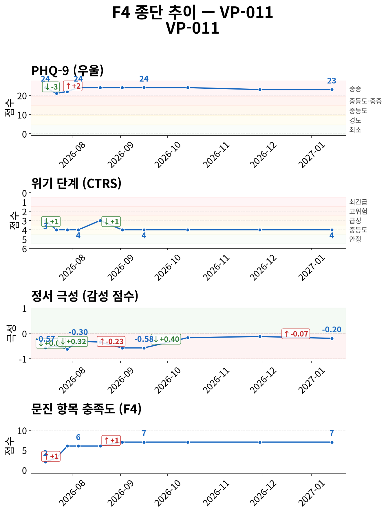
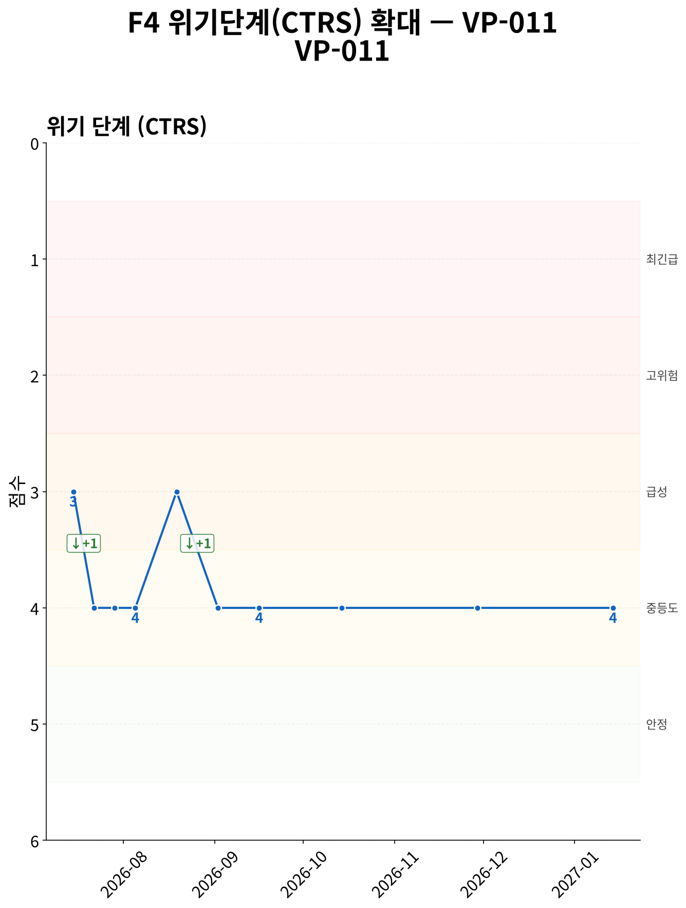
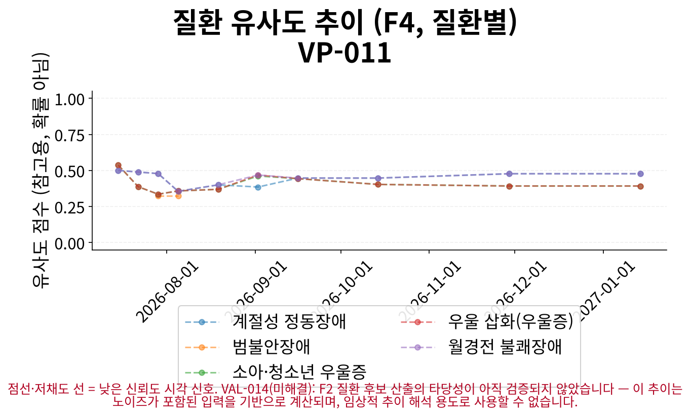
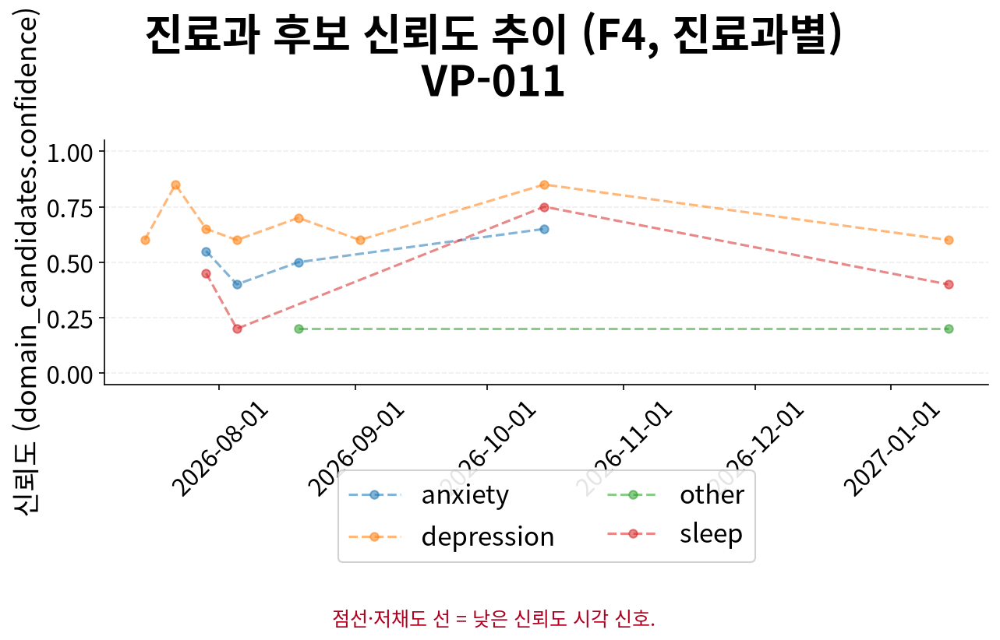

# F5 인계 요약 보고서 — VP-011

> **핵심 요약**
>
> - 환자: 한소영 (VP-011) — 10회차 (2027-01-14), 총 10세션 · 183일
> - 주호소: 아침마다 지끈거리는 두통과 속 더부룩함으로 식사하기 어렵고 피로와 집중력 저하가 지속됨
> - 위험 플래그: 자살사고 문항 양성 이력 없음 (자가보고 기준)
> - 최신 설문: PHQ-9 23/27 (중증) ↓ (24→23, 1회차 대비)
> - 주요 우려: 특이 우려 사항 없음

> **면책 조항**
>
> - 자가보고(AI 대화형 문진) 기반 비공식 문서이며 공식 의무기록·의학적 진단이 아닙니다.
> - AI 예상질환(하단)은 유사도 기반 참고 정보일 뿐 확률·가능성·진단이 아닙니다.
> - 최종 진단과 치료 방향은 반드시 의료진의 판단에 따라 결정되어야 합니다.

## 위험/안전 평가

당해 세션(10회차, 2027-01-14) 위험평가: 자살/자해 사고 표현 있음 — 환자 발화: "글쎄요… 그냥 다 혼자 견디고 있어요. 누구한테도 딱히 털어놓고 그런 적은 없어요."; 구체적 계획/의도 부인 — 환자 발화: "아니요… (상세 부록 1 참조). 위기 단계(CTRS) 4/5 — 경도 우려 (준안정).

해당 없음 — 전체 세션 중 item-9 양성/안전 의뢰 이력이 없습니다.

> 최신 시행 척도 안내: 당해 세션에 F3 문진이 시행되어 별도 최신성 안내가 필요하지 않습니다.

## 주호소 및 현병력

**주호소**: 아침마다 지끈거리는 두통과 속 더부룩함으로 식사하기 어렵고 피로와 집중력 저하가 지속됨

**현병력**: 매일 아침부터 두통이 지끈거리고 약이 잘 듣지 않으며, 속 더부룩함으로 인해 식사가 거의 안 되고 있음. 잠도 잘 못 자는 날이 계속되어 피로와 에너지 부족이 지속되며, 일할 때 집중이 안 되어 스트레스를 받고 있음

### 정신상태검사 (MSE)

텍스트 문진 특성상 관찰 기반 MSE는 평가 불가; 대화에서 도출된 소견 없음

## 전체 세션 요약

> 이 표의 값은 AI가 진행한 대화형 문진(F1)에서 환자가 자가보고한 내용이며, 임상의의 직접 평가나 검증된 척도 시행이 아닙니다.

| 슬롯 | 최신값 | 출처 | 변화 | 비고 |
|---|---|---|---|---|
| 주호소 | 아침마다 지끈거리는 두통과 속 더부룩함으로 식사하기 어렵고 피로와 집중력 저하가 지속됨 | 9회차/2026-11-29 | 8회 변화 (S1→S2→S3→S5→S6→S7→S8→S9) · 상세 부록 참조 | A1 참조 (전문 서술) |
| 현병력 | 매일 아침부터 두통이 지끈거리고 약이 잘 듣지 않으며, 속 더부룩함으로 인해 식사가 거의 안 되고 있음. 잠도 잘 못 자는 날이 계속되어 피로와… (상세 부록 2 참조) | 7회차/2026-09-16 | 7회 변화 (S1→S2→S3→S4→S5→S6→S7) · 상세 부록 참조 | A2 참조 (전문 서술) |
| 정신과 과거력 | 미수집 | - | - | - |
| 신체질환/신경학적 병력 | 내과에서 검사 다 해봤는데 이상 없다고 함 | 7회차/2026-09-16 | 4회 변화 (S3→S5→S6→S7) · 상세 부록 참조 | - |
| 개인사/사회력 | 등산 3개월째 안 가고 있으며, 예전처럼 즐겁지 않고 귀찮다는 생각이 듦 | 6회차/2026-09-02 | - | - |
| 가족력 | 어머니 편두통, 아버지 위장 약함 | 2회차/2026-07-22 | - | - |
| 음주·흡연·물질사용 | 술 섭취 감소, 카페인 섭취 제한(아침 커피 한 잔), 수면제 미사용 | 3회차/2026-07-29 | - | - |
| 위험평가 | 자살/자해 사고 표현 있음 — 환자 발화: "글쎄요… 그냥 다 혼자 견디고 있어요. 누구한테도 딱히 털어놓고 그런 적은 없어요."; 구체적 계획… (상세 부록 3 참조) | 5회차/2026-08-19 | 2회 변화 (S3→S5) · 상세 부록 참조 | A3 참조 (전문 서술 + 종단 위험 신호) |

**주요 경과**

- 위험평가: S3: '자살/자해 사고 탐색 질문에 부인 — 환자 발화: "아니요, 그런 생각은 전혀 없어요. 오히려 그런 생각을…' → S5: '자살/자해 사고 표현 있음 — 환자 발화: "글쎄요… 그냥 다 혼자 견디고 있어요. 누구한테도 딱히 털어놓고…'
- 주호소: S1: '매일 지속되는 두통과 소화 불편, 피로' → S6: '두통은 여전히 거의 매일 있으며 약을 먹어도 잘 가라앉지 않고, 속 더부룩함으로 인해 식사가 거의 안 되는…' → S9: '아침마다 지끈거리는 두통과 속 더부룩함으로 식사하기 어렵고 피로와 집중력 저하가 지속됨'
- 현병력: S1: '3개월간 지속되는 두통(띵하고 쥐어짜는 듯한 통증), 소화 불편(속 쓰림, 식욕 감소, 체중 3kg 감소),…' → S4: '머리가 띵하게 찌릿하게 오는 두통이 지속되고 속이 더부룩하여 식사 거르는 날이 많으며 피로로 인해 활동 감소' → S7: '매일 아침부터 두통이 지끈거리고 약이 잘 듣지 않으며, 속 더부룩함으로 인해 식사가 거의 안 되고 있음. 잠…'
- 신체질환/신경학적 병력: S3: '신경과의 뇌 MRI 및 피 검사 정상 소견' → S6: '내과에서 검사만 몇 번 하고 이상 없다고 했으나, 신경과에서 뇌 MRI 및 피 검사 정상 소견, 위내시경 및…' → S7: '내과에서 검사 다 해봤는데 이상 없다고 함'

## 시행된 설문

> AI가 진행한 대화형 문진 결과이며, 검증된 임상 설문 시행이 아닙니다.

**PHQ-9 23/27 (중증)** — 10회차 (2027-01-14)

- 응답: 3,2,3,3,3,3,3,3,0
- 자살사고 문항(9번): 음성
- 문진 방식: natural

## 종단 추세

전체 방향: **개선** (10세션, 183일)

> 전체 방향은 척도·위기단계·정서 방향의 다수결로 계산되며, 악화 신호가 하나라도 있으면 악화로 우선 판정합니다. 정서 포함 여부에 따라 결과가 달라질 수 있습니다.

| 항목 | 방향 | 근거 |
|---|---|---|
| PHQ-9 총점 | 개선 | PHQ-9: 세션 1→10: 24 → 23 (-1) |
| 위기 단계(CTRS) | 개선 | 세션 1→10: 3 → 4 (+1) |
| 감성 점수 | 개선 | 세션 1→10: -0.572727 → -0.2 (+0.373) |
| 문진 항목 충족도 | 개선 | 세션 1→10: 2 → 7 (+5) |

위기 반응 발생 세션 없음
위험 고조 세션 중 설문 미시행 사례 없음
종단 추세 일관성(설문·CTRS·감성): 일치

### 추세 차트

*그림 1. 설문 총점·위기 단계(CTRS)·정서·문진 충족도 추이 (10세션, 183일) — 위기 단계는 값이 낮을수록(1에 가까울수록) 위험이 높습니다.*

*그림 2. 위기 단계(CTRS) 확대 추이 — 1(최긴급)에 가까울수록 위험, 5(안정)에 가까울수록 안정적입니다.*

*그림 3. 세션별 질환 유사도 추이 — 점선·저채도 선은 참고용 유사도 신호일 뿐이며 확률·가능성·진단이 아닙니다.*

*그림 4. 세션별 진료과 후보 신뢰도 추이 — 값이 높을수록 해당 진료과 매칭 신뢰도가 높습니다.*

## AI 참고 정보 (비진단)

> ⚠ 유사도(similarity)일 뿐 확률·가능성·신뢰도가 아닙니다 — 임상 판단 대체 불가.

| 순위 | 질환 | 유사도 |
|---|---|---|
| 공동 1위 | 계절성 정동장애 | 0.477 |
| 공동 1위 | 월경전 불쾌장애 | 0.477 |
| 공동 3위 | 우울 삽화(우울증) | 0.392 |

기타 후보: 소아·청소년 우울증(0.392)

> 이 정보는 AI가 생성한 참고용 예상 질환 후보이며 의학적 진단이 아닙니다. 함께 제공되는 설문 추천(recommended_questionnaire) 역시 초기 상담(인테이크) 지원을 위한 척도 제안일 뿐, 진단적 판단이 아닙니다. 최종 진단과 치료 방향은 반드시 의료진의 판단에 따라 결정되어야 합니다.
> 추천 설문: PHQ-9 — PHQ-9 screens depressive-symptom burden only, does not screen manic/hypomanic symptoms — bipolar-spectrum presentations need clinician follow-up regardless of score.

## 권장 진료과 및 후속 조치

| 진료과 | 사유 |
|---|---|
| 정신건강의학과 | 우울감, 피로, 수면 문제, 집중력 저하, 사회적 지지 부족 등 우울 관련 증상과 신체 증상이 복합적으로 나타나며, PHQ-9 점수가 중증(severe)으로 확인됨 |
| 가정의학과 | 두통, 소화불량, 피로 등 신체 증상이 내과 검사에서 정상으로 확인되었으나 지속되며, 수면 위생 개선이 필요한 수면 문제 동반 |

추천 설문: PHQ-9 — PHQ-9 screens depressive-symptom burden only, does not screen manic/hypomanic symptoms — bipolar-spectrum presentations need clinician follow-up regardless of score.

> 약물 정보: 별도 구조화 항목 없음, HPI/병력 서술 포함 여부만 확인

## 임상 종합 소견

AI 종합 소견 미생성 (narrative disabled)

## 상세 부록

**1. 위험평가 발화 원문 (당해 세션)**

자살/자해 사고 표현 있음 — 환자 발화: "글쎄요… 그냥 다 혼자 견디고 있어요. 누구한테도 딱히 털어놓고 그런 적은 없어요."; 구체적 계획/의도 부인 — 환자 발화: "아니요, 기분 문제는 아니고요. 그냥 몸이 아프니까 그런 거지, 기분 문제는 아니에요."

**2. 현병력 최신값 전문**

매일 아침부터 두통이 지끈거리고 약이 잘 듣지 않으며, 속 더부룩함으로 인해 식사가 거의 안 되고 있음. 잠도 잘 못 자는 날이 계속되어 피로와 에너지 부족이 지속되며, 일할 때 집중이 안 되어 스트레스를 받고 있음

**3. 위험평가 최신값 전문**

자살/자해 사고 표현 있음 — 환자 발화: "글쎄요… 그냥 다 혼자 견디고 있어요. 누구한테도 딱히 털어놓고 그런 적은 없어요."; 구체적 계획/의도 부인 — 환자 발화: "아니요, 기분 문제는 아니고요. 그냥 몸이 아프니까 그런 거지, 기분 문제는 아니에요."

### 슬롯별 전체 변화 이력 (미압축)

**주호소**

S1: '매일 지속되는 두통과 소화 불편, 피로' → S2: '두통, 소화 불편, 피로, 새벽 각성' → S3: '머리가 띵하게 찌릿하게 오는 두통과 속이 더부룩해서 밥을 거의 못 먹는 상태' → S5: '두통과 속 더부룩함이 지속되고 있으며, 약을 먹어도 잘 가라앉지 않고 식사를 거의 못 하는 상태' → S6: '두통은 여전히 거의 매일 있으며 약을 먹어도 잘 가라앉지 않고, 속 더부룩함으로 인해 식사가 거의 안 되는 상태' → S7: '매일 아침 두통이 심하고 속이 더부룩하여 식사가 어려우며, 잠도 잘 못 자고 피로와 집중력 저하가 지속됨' → S8: '아침마다 지끈거리는 두통과 속 더부룩함으로 식사 어려움, 피로와 집중력 저하 지속' → S9: '아침마다 지끈거리는 두통과 속 더부룩함으로 식사하기 어렵고 피로와 집중력 저하가 지속됨'

**현병력**

S1: '3개월간 지속되는 두통(띵하고 쥐어짜는 듯한 통증), 소화 불편(속 쓰림, 식욕 감소, 체중 3kg 감소), 피로로 인한 집중력 저하 및 활동 감소(주말 등산 및 친구 만남 중단). 새벽 각성 및 수면 질 저하 동반. 신체 검사 및 혈액검사에서 특이 소견 없음. 환자는 신체적 원인을 의심하나, 정신적 요인과의 연관성도 고려 필요.' → S2: '두통(띵하고 쥐어짜는 듯한 통증)이 3개월간 지속되며, 진통제를 여러 성분 바꿔 시도했으나 효과 없음. 두통이 없는 날에도 새벽 각성 및 수면 질 저하가 반복됨. 소화 불편(속 쓰림, 식욕 감소, 체중 3kg 감소)으로 인해 식사를 거르는 날이 많으며, 속이 더부룩하고 피로로 인해 활동 감소(주말 등산 중단). 신체 검사 및 혈액검사에서 특이 소견 없음. 환자는 신체적 원인을 의심하나 정신적 요인과의 연관성도 고려 필요.' → S3: '두통(띵하고 찌릿하게 오는 통증)이 2주 전부터 지속되며, 신경과에서 뇌 MRI와 피 검사 모두 정상 소견이었으나 두통은 여전함. 소화 불편(속이 더부룩하고 밥 못 먹음)으로 인해 식사 거르는 날이 많으며, 피로로 인해 활동 감소(주말 등산 중단). 환자는 신체적 원인을 의심하나 정신적 요인과의 연관성도 고려 중' → S4: '머리가 띵하게 찌릿하게 오는 두통이 지속되고 속이 더부룩하여 식사 거르는 날이 많으며 피로로 인해 활동 감소' → S5: '두통은 약을 먹어도 잘 가라앉지 않고 지속되며, 속 더부룩함으로 인해 밥을 거의 먹지 못하는 상태가 계속되고 있음' → S6: '두통은 매일 지속되고 약을 먹어도 잘 가라앉지 않으며, 속 더부룩함으로 인해 식욕이 없어 식사가 거의 안 되고 있음. 피로와 에너지 부족은 이전보다는 조금 덜하지만 여전히 지속됨. 등산 활동은 3개월째 하지 않고 있으며, 예전처럼 즐겁지 않고 귀찮다는 생각이 듦. 두통이 없는 날에도 새벽에 자주 깨는 증상이 있음' → S7: '매일 아침부터 두통이 지끈거리고 약이 잘 듣지 않으며, 속 더부룩함으로 인해 식사가 거의 안 되고 있음. 잠도 잘 못 자는 날이 계속되어 피로와 에너지 부족이 지속되며, 일할 때 집중이 안 되어 스트레스를 받고 있음'

**신체질환/신경학적 병력**

S3: '신경과의 뇌 MRI 및 피 검사 정상 소견' → S5: '신경과의 뇌 MRI 및 피 검사 정상 소견, 위내시경 및 혈액검사 정상' → S6: '내과에서 검사만 몇 번 하고 이상 없다고 했으나, 신경과에서 뇌 MRI 및 피 검사 정상 소견, 위내시경 및 혈액검사 정상' → S7: '내과에서 검사 다 해봤는데 이상 없다고 함'

**위험평가**

S3: '자살/자해 사고 탐색 질문에 부인 — 환자 발화: "아니요, 그런 생각은 전혀 없어요. 오히려 그런 생각을 하면 더 힘들어질 것 같아서 아예 멀리하려고 해요. 그냥 몸이 아프니까 기운도 없고, 아..."' → S5: '자살/자해 사고 표현 있음 — 환자 발화: "글쎄요… 그냥 다 혼자 견디고 있어요. 누구한테도 딱히 털어놓고 그런 적은 없어요."; 구체적 계획/의도 부인 — 환자 발화: "아니요, 기분 문제는 아니고요. 그냥 몸이 아프니까 그런 거지, 기분 문제는 아니에요."'

## 각주

모델: solar-pro3-260323 · 생성 시각: 2026-07-15T17:31:04.293499 · 세션ID: f1_VP-011_followup
설문 문항 출처: v1, verbatim Pfizer/phqscreeners.com Korean PHQ-9 PDF, retrieved 2026-07-13 (item_bank_v1_sources.md §1.2/§1.3, appendix §A1); translation chosen per ADR-033 decision 1 (Seo & Park 2015's Korean validation study administered this same translation)

### 시스템 참고 (내부 감사용, 임상 판단 근거 아님)

종단 추세 판정 근거: overall_direction은 세션별 척도/CTRS/sentiment 방향의 다수결(worsened-priority)로 계산되며(src.f4::_overall_direction), sentiment 포함 여부에 따라 verdict가 달라질 수 있습니다(REV-045 row 2) — 세부 근거는 trend_verdicts의 evidence를 참고하십시오.
