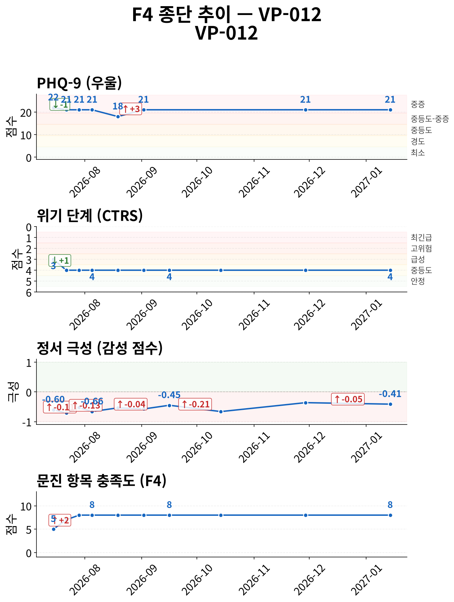
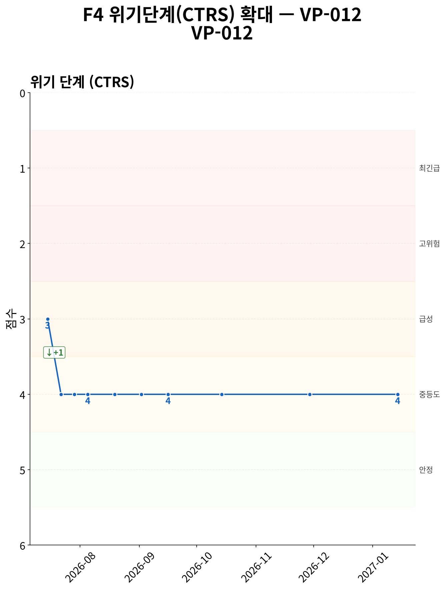
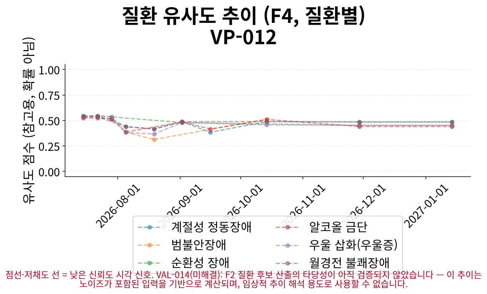
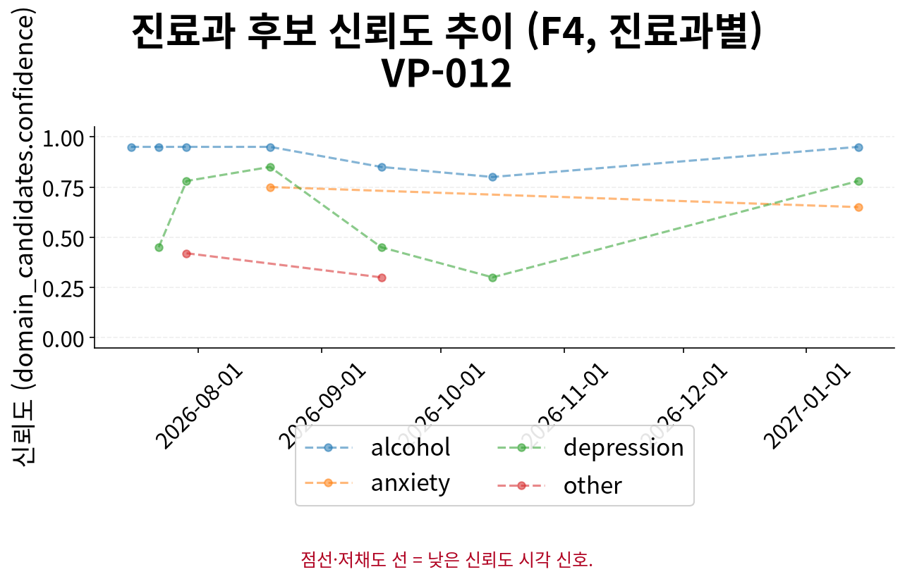

# F5 인계 요약 보고서 — VP-012

> **핵심 요약**
>
> - 환자: 정우식 (VP-012) — 10회차 (2027-01-14), 총 10세션 · 183일
> - 주호소: 건강검진에서 간 수치가 많이 올라가서 술을 줄이려고 노력 중이지만, 스트레스를 받을 때 술 생각이 자주 나고 한 잔 마시면 손 떨림이 줄어들고… (상세 부록 1 참조)
> - 위험 플래그: 자살사고 문항 양성 이력 없음 (자가보고 기준)
> - 최신 설문: PHQ-9 21/27 (중증) ↓ (22→21, 1회차 대비)
> - 주요 우려: 특이 우려 사항 없음

> **면책 조항**
>
> - 자가보고(AI 대화형 문진) 기반 비공식 문서이며 공식 의무기록·의학적 진단이 아닙니다.
> - AI 예상질환(하단)은 유사도 기반 참고 정보일 뿐 확률·가능성·진단이 아닙니다.
> - 최종 진단과 치료 방향은 반드시 의료진의 판단에 따라 결정되어야 합니다.

## 위험/안전 평가

당해 세션(10회차, 2027-01-14) 위험평가: 자살/자해 사고 탐색 질문에 부인 — 환자 발화: "전혀 없습니다. 그런 생각은 한 번도 해본 적 없고, 제 문제는 오로지 술을 줄이는 일뿐이에요.". 위기 단계(CTRS) 4/5 — 경도 우려 (준안정).

해당 없음 — 전체 세션 중 item-9 양성/안전 의뢰 이력이 없습니다.

> 최신 시행 척도 안내: 당해 세션에 F3 문진이 시행되어 별도 최신성 안내가 필요하지 않습니다.

## 주호소 및 현병력

**주호소**: 건강검진에서 간 수치가 많이 올라가서 술을 줄이려고 노력 중이지만, 스트레스를 받을 때 술 생각이 자주 나고 한 잔 마시면 손 떨림이 줄어들고 마음이 가라앉는 상황

**현병력**: 건강검진에서 간 수치 상승 결과를 받은 후 술을 줄이려고 노력하여 매일 마시던 것을 주 5일 정도로 줄였으나, 여전히 술 생각이 자주 나고 스트레스 받을 때 특히 강하게 들며, 손이 떨릴 때 한 잔 마시면 증상이 완화되는 현상이 있음

### 정신상태검사 (MSE)

텍스트 문진 특성상 관찰 기반 MSE는 평가 불가; 대화에서 도출된 소견 없음

## 전체 세션 요약

> 이 표의 값은 AI가 진행한 대화형 문진(F1)에서 환자가 자가보고한 내용이며, 임상의의 직접 평가나 검증된 척도 시행이 아닙니다.

| 슬롯 | 최신값 | 출처 | 변화 | 비고 |
|---|---|---|---|---|
| 주호소 | 건강검진에서 간 수치가 많이 올라가서 술을 줄이려고 노력 중이지만, 스트레스를 받을 때 술 생각이 자주 나고 한 잔 마시면 손 떨림이 줄어들고… (상세 부록 2 참조) | 9회차/2026-11-29 | 8회 변화 (S1→S3→S4→S5→S6→S7→S8→S9) · 상세 부록 참조 | A1 참조 (전문 서술) |
| 현병력 | 건강검진에서 간 수치 상승 결과를 받은 후 술을 줄이려고 노력하여 매일 마시던 것을 주 5일 정도로 줄였으나, 여전히 술 생각이 자주 나고 스트… (상세 부록 3 참조) | 8회차/2026-10-14 | 8회 변화 (S1→S2→S3→S4→S5→S6→S7→S8) · 상세 부록 참조 | A2 참조 (전문 서술) |
| 정신과 과거력 | 중학교 때 아버지와 크게 다툰 기억이 가끔 떠올라 술 없이는 감정을 다스리기 힘들 때가 많음 | 2회차/2026-07-22 | - | - |
| 신체질환/신경학적 병력 | 건강검진에서 간 수치 상승 결과 | 1회차/2026-07-15 | - | - |
| 개인사/사회력 | 지인 모임에 예전처럼 자주 나가지 못하고 식당 일로 인해 정신없는 날이 많으며, 배우자와는 자주 다퉈서 혼자 버티는 상황임 | 3회차/2026-07-29 | - | - |
| 가족력 | 가족 중 특별히 그런 분은 없었으나, 어릴 때 아버지가 술을 자주 드셨고 중학교 때 한 번 크게 다투신 적이 있음 | 2회차/2026-07-22 | - | - |
| 음주·흡연·물질사용 | 한 병 반도 자주 마시고 있음 | 5회차/2026-08-19 | 2회 변화 (S1→S5) · 상세 부록 참조 | - |
| 위험평가 | 자살/자해 사고 탐색 질문에 부인 — 환자 발화: "전혀 없습니다. 그런 생각은 한 번도 해본 적 없고, 제 문제는 오로지 술을 줄이는 일뿐이에… (상세 부록 4 참조) | 10회차/2027-01-14 | 8회 변화 (S1→S3→S4→S5→S6→S8→S9→S10) · 상세 부록 참조 | A3 참조 (전문 서술 + 종단 위험 신호) |

**주요 경과**

- 위험평가: S1: '자살/자해 사고 표현 있음 — 환자 발화: "아니요, 그런 적은 없었어요. 정신과를 간 적도 없고, 상담 같…' → S6: '자살/자해 사고 탐색 질문에 부인 — 환자 발화: "아니요, 그런 생각은 전혀 없어요. 그냥 술을 줄이고 싶…' → S10: '자살/자해 사고 탐색 질문에 부인 — 환자 발화: "전혀 없습니다. 그런 생각은 한 번도 해본 적 없고, 제…'
- 주호소: S1: '8-10년 전부터 거의 매일 소주 한 병 이상 마시며, 최근 2-3년 새 양이 늘어나 한 병 반도 마시고,…' → S6: '간 수치가 다시 안 좋아져서 술을 줄이고 싶다는 고민' → S9: '건강검진에서 간 수치가 많이 올라가서 술을 줄이려고 노력 중이지만, 스트레스를 받을 때 술 생각이 자주 나고…'
- 현병력: S1: '15년 전 식당 개업 후 음주 시작, 초기 하루 한두 잔에서 최근 2-3년 사이 한 병 반으로 증가, 손님…' → S5: '식당이 비수기라 경제적으로 빠듯한 상황에서 스트레스가 많을 때 술을 더 많이 마시게 되고, 한 병 반도 자주…' → S8: '건강검진에서 간 수치 상승 결과를 받은 후 술을 줄이려고 노력하여 매일 마시던 것을 주 5일 정도로 줄였으나…'
- 음주·흡연·물질사용: S1: '15년 전부터 매일 소주 한 병 이상, 최근 2-3년 사이 한 병 반으로 증가' → S5: '한 병 반도 자주 마시고 있음'

## 시행된 설문

> AI가 진행한 대화형 문진 결과이며, 검증된 임상 설문 시행이 아닙니다.

**PHQ-9 21/27 (중증)** — 10회차 (2027-01-14)

- 응답: 2,2,3,3,2,3,3,3,0
- 자살사고 문항(9번): 음성
- 문진 방식: natural

## 종단 추세

전체 방향: **개선** (10세션, 183일)

> 전체 방향은 척도·위기단계·정서 방향의 다수결로 계산되며, 악화 신호가 하나라도 있으면 악화로 우선 판정합니다. 정서 포함 여부에 따라 결과가 달라질 수 있습니다.

| 항목 | 방향 | 근거 |
|---|---|---|
| AUDIT-C 총점 | 개선 | AUDIT-C: 세션 7→8: 11 → 10 (-1) |
| PHQ-9 총점 | 개선 | PHQ-9: 세션 1→10: 22 → 21 (-1) |
| 위기 단계(CTRS) | 개선 | 세션 1→10: 3 → 4 (+1) |
| 감성 점수 | 개선 | 세션 1→10: -0.6 → -0.4125 (+0.188) |
| 문진 항목 충족도 | 개선 | 세션 1→10: 5 → 8 (+3) |

위기 반응 발생 세션 없음
위험 고조 세션 중 설문 미시행 사례 없음
종단 추세 일관성(설문·CTRS·감성): 일치

### 추세 차트

*그림 1. 설문 총점·위기 단계(CTRS)·정서·문진 충족도 추이 (10세션, 183일) — 위기 단계는 값이 낮을수록(1에 가까울수록) 위험이 높습니다.*

*그림 2. 위기 단계(CTRS) 확대 추이 — 1(최긴급)에 가까울수록 위험, 5(안정)에 가까울수록 안정적입니다.*

*그림 3. 세션별 질환 유사도 추이 — 점선·저채도 선은 참고용 유사도 신호일 뿐이며 확률·가능성·진단이 아닙니다.*

*그림 4. 세션별 진료과 후보 신뢰도 추이 — 값이 높을수록 해당 진료과 매칭 신뢰도가 높습니다.*

## AI 참고 정보 (비진단)

> ⚠ 유사도(similarity)일 뿐 확률·가능성·신뢰도가 아닙니다 — 임상 판단 대체 불가.

| 순위 | 질환 | 유사도 |
|---|---|---|
| 공동 1위 | 계절성 정동장애 | 0.485 |
| 공동 1위 | 월경전 불쾌장애 | 0.485 |
| 공동 3위 | 우울 삽화(우울증) | 0.452 |

기타 후보: 순환성 장애(0.452), 알코올 금단(0.440)

> 이 정보는 AI가 생성한 참고용 예상 질환 후보이며 의학적 진단이 아닙니다. 함께 제공되는 설문 추천(recommended_questionnaire) 역시 초기 상담(인테이크) 지원을 위한 척도 제안일 뿐, 진단적 판단이 아닙니다. 최종 진단과 치료 방향은 반드시 의료진의 판단에 따라 결정되어야 합니다.
> 추천 설문: PHQ-9 — PHQ-9 screens depressive-symptom burden only, does not screen manic/hypomanic symptoms — bipolar-spectrum presentations need clinician follow-up regardless of score.

## 권장 진료과 및 후속 조치

| 진료과 | 사유 |
|---|---|
| 정신건강의학과 | 알코올 사용장애와 관련된 금단 증상(손 떨림, 불안), 간 수치 상승, AUDIT/CAGE 스크리닝 양성 가능성, PHQ-9 21점(중증 우울증), GAD-7 양성 가능성 등 복합적인 정신건강 문제 |
| 내과 | 간 수치 상승 및 알코올 관련 간 질환 관리 필요 |

추천 설문: PHQ-9 — PHQ-9 screens depressive-symptom burden only, does not screen manic/hypomanic symptoms — bipolar-spectrum presentations need clinician follow-up regardless of score.

> 약물 정보: 별도 구조화 항목 없음, HPI/병력 서술 포함 여부만 확인

## 임상 종합 소견

AI 종합 소견 미생성 (narrative disabled)

## 상세 부록

**1. 주호소 전문**

건강검진에서 간 수치가 많이 올라가서 술을 줄이려고 노력 중이지만, 스트레스를 받을 때 술 생각이 자주 나고 한 잔 마시면 손 떨림이 줄어들고 마음이 가라앉는 상황

**2. 주호소 최신값 전문**

건강검진에서 간 수치가 많이 올라가서 술을 줄이려고 노력 중이지만, 스트레스를 받을 때 술 생각이 자주 나고 한 잔 마시면 손 떨림이 줄어들고 마음이 가라앉는 상황

**3. 현병력 최신값 전문**

건강검진에서 간 수치 상승 결과를 받은 후 술을 줄이려고 노력하여 매일 마시던 것을 주 5일 정도로 줄였으나, 여전히 술 생각이 자주 나고 스트레스 받을 때 특히 강하게 들며, 손이 떨릴 때 한 잔 마시면 증상이 완화되는 현상이 있음

**4. 위험평가 최신값 전문**

자살/자해 사고 탐색 질문에 부인 — 환자 발화: "전혀 없습니다. 그런 생각은 한 번도 해본 적 없고, 제 문제는 오로지 술을 줄이는 일뿐이에요."

### 슬롯별 전체 변화 이력 (미압축)

**주호소**

S1: '8-10년 전부터 거의 매일 소주 한 병 이상 마시며, 최근 2-3년 새 양이 늘어나 한 병 반도 마시고, 스트레스 받을 때마다 술 생각이 먼저 나며 한 번 마시기 시작하면 멈추기 어려움' → S3: '간 수치가 걱정되어 술을 줄여야겠다고 생각했으나, 식당 일로 인한 스트레스로 다시 술이 조금씩 늘어나고 있음' → S4: '간 수치가 걱정되어 술을 줄이려고 했으나 식당 일로 인한 스트레스로 다시 술이 조금씩 늘어나고 있음' → S5: '식당이 비수기라 경제적으로 빠듯한 날일수록 술을 더 많이 마시게 되고, 한 병 반도 자주 마시며 기분이 더 가라앉는 상황' → S6: '간 수치가 다시 안 좋아져서 술을 줄이고 싶다는 고민' → S7: '간 수치가 다시 나빠져서 술을 줄이고 싶은 고민' → S8: '건강검진에서 간 수치가 많이 올라가서 술을 줄이고 싶지만, 매일 마시던 것을 주 5일 정도로 줄였음에도 술 생각이 자주 나고 스트레스 받을 때 특히 강하게 들며, 손이 떨릴 때 한 잔 마시면 나아지는 증상이 있음' → S9: '건강검진에서 간 수치가 많이 올라가서 술을 줄이려고 노력 중이지만, 스트레스를 받을 때 술 생각이 자주 나고 한 잔 마시면 손 떨림이 줄어들고 마음이 가라앉는 상황'

**현병력**

S1: '15년 전 식당 개업 후 음주 시작, 초기 하루 한두 잔에서 최근 2-3년 사이 한 병 반으로 증가, 손님 없거나 스트레스 시 음주 충동 심화, 아침 손 떨림 및 피로감 동반, 음주 중단 시 악순환 반복' → S2: '건강검진에서 간 상태가 걱정된다고 언급' → S3: '8-10년 전부터 거의 매일 소주 한 병 이상 마시기 시작, 최근 2-3년 새 한 병 반으로 양이 증가, 스트레스 받을 때마다 술 생각이 먼저 나고 한 번 마시기 시작하면 멈추기 어려움' → S4: '간 수치 문제로 술 줄이려 했으나 식당 일로 인한 스트레스로 술이 다시 늘어나기 시작함. 집사람과 술로 인한 다툼 발생 후 마음이 무거워짐' → S5: '식당이 비수기라 경제적으로 빠듯한 상황에서 스트레스가 많을 때 술을 더 많이 마시게 되고, 한 병 반도 자주 마시며 그로 인해 기분이 더 가라앉는 상황' → S6: '간 수치가 또 안 좋아졌다고 말함' → S7: '간 수치가 다시 나빠져서 술을 줄이고 싶은 고민' → S8: '건강검진에서 간 수치 상승 결과를 받은 후 술을 줄이려고 노력하여 매일 마시던 것을 주 5일 정도로 줄였으나, 여전히 술 생각이 자주 나고 스트레스 받을 때 특히 강하게 들며, 손이 떨릴 때 한 잔 마시면 증상이 완화되는 현상이 있음'

**음주·흡연·물질사용**

S1: '15년 전부터 매일 소주 한 병 이상, 최근 2-3년 사이 한 병 반으로 증가' → S5: '한 병 반도 자주 마시고 있음'

**위험평가**

S1: '자살/자해 사고 표현 있음 — 환자 발화: "아니요, 그런 적은 없었어요. 정신과를 간 적도 없고, 상담 같은 것도 처음. 이 앱이 처음이에요."; 구체적 계획/의도 부인 — 환자 발화: "15년 전 식당을 열고 나서부터 술을 마시기 시작했어요. 처음엔 하루 한두 잔이었는데, 시간이 지나면서 점점 양이 늘었어요. 특히 손님이 없거나..."' → S3: '자살/자해 사고 탐색 질문에 부인 — 환자 발화: "아니요, 그런 생각은 전혀 없어요. 그냥 술을 줄이고 싶은 거예요."' → S4: '자살/자해 사고 탐색 질문에 부인 — 환자 발화: "아니요, 그런 생각은 전혀 없습니다. 술을 줄이고 싶은 마음은 있지만, 삶 자체를 포기하고 싶은 마음은 전혀 없어요."' → S5: '자살/자해 사고 탐색 질문에 부인 — 환자 발화: "아니요, 그런 생각은 전혀 없어요. 그냥 술을 줄이고 싶은 마음이 클 뿐이에요."' → S6: '자살/자해 사고 탐색 질문에 부인 — 환자 발화: "아니요, 그런 생각은 전혀 없어요. 그냥 술을 줄이고 싶은 거예요."' → S8: '자살/자해 사고 탐색 질문에 부인 — 환자 발화: "네, 맞아요. 간 수치가 걱정돼서 줄이려고는 했는데, 한 번 마시기 시작하면 멈추기가 어려워요. 의지로 안 되는 것 같아서 답답하기도 하고, 그..."' → S9: '자살/자해 사고 탐색 질문에 부인 — 환자 발화: "네, 스트레스를 받으면 자꾸 술 생각이 나요. 특히 식당 운영하다 보면 아침부터 컨디션이 안 좋을 때가 많은데, 그럴수록 한 잔이라도 마셔야 정..."' → S10: '자살/자해 사고 탐색 질문에 부인 — 환자 발화: "전혀 없습니다. 그런 생각은 한 번도 해본 적 없고, 제 문제는 오로지 술을 줄이는 일뿐이에요."'

## 각주

모델: solar-pro3-260323 · 생성 시각: 2026-07-15T17:31:05.371227 · 세션ID: f1_VP-012_followup
설문 문항 출처: v1, verbatim Pfizer/phqscreeners.com Korean PHQ-9 PDF, retrieved 2026-07-13 (item_bank_v1_sources.md §1.2/§1.3, appendix §A1); translation chosen per ADR-033 decision 1 (Seo & Park 2015's Korean validation study administered this same translation)

### 시스템 참고 (내부 감사용, 임상 판단 근거 아님)

종단 추세 판정 근거: overall_direction은 세션별 척도/CTRS/sentiment 방향의 다수결(worsened-priority)로 계산되며(src.f4::_overall_direction), sentiment 포함 여부에 따라 verdict가 달라질 수 있습니다(REV-045 row 2) — 세부 근거는 trend_verdicts의 evidence를 참고하십시오.
