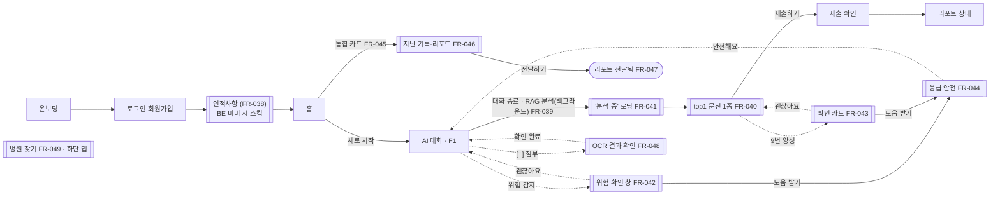

# Neuro-Sync 프론트엔드 v3 PRD (증분)

> **상위 문서**: [`PRD_neuro-sync.md`](./PRD_neuro-sync.md) (마스터, v1.5) · **원본 요청**: [`../neurosync_frontend_handoff_v3.md`](../neurosync_frontend_handoff_v3.md) · **AI 기능 축**: [`../AI_master_plan.md`](../AI_master_plan.md)
>
> 본 문서는 마스터 PRD를 대체하지 않는 **증분(delta) PRD**다. 프론트엔드 핸드오프 v3(2026-07-15)에서 확정된 방향을 테스트 가능한 요구사항으로 구조화한다. 여기서 신설/개정하는 요구사항은 **FR-038부터** 이어 붙이며, 기존 FR을 개정하는 항목은 "(개정: FR-0xx)"로 명시한다. 마스터와 충돌하던 절(§2.2 Gherkin·§5.4/§5.4.1·§5.5 Flow A/C·§6 데모 IN·Appendix D)은 **마스터 v1.5(2026-07-15)에서 개정 완료**되어 본 문서가 단일 기준이다.

## 기능 축 (F1–F5, AI_master_plan 기준)

| 축 | 의미 | 상태 |
|---|---|---|
| **F1** | 자율 대화 (임상 슬롯 백그라운드 추출 포함) | ✅ 구현 완료 |
| **F2** | RAG 기반 질환 도메인 추정 | ✅ ai-server 완료 · ⚠️ 플랫폼 프록시 필요 |
| **F3** | 구조화 문진 (5종 채점기) | ✅ 채점기 완료 · ⚠️ **저장 스키마 확장 필요 (§6-D)** |
| **F4** | 종단적 상태 추론 (점수 추이) | ✅ ai-server 완료 · ⚠️ 프록시 필요 |
| **F5** | 핸드오프 리포트 | ⚠️ 자동 전달 → 수동 전달로 개정 필요 |

---

## Changelog

- **v3.1 (2026-07-15)**: PRD 리뷰(Critical 1·Major 13·Minor 7, FAIL) 반영 개정 + **데모 범위 결정**
  - **데모 범위 확정**: v3 P0(FR-039~044) 전부 **7/31 데모 포함** — §7 일정 신설, §10 일정 리스크 등재. 마스터 §6 "데모 IN" v1.5 개정 완료
  - **C-1 해소**: `questionnaire_results.type`이 `('PHQ9','GAD7')` CHECK 제약(`apps/api/src/models/questionnaire.py:34`)이라 AUDIT-C/PHQ-4 저장 불가 → **§6-D 스키마 마이그레이션** BE 작업 신설, 미결 #7 등재
  - FR-042 의존성 오타(자기참조 → FR-011), FR-048에 FR-028(파일 보안) 의존성 연결
  - FR-002 개정 범위 명시(비상 연락처·연령 검증은 register 존치), FR-038 미구현 기간 폴백("가입→홈 직행") 정의
  - P1(FR-045/047) Gherkin 수용 기준 추가, §4에 라우트·상태(loading/error/empty) 컬럼 추가
  - 핫라인 마이그레이션 범위 확대(미결 #5): 클라이언트 3개 화면 + **서버 WS payload** — 마스터 문서는 v1.5에서 109로 개정 완료, 코드 변경만 잔존
  - PHQ-4 폴백을 **잠정(config 상수)** 으로 명시(미결 #4 확정 전 테스트 가능하게 분리), PHQ-4 한국어판 검증·라이선스를 미결 #4에 추가
  - FR-046 환자 노출 가드레일 정의(표준 문진 점수=노출 가능 / AI 추정·질환명=비노출 / CTRS 환자 노출=임상 자문, 미결 #6 확장)
  - 신규 AI 인터페이스 3종의 마스터 §0.3 contract 등재를 미결 #8로, `domain/infer` SLA를 NFR(v3-3)에 명시
  - Minor: §6에 `slots/extract` 행 복원, 배지 라벨 정의 명확화, Success Metrics 기준선 명시, 동반이환 리스크·프록시 로그 감사 추가
- **v3.0 (2026-07-15)**: 프론트엔드 핸드오프 v3 방향 확정 → 본 증분 PRD 신설
  - 문진 파이프라인을 **고정 순차(대화→PHQ-9→GAD-7)에서 RAG top1 단일 문진**으로 전환 (FR-039/040/041)
  - **'질환 추정·문진 안내' 화면 폐기** — 질환명·신호 강도 노출은 자기진단 유도 위험. 추정 결과는 화면에 남기지 않고 **라우팅에만** 사용
  - 위험 트리아지를 **말풍선 버튼 → 공통 확인 창 컴포넌트**로 통일 (FR-042/043)
  - 핸드오프 리포트를 **자동 전달 → 보관·수정·수동 전달**로 개정 (FR-047, 개정: FR-018)
  - 인적사항 수집 항목 **10종으로 확장** (FR-038, 개정: FR-002)
  - OCR을 사전 문진 업로드 단계에서 제거 → **대화 중 처방약 첨부**로 이동 (FR-048, 개정: FR-008/009)
  - 핫라인 기준 **109(자살예방 통합)** 로 정리 + 병원 찾기 개편 (FR-044/049)

---

## 1. Overview

### 1.1 배경 / 변경 동기

마스터 PRD 기준 데모(Phase 1b) 흐름은 **대화 → PHQ-9 → GAD-7 고정 순차**였다. 이는 모든 사용자가 두 표준 문진을 전부 수행하게 만들어 (a) 불필요한 응답 부담, (b) 주 증상과 무관한 문진 강요라는 문제가 있었다. v3는 F2(RAG)를 실제로 활용해 **대화에서 추정한 주 증상 도메인의 top1 문진 1종만** 수행하도록 파이프라인을 재설계한다.

동시에, 위험 트리아지·리포트 전달·인적사항 수집·OCR 진입점을 실제 임상 안전 원칙과 운영 현실(리포트는 병원 방문 시에만 전달)에 맞게 정비한다.

### 1.2 핵심 원칙 (변경 불가 제약)

1. **AI는 진단하지 않는다.** 화면에 **AI가 추정한 질환명·신호 강도를 노출하지 않는다.** 도메인 추정은 문진 라우팅에만 쓰고, 문진 화면에는 **도구명(PHQ-9 등)만** 표시한다.
   - *가드레일 경계*: **표준화 문진의 점수·추이는 환자 본인 응답의 산술 결과**이므로 환자에게 노출 가능(FR-046). 비노출 대상은 **AI 추론 산출물**(도메인 추정, 질환명, 신호 강도)이다. AI 추론 지표인 **CTRS의 환자 노출 여부는 임상 자문으로 확정**(미결 #6).
2. **강제 전환 없음.** 모든 위험 대응은 **사용자 확인(도움 받기/괜찮아요) 이후에만** 다음 단계로 진행한다. *(마스터 §2.2·§5.4.1·Flow C의 "강제 전환"은 v1.5에서 본 원칙으로 개정 완료.)*
3. **최종 판단은 의료진.** "AI 추정은 참고용" 고지는 유지하되, 문진 헤더 하위 서브텍스트로 배치한다.
4. **민감정보 최소수집.** 인적사항 전 항목에 "응답하지 않음"을 허용하며, 이것이 **기본 선택값**이다.
5. **리포트는 환자 통제.** 자동 전송하지 않고, 보관 → 열람·수정 → 환자가 원할 때 전달한다.

### 1.3 범위 (In Scope)

프론트엔드(모바일) 9개 수정사항(FR-038 ~ FR-049) + 이를 위한 플랫폼 프록시/스키마 의존성(§6). **이 중 P0(FR-039~044)는 7/31 데모 포함**(§7).

### 1.4 Non-Goals (Out of Scope)

- 의료진 웹 대시보드 변경 (마스터 PRD §3 FR-015~021 유지)
- AI 내부 로직(RAG·채점·추이·OCR 프롬프트) — [`AI_master_plan.md`](../AI_master_plan.md) 소관, ai-server 구현 완료 전제
- 사전 문진 단계의 문서 업로드(FR-008) — 대화 중 첨부(FR-048)로 대체, 진료기록 API 연동 시 생략 가능
- '질환 추정·문진 안내' 화면 및 `survey_route.png` 시안 — **폐기**

---

## 2. User Flow (v3)



---

## 3. Functional Requirements

> Owner: `P` = Platform, `A` = AI Research, `S` = Shared. Priority: P0(Must)/P1(Should)/P2(Could).

| ID | Owner | Requirement | Priority | Dependencies |
|----|-------|------------|----------|--------------|
| **FR-038** | P | **인적사항 확장 입력** (가입 직후 신규 화면). 생년월일·성별·거주지역·혼인 상태·동거 형태·학력·직업·고용상태·소득수준·종교 10종을 드롭다운/칩으로 수집, **모든 항목 "응답하지 않음"이 기본 선택값**. [다음]/[나중에 하기] → 홈. **개정 경계(FR-002)**: 기존 register의 이름·연락처·**비상 연락처**·**연령 검증 분기(만 14세 미만)** 는 **register에 존치**하고, 본 화면은 추가 인적사항만 담당. **BE(§6-C) 미비 기간에는 화면을 노출하지 않고 가입 → 홈 직행**. 종교(PIPA §23 사상·신념)·소득 등 민감 항목은 **수집 목적 고지 + 별도 옵트인 동의** 하에만 저장(미결 #3). | P2 | FR-001, FR-002, §6-C |
| **FR-039** | S | **RAG top1 문진 라우팅.** 대화 종료(진행률 충족 또는 설문 이동) 시 도메인 추정을 **백그라운드**로 호출하고 top1 도메인의 문진 1종으로 **바로 진입**. 안내 화면 없음. 추정 결과는 **화면에 미노출**, 라우팅에만 사용. 실패·저신뢰 시 **폴백 문진**(§4.1, 잠정 PHQ-4 — config 상수 `FALLBACK_SURVEY`, 미결 #4)으로 진행. — **P**: '분석 중' 로딩 + 라우팅. **A**: `/ai/domain/infer` | **P0** | FR-004, §6-A |
| **FR-040** | P | **문항 주입형 공통 문진 컴포넌트.** 고정 라우팅(chat→phq9→gad7) 제거, 단일 컴포넌트에 문항 배열을 주입해 PHQ-9/GAD-7/AUDIT-C/PHQ-4를 렌더. 진행 표기 **'문진 1/1'**. 헤더엔 **도구명만**, "참고용·진단은 의료진" 서브텍스트. 결과 저장은 `POST /sessions/:id/questionnaires` — **type 확장 마이그레이션(§6-D) 선행 필수**. | **P0** | FR-039, §6-D, `/ai/survey/score` |
| **FR-041** | P | **대화 '분석 중' 로딩 상태.** 대화 종료~top1 문진 진입 사이(목표 2~3초, 상한 5초 — NFR v3-3) 대기 상태를 대화 화면에 표시(폐기된 안내 화면의 대기 처리 대체). 상한 초과·오류 시 폴백 문진으로 진행. | **P0** | FR-039 |
| **FR-042** | S | **공통 위험 확인 창 컴포넌트.** 대화 중=모달, 문진 중=인라인 카드로 동일 컴포넌트 표시(클라이언트 렌더, 에이전트 메시지 수정 불필요). [도움 받기]→응급, [괜찮아요]→원래 화면 복귀. **확인 없이는 전환 금지.** (개정: FR-005/011 트리아지 UX — 마스터 v1.5 반영 완료) | **P0** | FR-005, FR-011 |
| **FR-043** | S | **문진 자살 문항(9번) 확인 카드.** PHQ-9 9번 양성 응답 시 인라인 확인 카드 노출. **응답 값은 그대로 저장(점수 계산 유지), 설문 중단 없음.** [도움 받기]→응급, [괜찮아요]→다음 문항. | **P0** | FR-040, FR-042 |
| **FR-044** | S | **응급 안전 화면 개편.** [도움 받기] 선택 시에만 진입. 핫라인 **109(자살예방 통합)·119·112**, "지금 혼자 계신가요?" 응답을 `PATCH /risk_events/:id`로 기록→대시보드 alert. [안전해요]→이전 화면 복귀. (개정: FR-011 — 핫라인 109 기준. 코드 마이그레이션 범위는 미결 #5) | **P0** | FR-011, FR-022 |
| **FR-045** | P | **홈 지난 기록·리포트 통합 카드.** 최근 문진 일자 + 상태 배지 3단계(§4.2). 카드 탭→기록·리포트 화면. *(우선순위 근거: 핸드오프 수정6 P1 승계. FR-047 완료 전에는 배지를 '보관' 단일 상태로 표시)* | P1 | FR-013, FR-047 |
| **FR-046** | S | **지난 기록·리포트 화면.** 점수 추이 차트(F4 `/ai/temporal/summarize`의 `plot_data` 바인딩) + 문진 이력. 기록 탭→PDF/열람 창. **환자 노출 가드레일**: 표준 문진 점수·추이 = 노출 가능 / AI 도메인 추정·질환명 = 비노출 / **CTRS 노출 여부·표현 방식(낮을수록 위험 명시 포함) = 임상 자문 후 확정(미결 #6)**. | P2 | FR-018, §6-A |
| **FR-047** | P | **리포트 수동 전달.** 자동 생성·전달 폐지. 문진 완료 시 **보관** → 환자가 **열람·수정** → [전달하기]로만 전송. (개정: FR-018 자동 전달. §6-B BE 변경 완료 전에는 [전달하기] 버튼 비노출) *(우선순위 근거: 핸드오프 수정7은 P2였으나 FR-045(P1) 상태 배지가 전달 상태에 의존하므로 P1로 상향)* | P1 | FR-010, §6-B |
| **FR-048** | S | **대화 중 처방약 첨부 → OCR 확인.** 입력바 [+](카메라/파일)로 처방전 촬영→`/ai/ocr/parse`→추출 카드 검증·수정("확인 필요"=빨간 배지)→[확인 완료]→대화 복귀, **확정 내용만 리포트 반영.** 업로드 파일에는 **FR-028 보안 통제 전체 적용**(MIME 화이트리스트·매직넘버·멀웨어 스캔·파일명 새니타이즈·20MB 제한). (개정: FR-008/009 진입점 이동) | P2 | FR-004, **FR-028**, §6-A |
| **FR-049** | P | **병원 찾기 개편(독립 탭).** 지도+목록, 거리/운영시간 정렬, [전화]/[길찾기]→외부 앱. **위기 상태(CTRS 1–2)에서는 목록보다 119/109 안내 우선.** (개정: FR-012) | P2 | FR-012, `/ai/nearby/hospitals` |

### 3.1 Acceptance Criteria (Gherkin) — P0

**FR-039/040/041 — RAG top1 문진 라우팅**
```gherkin
Scenario: 대화 종료 시 top1 문진으로 바로 진입
  Given 사용자가 대화를 종료(진행률 충족 또는 설문 이동)했다
  When 클라이언트가 백그라운드로 도메인 추정을 요청한다
  Then 대화 화면에 '분석 중' 로딩 상태가 표시된다 (목표 2~3초)
  And 응답 top1이 depression이면 PHQ-9 문항이 주입된 문진 화면으로 전환된다
  And 문진 화면 어디에도 질환명·신호 강도가 표시되지 않는다
  And 진행 표기는 '문진 1/1'이다

Scenario: 도메인 추정 실패/저신뢰 폴백 (잠정 — 폴백 도구는 config 상수 FALLBACK_SURVEY)
  Given 도메인 추정이 5xx/타임아웃(5초, NFR v3-3)이거나 top1 신뢰도가 임계값 미만이다
  When '분석 중' 상태가 종료된다
  Then FALLBACK_SURVEY에 지정된 문진(현재 잠정값 PHQ-4)으로 진행한다
  And 사용자에게 실패 사실을 병명 형태로 노출하지 않는다
  # 미결 #4 확정 대상: FALLBACK_SURVEY 값(PHQ-4 여부·한국어판 검증), 실패 안내 UX(조용히 진행 vs 토스트).
  # 본 시나리오는 "폴백이 존재하고 병명 비노출"만 검증하며, 도구 선택은 상수 교체로 흡수한다.

Scenario: 문진 결과 저장 (AUDIT-C/PHQ-4 포함)
  Given top1이 alcohol이라 AUDIT-C를 완료했다
  When POST /sessions/:id/questionnaires 로 결과를 저장한다
  Then 서버는 type='AUDITC'를 수용하고 200을 반환한다   # §6-D 마이그레이션 완료 전제
```

**FR-042/043 — 위험 확인 창**
```gherkin
Scenario: 대화 중 위험 감지
  Given 대화 중 WS로 risk:detected(high/critical)를 수신했다
  When 확인 창(모달)이 표시된다
  Then 사용자가 [도움 받기]를 누르기 전에는 응급 화면으로 전환되지 않는다
  And [괜찮아요]를 누르면 대화가 그대로 이어진다

Scenario: 문진 9번 양성
  Given PHQ-9 9번 문항에 양성(1점 이상)으로 응답했다
  When 인라인 확인 카드가 노출된다
  Then 9번 응답 값은 저장되어 총점 계산에 포함된다
  And 설문은 중단되지 않는다
  And [도움 받기]→응급, [괜찮아요]→다음 문항으로 진행한다
```

**FR-044 — 응급 안전 화면**
```gherkin
Scenario: 응급 진입 및 안전 확인 기록
  Given 위험 확인 창에서 [도움 받기]를 선택했다
  Then 109·119·112 전화 버튼이 표시된다
  When "지금 혼자 계신가요?"에 응답한다
  Then PATCH /risk_events/:id로 alone_status가 기록되어 대시보드 alert로 반영된다
  And [안전해요]를 눌러야만 이전 화면으로 복귀한다
```

### 3.2 Acceptance Criteria (Gherkin) — P1

**FR-045 — 홈 통합 카드**
```gherkin
Scenario: 상태 배지 3단계 표시
  Given 최근 문진이 완료되어 리포트가 보관 상태다
  Then 홈 통합 카드에 최근 문진 일자와 '보관(미전달)' 회색 배지가 표시된다
  When 환자가 기록·리포트 화면에서 [전달하기]를 실행한다
  Then 배지가 '전달됨' 파랑으로 갱신된다
  When 의료진이 웹에서 검토를 완료한다
  Then 배지가 '검토 완료' 초록으로 갱신된다

Scenario: FR-047 미완료 기간 축소 표시
  Given §6-B 백엔드 변경이 아직 배포되지 않았다
  Then 카드 배지는 '보관' 단일 상태로만 표시되고 전달 상태를 표시하지 않는다
```

**FR-047 — 리포트 수동 전달**
```gherkin
Scenario: 자동 전달 폐지 및 수동 전달
  Given 환자가 문진을 완료·제출했다
  Then 리포트는 생성 후 '보관' 상태로 저장되며 의료진에게 자동 전달되지 않는다
  When 환자가 기록·리포트 화면에서 리포트를 열람·수정하고 [전달하기]를 누른다
  Then 그 시점에만 의료진 웹에 리포트가 노출되고 상태가 '전달됨'으로 바뀐다

Scenario: BE 미비 기간 가드
  Given §6-B 변경이 배포되지 않아 서버가 여전히 자동 전달한다
  Then 클라이언트는 [전달하기] 버튼을 렌더하지 않는다 (이중 전달 방지)
```

---

## 4. 화면 명세 (수정 1~9)

각 화면의 상세 시안은 [`../neurosync_frontend_handoff_v3.md`](../neurosync_frontend_handoff_v3.md)의 임베드 이미지를 참조. 아래는 구현 계약(라우트/구성/상태/연결)이다.

| # | 화면 | 라우트 (expo-router) | 구성 | 상태 (loading / error / empty 포함) | 연결 |
|---|------|------|------|-----------|------|
| 1 (FR-038) | 인적사항 | `/(auth)/demographics` (신규) | 10개 항목 드롭다운/칩 + "응답하지 않음" 기본값 | 입력중 / **저장 실패(재시도+나중에 하기)** / BE 미비 시 미노출 | [다음]·[나중에 하기]→홈 |
| 2 (FR-039~041) | 대화→문진 | `/(patient)/intake/chat` → `/(patient)/intake/survey` (문항 주입형, 기존 phq9·gad7 라우트 대체) | 대화 '분석 중' 로딩 → 문항 주입형 문진 | 대화 / **분석중(상한 5s)** / **추정 실패→폴백** / 문진 / 저장 실패(재시도) | 대화 종료→로딩→top1 문진→[제출]→제출 확인 |
| 3 (FR-042) | 위험 확인 창(대화) | (모달 — chat 내) | 도움받기/괜찮아요 | 표시/숨김 — **오프라인에서도 즉시 렌더(NFR v3-1)** | [도움 받기]→응급, [괜찮아요]→대화 |
| 4 (FR-043) | 확인 카드(문진) | (인라인 — survey 내) | 도움받기/괜찮아요 | 표시/숨김 | [도움 받기]→응급, [괜찮아요]→다음 문항 |
| 5 (FR-044) | 응급 안전 | `/(patient)/emergency` (기존 개편) | 109/119/112 + 혼자 계신가요 | 진입/응답/기록 — **기록 실패 시 화면 차단 금지(best-effort)** | 전화·[안전해요]→이전 화면 |
| 6 (FR-045) | 홈 통합 카드 | `/(patient)/(tabs)/home` (기존 개편) | 최근 일자 + 상태 배지 | 보관/전달됨/검토완료 / **이력 없음(empty)** / 조회 실패(재시도) | 카드 탭→기록·리포트 |
| 7 (FR-046/047) | 기록·리포트 | `/(patient)/(tabs)/records` (신규 탭) | 추이 차트 + 문진 이력 + PDF | 로딩 / **차트 로드 실패(이력 리스트는 유지)** / 이력 없음 / 보관/전달됨/검토완료 | 기록→PDF, [전달하기]→전달됨 |
| 8 (FR-048) | OCR 확인 | `/(patient)/intake/ocr-confirm` (신규) | 추출 카드 + "확인 필요" 빨간 배지 | 촬영/파싱중/파싱 실패(재촬영)/검증 | [확인 완료]→대화 |
| 9 (FR-049) | 병원 찾기 | `/(patient)/(tabs)/hospitals` (기존 개편) | 지도+목록, 정렬 | 로딩/위치권한 거부/결과 없음/**위기(119·109 우선)** | [전화]/[길찾기]→외부 |

> 라우트 참고: 기존 하단 탭은 홈·병원·설정 3개. FR-046 신설 시 **기록 탭 추가**(홈·기록·병원·설정 4탭)로 확장하며, 탭 구성 변경은 FR-045/046 구현 시점에 확정.

### 4.1 top1 도메인 → 문진 매핑 (FR-040)

| top1 도메인 | 문진 도구 | 비고 |
|---|---|---|
| depression (우울) | PHQ-9 | 기존 문항 재사용 |
| anxiety (불안) | GAD-7 | 기존 문항 재사용 |
| alcohol (음주) | AUDIT-C | v2 한국어 문항(KNHANES 임계값) — **저장은 §6-D 선행** |
| 후보 없음·저신뢰 | `FALLBACK_SURVEY` (잠정 PHQ-4) | **미결 #4** — 도구 확정 + 한국어판 검증·라이선스 확인 |

### 4.2 상태 배지 정의 (FR-045)

| 상태 | 색 | 의미 |
|---|---|---|
| 보관(미전달) | 회색 | 문진 완료·리포트 생성됨, 환자가 아직 전달하지 않음 *(핸드오프 라벨 '미작성'을 의미 명확화를 위해 '보관'으로 표기 — UX 카피는 디자인 검토에서 확정)* |
| 전달됨 | 파랑 | 환자가 [전달하기] 실행 |
| 검토 완료 | 초록 | 의료진 웹에서 확인 완료 |

> 문진 자체를 시작하지 않은 사용자는 카드가 empty 상태("첫 문진을 시작해 보세요")로 표시된다.

### 4.3 핫라인 (FR-044) — 109 기준

109(자살예방 통합번호, 구 1393·1577-0199 통합) · 119(응급의료) · 112(경찰). **마스터 PRD 문서는 v1.5에서 109로 개정 완료.** 코드 마이그레이션 범위는 미결 #5 참조(클라이언트 3개 화면 + 서버 payload). CTRS 초응급(1) 확인 창 정책은 임상 자문(미결 #6).

---

## 5. Non-Functional (증분)

- **NFR(v3-1) 안전 우선 렌더**: 위험 확인 창/응급 화면은 네트워크 상태와 무관하게 즉시 렌더(핫라인 하드코딩 폴백 보장). tel: 실패 시 번호 복사 폴백.
- **NFR(v3-2) 질환명 비노출 감사**: 도메인 추정 응답은 **클라이언트 상태·로그·화면 및 플랫폼 프록시(apps/api) 로그** 어디에도 병명 문자열로 잔류시키지 않는다(라우팅 키로만 사용). 프록시는 도메인명을 로그에 남기지 않거나 코드화한다.
- **NFR(v3-3) '분석 중' SLA**: `POST /ai/domain/infer` 프록시 경유 p95 ≤ 3초, 클라이언트 대기 상한 5초. 초과 시 폴백 문진으로 진행. *(이 SLA는 신규 인터페이스 contract 등재(미결 #8)와 함께 마스터 §0.3에 반영한다.)*
- 기타 성능·보안 SLA는 마스터 PRD §4를 승계한다.

---

## 6. 데이터 · API 의존성 (코드 정합 맵)

| 항목 | 프론트 | API / 이벤트 | 백엔드 소스 | 상태 |
|---|---|---|---|---|
| 인적사항 저장 (FR-038) | 신규 화면 | 프로필 수정 API 신설 | `apps/api/.../patient_profile.py` (컬럼 추가) | ⚠️ **BE 신규 (§6-C)** |
| RAG 도메인 추정 (FR-039) | '분석 중' + 라우팅 | `POST /ai/domain/infer` | `apps/ai-server/src/routes/domain.py` (F2) | ✅ AI 완료 · ⚠️ **프록시 필요 (§6-A)** |
| 설문 채점 (FR-040) | 문항 주입형 컴포넌트 | `POST /ai/survey/score` + `POST /sessions/:id/questionnaires` | `apps/ai-server/src/scoring/` (F3) · `apps/api/src/models/questionnaire.py` | ✅ 채점기 5종 완료 · ⚠️ **저장 스키마 확장 필요 (§6-D)** |
| 위험 감지 (FR-042) | `intake/chat.tsx` | WS `risk:detected` | `apps/api/.../sessions.py` | ✅ 완료 *(payload 핫라인 109 갱신 — 미결 #5)* |
| 위험 이벤트 기록 (FR-043/044) | 위험 창·응급 | `PATCH /api/v1/risk_events/:id` | `apps/api/.../risk_events.py` | ✅ 완료 |
| 리포트 상태 (FR-045) | 홈 카드 | `GET /sessions/:id/report/status` | `apps/api/.../sessions.py:251` | ✅ 완료 *(전달 상태 3단계는 §6-B에 종속)* |
| 종단 추이 (FR-046) | 기록·리포트 화면 | `POST /ai/temporal/summarize` | `apps/ai-server/src/routes/temporal.py` (F4) | ✅ AI 완료 · ⚠️ **프록시 필요 (§6-A)** |
| 리포트 수동 전달 (FR-047) | 기록·리포트 화면 | `POST /sessions/:id/submit` 플로우 변경 | `apps/api/.../sessions.py` (F5) | ⚠️ **BE 협의 (§6-B)** (현재 자동 전달) |
| OCR (FR-048) | `chat.tsx` [+] + OCR 화면 | `POST /ai/ocr/parse` | `apps/ai-server/src/routes/ocr.py` | ✅ AI 완료 · ⚠️ **프록시 필요 (§6-A)** + FR-028 통제 적용 |
| 임상 슬롯 추출 (F1 배경) | (대화 백그라운드) | `POST /ai/slots/extract` | `apps/ai-server/src/routes/slots.py` (F1) | ✅ 완료 |
| 병원 검색 (FR-049) | `hospitals.tsx` | `GET /ai/nearby/hospitals` | `apps/ai-server/src/routes/nearby.py` | ✅ 완료 (PR #42) |

**BE 신규/협의 요약**

- **§6-A 프록시 게이트웨이** *(P0 차단)*: `domain/infer`·`temporal/summarize`·`ocr/parse`는 ai-server 내부 엔드포인트 → 모바일용 플랫폼 프록시 신설 (미결 #1). 데모 범위에서는 `domain/infer` 프록시가 최우선.
- **§6-B 리포트 수동 전달**: submit 자동 생성·전달을 "보관→수정→전달"로 변경 (미결 #2).
- **§6-C 인적사항 컬럼·API**: `patient_profiles`에 8개 컬럼 추가 + 프로필 수정 API. 소득수준·종교 등 민감 항목 수집 근거·동의 문구는 Consent 모듈과 함께 (미결 #3).
- **§6-D questionnaire type 확장** *(P0 차단 — 리뷰 C-1)*: `questionnaire_results.type`의 `CheckConstraint("type IN ('PHQ9','GAD7')")`(`apps/api/src/models/questionnaire.py:34`, `String(8)`)를 `AUDITC`·`PHQ4` 포함으로 확장 + Alembic 마이그레이션 + 요청 검증 갱신 (미결 #7). 이것 없이는 FR-040의 AUDIT-C/PHQ-4 결과 저장이 서버에서 거부된다.

---

## 7. 구현 일정 (데모 D-Day 2026-07-31, v3 P0 데모 포함 확정)

| 기간 | 트랙 | 항목 |
|---|---|---|
| 07-16 ~ 07-18 | **BE** | §6-A `domain/infer` 프록시 + §6-D questionnaire type 마이그레이션 (P0 차단 해소 최우선) |
| 07-16 ~ 07-21 | **FE** | FR-042 공통 위험 확인 창 + FR-043 문진 확인 카드 + FR-044 응급 개편(109) — BE 준비 완료라 즉시 착수 |
| 07-18 ~ 07-24 | **FE** | FR-040 문항 주입형 문진 컴포넌트(PHQ-9/GAD-7 선적용 → AUDIT-C/PHQ-4 주입) + FR-039/041 라우팅·로딩 (**프록시 완료 전 목(mock) 응답으로 선구현**, 프록시 배포 시 연결) |
| 07-25 ~ 07-28 | **공동** | E2E 통합 테스트: 대화→분석중→top1→제출, 폴백·오류 경로, 위험 트리아지 3종, 회귀(WS·PTT) |
| 07-29 ~ 07-30 | **공동** | 코드 프리즈 · 데모 리허설 · 시연 시나리오 고정 |
| post-demo | — | P1(FR-045/047 — §6-B 협의 완료 후), P2(FR-038/046/048/049) |

> **데모 IN (v3 관점)**: FR-039~044. **데모 OUT**: FR-038, FR-045~049 (데모에서는 리포트가 기존 자동 생성 흐름 유지 — FR-047 미적용이므로 충돌 없음).

---

## 8. 미결 / Open Questions

1. **플랫폼 프록시 신설** (BE, §6-A) — `domain/infer`·`temporal/summarize`·`ocr/parse` 모바일용 API. → **차단**: FR-039(데모 P0)/046/048. 데모 일정상 `domain/infer` 프록시는 **07-18까지** 필요.
2. **리포트 수동 전달 플로우** (BE, §6-B) — submit 자동 전달을 보관→수정→전달로. → **차단**: FR-047 (post-demo).
3. **인적사항 저장 백엔드** (BE, §6-C) — 8개 컬럼 + 프로필 수정 API + **민감 항목(소득·종교) 수집 목적 정당화·별도 옵트인 동의 설계**(마스터 4개 동의 모델 확장 여부 포함). → **차단**: FR-038.
4. **top1 동점/저신뢰 폴백 확정** — `FALLBACK_SURVEY` 도구(잠정 PHQ-4: **한국어판 타당화·라이선스 확인 필요** — 마스터는 K-PHQ-9/GAD-7만 확보) + 라우팅 실패 UX(조용히 진행 vs 안내 토스트) + 신뢰도 임계값. → **차단**: FR-039 폴백 시나리오의 도구 값 확정 (구조는 config 상수로 흡수, §3.1).
5. **핫라인 109 마이그레이션 (코드)** — 문서(마스터 v1.5)는 완료. 잔여 코드: **클라이언트** `onboarding.tsx`(1393 하드코딩)·`emergency.tsx`(1393·1577-0199 폴백 배열)·`settings.tsx`(안전 도움말 라벨) + **서버** WS `risk:detected` payload hotlines 기본값. 클라이언트/서버 payload가 이중 소스이므로 **서버 기본값 변경과 클라이언트 폴백 변경을 같은 릴리스로 묶는다**.
6. **CTRS 정책 (임상 자문)** — (a) 초응급(CTRS 1)에도 "확인 후 진행" 원칙 적용 여부, (b) **환자 대면 화면(FR-046)에 CTRS 노출 여부·표현 방식**.
7. **questionnaire type 확장** (BE, §6-D) — CHECK 제약·컬럼 길이·요청 검증·Alembic 마이그레이션. → **차단**: FR-040(데모 P0). **07-18까지** 필요.
8. **신규 AI 인터페이스 contract 등재** — `domain/infer`·`survey/score`·`temporal/summarize`를 마스터 §0.3 인터페이스 contract 표에 추가(시그니처 변경 시 양 PRD 동시 PR 규칙 적용) + NFR(v3-3) SLA 반영.

---

## 9. Success Metrics

> 기준선: 고정 2종 플로우는 실사용 배포 이력이 없으므로, 비교 지표는 **내부 QA·파일럿 세션 측정**을 기준선으로 한다.

| 지표 | 목표 | 근거 |
|---|---|---|
| 문진 완료율 | 내부 QA 기준 고정 2종 대비 **top1 1종 완료율 상승** | 응답 부담 감소 |
| 평균 문진 소요 | 2종 대비 단축 (문항 16→최대 10) | 문항 수 감소 |
| '분석 중' 폴백률 | 도메인 추정 실패·타임아웃으로 폴백 진행된 비율 < 10% | NFR(v3-3) SLA 검증 |
| 위험 확인 창 응답률 | 위험 감지 후 [도움 받기]/[괜찮아요] 명시 응답 비율 | 강제 전환 없음 원칙 검증 |
| 질환명 노출 사고 | **0건** (화면·클라이언트 로그·프록시 로그) | NFR(v3-2) 감사 |
| 리포트 전달 정합 | (FR-047 적용 후) 자동 전달 0건, 환자 [전달하기] 기반 전달만 | FR-047 |

---

## 10. Risks

| 리스크 | 영향 | 완화 |
|---|---|---|
| **데모 D-Day(7/31)까지 16일 — P0에 BE 차단 2건(§6-A/§6-D) 포함** | 데모 핵심 시나리오 미완 | 목 라우팅으로 FE 선구현(§7), BE 차단 해소 데드라인 07-18 명시, 07-24까지 미해소 시 **데모는 PHQ-9 고정 top1(우울 시나리오)로 축소 시연**하는 컨틴전시 |
| 프록시 미완으로 FR-039 지연 | 핵심 파이프라인 블록 | 목 라우팅 선구현, 프록시 연결만 후속 |
| 도메인 저신뢰 시 오라우팅 | 부적절 문진 제시 | `FALLBACK_SURVEY` 폴백(#4 확정) + '참고용' 고지 |
| **top1 단일 문진의 동반이환 누락** — 예: alcohol top1이면 우울 스크리닝 전체 생략 | 임상 정보 손실 | 리포트에 대화 기반 임상 슬롯(F1)이 보완 정보로 포함됨을 명시, 추가 문진 권고 로직은 post-demo 검토(임상 자문 연계) |
| 질환명 상태 잔류(클라이언트·프록시 로그/캐시) | 자기진단 유도·규제 | NFR(v3-2) 감사 — 프록시 로그 포함, 라우팅 키만 사용 |
| 자동 전달 잔존 로직 | 환자 통제 원칙 위반 | FR-047 BE 변경 완료 전 [전달하기] 비노출(§3.2 가드) |
| 핫라인 이중 소스(서버 payload vs 클라이언트 폴백) 불일치 | 위기 시 오안내 | 미결 #5 — 서버·클라이언트 동일 릴리스로 묶음 |
| PHQ-4 한국어판 미검증 | 폴백 문진의 임상 타당성 | 미결 #4 — 확정 전 폴백은 config 상수, 필요 시 PHQ-9로 잠정 대체 가능 |

---

## Appendix — 참조

- 마스터 PRD: [`PRD_neuro-sync.md`](./PRD_neuro-sync.md) v1.5 (FR-001~037, NFR, DB, User Flow — v3 충돌 절 개정 완료)
- 화면 스펙: [`screens/neuro-sync/`](./screens/neuro-sync/) (01-IA ~ 05-DEV-HANDOFF)
- 원본 요청·시안: [`../neurosync_frontend_handoff_v3.md`](../neurosync_frontend_handoff_v3.md), `../neurosync_frontend_handoff_v3.pptx`
- AI 기능 축(F1~F5): [`../AI_master_plan.md`](../AI_master_plan.md)
